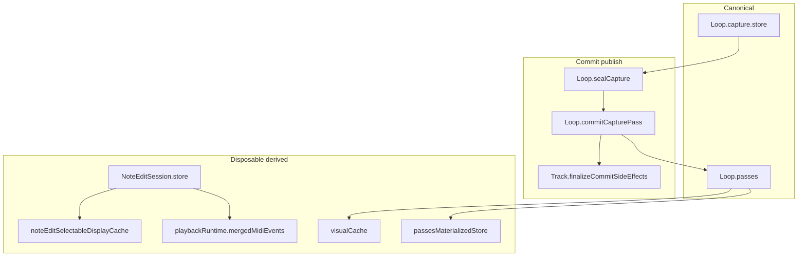

# Embedded firmware invariant review

Review date: 2026-08-05. Scope: current `src/` + guides/OpenSpec contracts. Durable copy target after approval: [`docs/plans/firmware_ownership_lifetime_review.md`](docs/plans/firmware_ownership_lifetime_review.md).

## Verdict

Capture/commit, dual undo stacks (E:/U:), and session-vs-passes edit ownership are **coherent and documented**. The main structural risks are **incomplete cache invalidation**, **parallel close paths on in-edit fold**, **display/playback dual revision discipline**, and **unfinished partial-load recovery** — not missing managers or a need for a new FSM.



---

## What is solid (do not redesign)

| Area | Owner / boundary | Evidence |
|------|------------------|----------|
| Capture stop | `Track::commitCaptureForStop` → `Loop::commitCapturePass` → `Track::finalizeCommitSideEffects` | [`Track.cpp`](src/Track.cpp), [`Loop.cpp`](src/Loop.cpp); OpenSpec `loop-commit-semantics` |
| In-edit overdub | Fold into session; no `OverdubPassAdded` | `Track::handleNoteEditFold` → `EditManager::foldLiveCaptureIntoNoteEditSession` |
| Live edit MIDI | `NoteEditSession.store` sole mutable source while active | `EditManager::editMidiEvents` / `sessionMidiEvents` |
| Geometry mutate | `applyEditSessionActions` pipeline | archived `edit-session-action-geometry` |
| Persistence admit | `StorageManager` only (DEC-008/012) | work queue + deferred undo hydrate |
| Stop validate | Wrap-only on stop; full validate deferred idle | [`LOOP_MIDI_STORAGE_AND_VALIDATION.md`](docs/Guides/LOOP_MIDI_STORAGE_AND_VALIDATION.md) |
| Durable mid-edit | `markCurrentEditBatchDurable` → **NoteEditPassClosed** | CURRENT_WORK HITL PASS `session_20260805_212234.log` |

---

## Confirmed problems

### P0 — Materialize freshness not part of `Loop::invalidateCaches`

**Invariant:** After any mutation that changes how `passes` + `loopLengthTicks` materialize (especially with active **editPasses**), `passesMaterializedStore_` must be marked stale before `midiEvents()` / `gatherCommittedEvents` serve it.

**Violation:**

```1614:1621:src/Loop.cpp
void Loop::invalidateCaches() {
  // noteCache, eventIndexValid, visualCacheDirty, playbackOrderDirty —
  // does NOT set passesMaterializedStoreStale_
}
```

Contrast with `Loop::markPassDerivedStale()`, which does set the flag. Callers that only invalidate:

- `TrackUndo` **LoopBoundaryChange** → `loop.invalidateCaches()` + `track.invalidateCaches()`
- `LoopEditManager::applyLoopLength` / preview → `track.invalidateCaches()` only
- `Track::invalidateCaches` → `activeLoop.invalidateCaches()` only

With active editPasses, `gatherCommittedEvents` copies from `midiEvents()`, which short-circuits when the stale flag is false — **length/geometry change can leave edit-overlaid materialize wrong**.

**Enforce at:** `Loop::invalidateCaches` (or make it call `markPassDerivedStale` / set `passesMaterializedStoreStale_`). Do not rely on every geometry caller remembering a second API.

**Fix cost:** Small, localized; add native test: length change with active editPass → next gather ≠ pre-change materialize.

---

### P1 — Undo routing contract drift (docs vs firmware)

**Firmware:** `MidiButtonActions::handleUndo` — while `isNoteEditActive()`, if session stack empty → **return** (no global fallthrough). Same for redo.

**Guide / rules say “prefer before” / numbered fallthrough:**

- [`LOOP_MIDI_STORAGE_AND_VALIDATION.md`](docs/Guides/LOOP_MIDI_STORAGE_AND_VALIDATION.md) routing §: (1) session if non-empty (2) global …
- [`ARCHITECTURE_RULES.md`](docs/00-authority/ARCHITECTURE_RULES.md): “session undo before global stack”

**Product effect:** Mid-session durable **NoteEditPassClosed** (**U:**) cannot be undone via the undo button until NOTE_EDIT exits — matching OpenSpec “session undo does not pop global” spirit, **contradicting** guide step 2 fallthrough.

**Invariant:** One product contract for E: vs U: during NOTE_EDIT.

**Enforce at:** Single authority — update guide + ARCHITECTURE_RULES to match `handleUndo` (session-gated, no fallthrough), **or** change `handleUndo` if fallthrough is intended. Prefer **docs → code** unless product wants U: reachable mid-session.

---

### P1 — In-edit fold duplicates wrap finalize ownership

**Invariant (guide):** After `finalizePendingNotes`, seal must not re-close those notes via a second owner story.

**Normal path:** pending close → `sealCapture` → `finalizeWrapWindowOnStore`.

**Fold path:** `finalizePendingNotes` then `foldLiveCaptureIntoNoteEditSession` which **also** calls `LoopStopFinalize::finalizeWrapWindowOnStore` on `capture.store` ([`EditManager.cpp`](src/EditManager.cpp)).

**Risk:** Parallel close pipelines; mostly idempotent today, hard to reason about when wrap rules change.

**Enforce at:** One wrap-finalize owner shared by seal and fold (extend existing `LoopStopFinalize` / stop prep — do not add a third helper). Fold should call the same post-pending policy as seal, not a sibling call site.

---

### P1 — NOTE_EDIT geometry + PLAYING: defer playback merged rebuild (priority)

**Evidence:** `captures/session_20260805_222144.log` — reboot @ 303s and hang @ 248.7s post-reboot during rapid position/pitch edits with transport running.

**Invariant:** MIDI clock path must not run `ensurePlaybackMergedMidiEventsBuilt` + full session `assign` + `rebuildPlaybackOrder` on every geometry-driven `sessionPlaybackPreviewRevision_` bump while PLAYING.

**Fix (this branch):**
- `Track::invalidateCaches(true)` while PLAYING + NOTE_EDIT → `scheduleDeferredNoteEditDisplayRefresh()` instead of immediate `bumpSessionPlaybackPreviewRevision()`.
- `flushDeferredNoteEditDisplayRefresh` → `invalidateCaches(false)` after playback bump (no double bump / re-defer).

**Enforce at:** `Track::invalidateCaches`, `EditManager::flushDeferredNoteEditDisplayRefresh`; main-loop flush via `ControlSurfaceManager` (80 ms idle).

**Audition tradeoff:** While fader is moving during PLAYING, audible MIDI may lag session store by up to `kDeferredNoteEditDisplayRefreshIdleMs` after last edit; display preview still updates immediately.

---

### P1 — Dual display vs playback revision (addressed by defer fix)

**Invariant:** After session-store geometry that should be audible, playback merged events must not stay stale indefinitely while display advanced.

**Structure:** `Track::invalidateCaches(refreshPlaybackPreview)` bumps display always; playback immediate when stopped, deferred when PLAYING.

---

## Hard-to-reason / debt (not proven bugs)

| Topic | Invariant difficulty | Enforce / contain |
|-------|----------------------|-------------------|
| `overlapNotes` still mutated + fingerprinted while commit authority is `baselineMap` + `changedOverlapNoteIds` + store | Dual models can disagree | Keep projection/commit off `overlapNotes` membership; shrink fingerprint to authority fields when touching focus |
| `selectedNoteIdx` vs `EditorSelection.primaryNote` | Index remapped after filter; mover can be absent from filtered list | Geometry/select: `primaryNote` truth; index UI cursor only |
| Spec tension: `baselineMap` “full loop” (geometry) vs closure-only (heap routing) | Memory vs completeness | Reconcile OpenSpec wording to `populateBaselineMapForEditClosure` (code truth) |
| Many derived layers (materialize, merged window, visualCache, session store, display cache, scratch) | Correct only if invalidation complete | Document as disposable in [`DerivedViews.md`](docs/00-authority/Architecture/DerivedViews.md); fix P0 first |
| Phase-gate docs name deferred overdub FSM symbols removed from `src/` | Agent confusion | Sync OpenSpec-Phase-Gate protected-path names to `commitCaptureForStop` |
| Long-loop gather omits edit overlay until idle rematerialize | Temporary display/playback disagreement | Known tradeoff; do not “fix” with full gather on clock |

---

## Real-time safety and allocation

**Confirmed structure:** `ClockManager` → `TrackManager::updateAllTracks` → `playMidiEvents` → `ensurePlaybackMergedMidiEventsBuilt` → possible `assign` of full session + `rebuildPlaybackOrder` (heap `sortPhases` vector).

**Invariant:** Clock path must not SD / full materialize / unbounded alloc; rebuild only on revision miss.

**Pressure point:** NOTE_EDIT revision bumps while PLAYING force full session copy + order rebuild on next pulse.

**Contain (no redesign):** Keep prewarm (`ensurePlaybackMergedEventsForSlot`, idle maintenance); avoid bump storms; do not move SD onto this stack. Optional later: pre-sized order buffer to remove per-rebuild `sortPhases` alloc — only if profiling shows cost.

---

## Persistence and power-loss recovery

| Case | Behavior | Gap |
|------|----------|-----|
| Committed passes + deferred save completed | Restored via StorageManager | Solid for Phases 0–4 |
| Mid-NOTE_EDIT after `markCurrentEditBatchDurable` + save | **U:** can disable editPass rows | HITL PASS 2026-08-05 |
| In-RAM session geometry / **E:** stack | Lost on reboot (by design) | Documented |
| Mid-pass crash (unsealed chunk) | Spec: longest valid prefix + quarantine | **Phase 5 unchecked** in [`continuous-runtime-persistence`](openspec/changes/continuous-runtime-persistence/tasks.md) |

**Enforce Phase 5 at:** `StorageManager` load / `readLoopPersisted` / existing quarantine helpers — not a new recovery manager.

---

## Testing strategy

Each improvement ships with **both**:

1. **Automated** — `pio test -e native` (and new native cases where noted).
2. **Manual regression** — hardware HITL or scripted manual steps below; serial capture **required**; log archived under `captures/` with `MT-<id>` in the session note.

**Common setup (all manual tests):**

```bash
pio run -e teensy41-capture-serial -t upload   # after firmware change
.venv/bin/python scripts/capture_session.py --port /dev/cu.usbmodem154944801
```

Track/slot defaults unless noted: **track 5**, **loop slot 1**, **MIDI channel 5**. Reference: [`docs/Guides/HITL_TEST_SCENARIOS.md`](docs/Guides/HITL_TEST_SCENARIOS.md).

**Regression gate (run before and after every item):**

```bash
pio test -e native
.venv/bin/python scripts/host_midi_hitl.py run --layered --preset base \
  --midi-out "Teensy" --midi-in "Teensy" --track 5 --midi-channel 5
```

---

## Manual regression tests per improvement

### MT-P0 — Materialize stale after loop-length change with committed editPass

**Covers:** P0 `Loop::invalidateCaches` / `passesMaterializedStoreStale_`.

**Precondition:** Slot has **recordPass + overdubPass + at least one committed editPass** (exit NOTE_EDIT after move/delete so `NoteEditPassClosed` is on disk).

**Steps:**

1. Run `edit_full` layered preset **or** manual: 2-bar record → overdub → NOTE_EDIT → move one note → exit edit (commit).
2. Re-enter NOTE_EDIT on the same slot; confirm piano-roll shows edited geometry.
3. Enter **LOOP_EDIT** (loop length mode); hold-preview **shorten loop by 1 bar** (or lengthen); commit length change.
4. While still in NOTE_EDIT (or exit and re-enter): move a **different** note; exit edit.
5. Play loop for **3 full cycles**; optionally overdub one bar.

**Pass criteria:**

- Serial: no `SealFailed`, no `gather` / materialize assert logs; `NoteEditSessionCommitted` once per edit exit.
- **Playback:** edited notes audible at new loop boundary; no duplicate note-ons at wrap; no missing notes that OLED still shows.
- **After global undo** (post-exit): `Scoped edit pass undone` restores pre-edit geometry; loop length undo (if separate **LoopBoundaryChange** entry) restores prior length without ghost notes.
- Compare `#CAP,MI` note-off/on pairs at wrap before vs after length change — no extra stuck notes (host MIDI in or logic analyzer).

**Automated supplement:** native test `length_change_with_active_edit_pass_invalidates_materialize` (new).

**Capture label:** `MT-P0_materialize_after_loop_length_<date>.log`

**Result (2026-08-05):** Conditional PASS — functional steps met in `session_20260805_222144.log`; stability gate moved to P1-display-audition (reboot + hang under NOTE_EDIT + PLAYING).

---

### MT-P1-undo — E: vs U: routing during NOTE_EDIT (docs + behavior lock)

**Covers:** P1 undo routing contract (session-gated; no global fallthrough while NOTE_EDIT active).

**Steps:**

1. `edit_full` or manual prelude → enter NOTE_EDIT → perform **two** geometry actions of different kinds (e.g. move then length) so **E:** stack has ≥2 entries.
2. **E: undo/redo** while still in NOTE_EDIT — confirm `EditSession undo` / `EditSession redo` in serial; geometry and OLED match.
3. Drain **E:** stack (undo until `No session undo available`).
4. With NOTE_EDIT **still active**, press **global undo** (double-tap / configured undo).
5. Observe: must log `No session undo available` and **must not** log `Scoped edit pass undone` / `Overdub undone` / pass disable for **U:**.
6. Exit NOTE_EDIT; wait for `PERS,result,ok` (deferred save drain).
7. Press global undo — **U:** must run (`Scoped edit pass undone` or equivalent).
8. **Reboot test** (optional, already gated in CURRENT_WORK): mid-NOTE_EDIT after autosave checkpoint → reboot → **U:** restores pre-checkpoint committed state; **E:** stack empty.

**Pass criteria:**

- Step 4–5: zero global undo side effects while `isNoteEditActive()`.
- Step 7: global undo works after exit.
- Step 8: matches durable checkpoint behavior in `session_20260805_212234.log` pattern.

**Automated supplement:** none required for docs-only; if `handleUndo` changes, add native routing test.

**Capture label:** `MT-P1_undo_routing_<date>.log`

---

### MT-P1-fold — In-edit overdub stop wrap / note-off correctness

**Covers:** P1 unified wrap finalize between `sealCapture` and `foldLiveCaptureIntoNoteEditSession`.

**Primary preset:**

```bash
.venv/bin/python scripts/host_midi_hitl.py run --layered --preset edit_overdub_during_note_edit \
  --midi-out "Teensy" --midi-in "Teensy" --track 5 --midi-channel 5
```

**Additional manual (wrap stress):**

1. 2-bar loop; record notes with **note-on in last 1/8 bar** and **sustain across wrap**.
2. Enter NOTE_EDIT; start **in-edit overdub**; add 2–4 notes in bar 2; stop overdub **near loop end** (last beat).
3. **E: undo** in-edit overdub layer only — pre-edit overdub and record layers unchanged (per HITL scenario doc).
4. **E: redo**; exit NOTE_EDIT; global undo disables folded content correctly.

**Pass criteria:**

- Verifier `verify_edit_overdub_during_note_edit` PASS.
- No stuck notes after in-edit overdub stop (listen + host MIDI in).
- Serial: fold path logs present; no double-close artifacts (duplicate note-offs at same tick for same pitch).
- Session undo restores exact pre-overdub session store; redo restores overdub layer.

**Capture label:** `MT-P1_fold_in_edit_overdub_<date>.log`

---

### MT-P1-display-audition — NOTE_EDIT geometry while PLAYING (no hang)

**Covers:** P1 defer playback merged rebuild; repro from `session_20260805_222144.log`.

**Precondition:** Slot with committed editPass; loop length changed and NOTE_EDIT re-entered (MT-P0 step 2).

**Steps:**

1. Start transport (global transport short press).
2. Enter NOTE_EDIT while PLAYING.
3. **Move** note (F2/F3) — 10+ steps across loop.
4. **Pitch** change (F4/CC) — rapid sweep 20+ steps.
5. Pause fader 200 ms — confirm audible catches up (deferred flush).
6. Continue playing 3 cycles without editing.
7. Exit NOTE_EDIT; confirm commit + no reboot.

**Pass criteria:**

- No `#CAPTURE_RECONNECT` / `BOOT,load,start` during steps 1–6.
- Serial continues through pitch sweep (no mid-line freeze).
- After fader idle ≥80 ms, playback matches session store (listen).
- Optional: `non-canonical store` warnings acceptable; no watchdog reset.

**Capture label:** `MT-P1_display_audition_<date>.log`

---

### MT-P5-recovery — Partial persist / power-loss longest valid prefix

**Covers:** Phase 5 recovery (when implemented). **Do not run until Phase 5 code lands.**

**Steps (TBD with implementation — placeholder contract):**

1. Record 4+ bars; stop; allow deferred save to complete (`PERS,result,ok`).
2. Start new record or overdub; **power-cut or reset mid-pass** before chunk seal (test hook or controlled abort if provided).
3. Reboot; load slot.

**Pass criteria:**

- Boot does not fault; slot loads **longest valid prefix** of sealed chunks.
- Invalid tail quarantined (log mentions quarantine path).
- Playback length ≤ pre-crash committed length; no corrupt note stream.
- Undo stack consistent with loaded prefix.

**Capture label:** `MT-P5_recovery_<date>.log`

---

### MT-hygiene — Smoke after doc-only / low-risk items

**Covers:** phase-gate doc sync, baselineMap spec wording, overlapNotes fingerprint (if touched).

**Steps:** Regression gate only (`native` + `base`). If any firmware touched: add **5 min** NOTE_EDIT smoke — enter edit, one move, exit, one global undo.

**Capture label:** optional; note in PR if docs-only.

---

## Testing gaps (automated — unchanged)

- Native strong for geometry, focus, session undo, STK1 durable sequencing
- **Missing native:** materialize stale after length+editPass (P0); display↔session↔merged parity assert
- Edit HITL full matrix **parked**; layered `edit_full` Phase 3 in progress
- Mid-pass crash fixture **not** implemented (Phase 5)
- `test_redo_functionality` ignored on `native` (Track-coupled)

---

## Recommended follow-up (minimal; ranked)

Each item is **not done** until its **MT-*** manual test PASS is logged in `captures/` (or verifier PASS for scripted presets).

1. **P0 fix:** `Loop::invalidateCaches` materialize stale → **MT-P0 conditional PASS** (`session_20260805_222144.log`).
2. **P1-display-audition:** defer playback rebuild while PLAYING → **MT-P1-display-audition** (in progress).
3. **P1 docs:** LOOP_MIDI + ARCHITECTURE_RULES undo routing → **MT-P1-undo**.
4. **P1 fold:** single wrap-finalize path → **MT-P1-fold**.
5. **Phase 5:** longest-prefix recovery → **MT-P5-recovery**.
6. **Hygiene:** doc/spec sync → **MT-hygiene** smoke.

Do **not** introduce a new Manager, parallel undo model, or deferred-stop FSM — sync pipeline and dual stacks are the intended design.

**Deliverable:** copy this manual test matrix into [`docs/plans/firmware_ownership_lifetime_review.md`](docs/plans/firmware_ownership_lifetime_review.md) and add a row per MT-* to [`docs/Guides/HITL_TEST_SCENARIOS.md`](docs/Guides/HITL_TEST_SCENARIOS.md) § Manual regression (firmware invariant review).

---

## Pre-implementation note (if fixing P0 next)

Architecture checkpoint: ownership **NO**, transitions **NO** — invalidation completeness only. Proceed after user picks which ranked items to implement.
