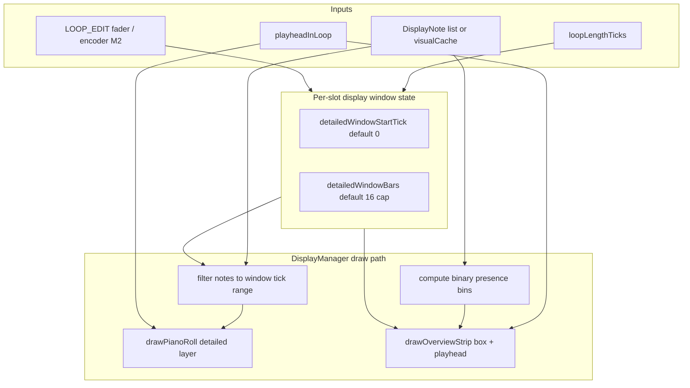

# Long-loop piano roll window and overview strip

**Apply after:** `long-record-memory-headroom` (OpenSpec change must ship first — long loops must not crash before display scaling is useful).

**Supersedes display scope from:** `record-stop-64-bar-crash` §6 (parked in `PARKED.md`).

**Suggested follow-on OpenSpec change id:** `long-loop-piano-roll-window` — scaffolded at [openspec/changes/long-loop-piano-roll-window/](../../openspec/changes/long-loop-piano-roll-window/).

---

## Why

Today `DisplayManager::drawPianoRoll` maps the **full** loop length onto the piano-roll width (`jamLength` / `loopLength` in [src/DisplayManager.cpp](src/DisplayManager.cpp)). For loops longer than 16 bars, notes compress to unreadable slivers and the display path may reconstruct or filter more notes than the 32-row framebuffer can usefully show.

The parked `record-stop-64-bar-crash` change correctly separated this from the RAM2 crash fix. This plan delivers the display work as its own change **after** `long-record-memory-headroom` restores reliable 48/64-bar record and persistence.

## Goals

1. **M1 (display-only):** When loop length exceeds 16 bars, render at most a **16-bar detailed piano-roll window** plus a **full-width overview strip** with a **fixed-at-start window box** (bars 0–15 until the user moves it in M2).
2. **M2 (LOOP_EDIT navigation):** In **LOOP_EDIT** mode, let the user **move** the detailed window along the loop and **resize** it from 1 to 16 bars (fader 3 and hold-turn encoder — same deferred controls named in the old §6.6).
3. Keep display work **off hot paths**: no full-loop note reconstruction per frame for the detailed layer; overview uses cheap binary presence bins only.
4. Extend `#CAP DISP` verification so HITL can assert bounded-window behavior on 32/64-bar loops.

## Non-goals

- Changing loop storage, capture, or persistence (handled by `long-record-memory-headroom`).
- Note-count density or velocity shading in the overview strip (v1 is binary **has notes** / **no notes** only).
- NOTE_EDIT piano-roll changes (window applies to loop playback / LOOP_EDIT display context).
- Jam-mode full-arrangement navigation (jam display may keep existing behavior unless explicitly extended later).

## User decisions (locked for this plan)

| Decision | Choice |
|----------|--------|
| Window scroll during playback | **Fixed at loop start** until user moves it (no auto-follow playhead in M1 or M2 default) |
| Delivery | **Phased in one change:** M1 display-only, then M2 LOOP_EDIT controls |
| Overview strip content v1 | Binary grouped note presence + **window box** (start/end of detailed view) |
| Grouping | Dynamic 1 / 2 / 4 / 8 / 16 / 32 / 64 bars based on total loop length |

### Tradeoff (fixed window)

While the detailed window stays at bars 0–15, the playhead cursor in the piano roll may leave the visible window during playback of later bars. M1 mitigates this by drawing the **playhead position on the overview strip** (full-loop context) even when it is outside the detailed window. M2 lets the user move the box in LOOP_EDIT before or during playback.

---

## Current behavior (baseline)

```788:830:src/DisplayManager.cpp
void DisplayManager::drawPianoRoll(uint32_t currentTick, Track& selectedTrack, uint8_t displaySlot, const std::vector<DisplayNote>& notes) {
    ...
    const uint32_t loopLength = resolveDisplayLoopLength(track, displaySlot, currentTick);
    ...
    drawGridLines(jamLength, pianoRollY0, pianoRollY1);
    drawAllNotes(track, displaySlot, currentTick, 0, jamLength, minPitch, maxPitch, notes);
    ...
    if (jamPos < jamLength) {
        int cx = TRACK_MARGIN + map(jamPos, 0, jamLength, 0, pianoRollWidth());
```

- Piano roll occupies rows `y = 0..31`; sidebar separator extends to `y = 39` ([drawSidebar](src/DisplayManager.cpp)).
- `#CAP DISP` already emits loop length, take/visual/frame note counts ([include/Utils/DebugSessionCapture.h](include/Utils/DebugSessionCapture.h)); HITL scripts parse it for live-record display checks.

---

## Milestone 1 — bounded window + overview strip (display-only)

### 1.1 Detailed window model

Add per-slot (or per-track active slot) display state:

| Field | Default | Meaning |
|-------|---------|---------|
| `detailedWindowStartTick` | `0` | First tick of the detailed piano-roll view |
| `detailedWindowBars` | `16` (capped) | Width of detailed view in bars; when loop ≤ 16 bars, use `loopBars` |

When `loopLengthTicks > 16 * BAR_TICKS`, the detailed layer maps **only** `[start, start + windowLength)` onto `pianoRollWidth()`, not the full loop.

When `loopLengthTicks ≤ 16 * BAR_TICKS`, behavior matches today (full loop in piano roll); overview strip may be hidden or collapsed.

### 1.2 Note filtering for detailed layer

In `resolveDisplayNotes` / `drawAllNotes`, filter `DisplayNote` list to notes intersecting the detailed window tick range (wrap-aware). Reuse existing note list sources (`visualCache`, live display buffer) — **do not** add a new display module noun; filter on read in `DisplayManager` or a small helper on `DisplayManager`.

Grid lines and playhead X position use **window-relative** ticks; playhead draws only when `playheadTick` falls inside the window (otherwise omit from detailed layer; show on overview only).

### 1.3 Overview strip layout

- **Placement:** Prefer the gap between piano roll (`y ≤ 31`) and bottom info rows; if insufficient, use the **lowest piano-roll row** (reuse one row from `y = 31`) per parked design Decision 6.
- **Width:** Full `pianoRollWidth()` (same horizontal scale as main roll, excluding sidebar).
- **Segments:** `segmentCount = displayWidth / segmentWidth` with dynamic bar grouping so the full loop fits:
  - Choose `barsPerSegment ∈ {1, 2, 4, 8, 16, 32, 64}` so `loopBars / barsPerSegment ≤ segmentCount`.
- **Segment draw:** Filled = **has notes** in that tick span; empty = **no notes** (binary v1). Presence can be precomputed once per loop revision from `visualCache` or a lightweight bin pass over chunk refs (no per-frame full reconstruct).
- **Window box:** Draw start/end markers (or a hollow rectangle) showing which loop segment maps to the detailed window.
- **Playhead:** Vertical tick or highlight on the strip at full-loop playhead position.

### 1.4 `#CAP DISP` extension (M1)

Extend `SC_DISP` / parser with window fields when loop > 16 bars, for example:

- `windowStartTick`, `windowBars`, `windowNoteCount` (notes drawn in detailed layer)

HITL gate (32-bar and 64-bar loops, playback):

- `loopLen` matches expected bars × `BAR_TICKS`
- `windowBars ≤ 16`
- `windowNoteCount > 0` when take/visual counts show content in the first window
- Overview presence bins cover full loop width (optional checksum field or dedicated `#CAP OVW` line if DISP gets too wide)

### 1.5 M1 exit criteria

- Native: unit test for tick-range filter and grouping table (no hardware).
- HITL: 32-bar and 64-bar runs with serial verify — bounded window fields present; no regression to `frameNotes == 0` when `take > 0` during PLAY (see `edit-record-display-length-mode` D1 gates).
- Visual sanity on device: 64-bar loop shows readable notes in first 16 bars; overview strip shows full-loop presence and window box at start.

---

## Milestone 2 — LOOP_EDIT window move and resize

### 2.1 Mode gating

Controls active only when `NoteEditManager::MAIN_MODE_LOOP_EDIT` (sidebar already shows **LOOP EDIT**). Ignore in REC / OVERD / NOTE_EDIT / PLAY-only contexts.

### 2.2 Move window (primary M2 control)

- **Input (proposed, match existing LOOP_EDIT patterns in [src/LoopEditManager.cpp](src/LoopEditManager.cpp)):**
  - **Fader 3** — slide window start along loop (quantize to bar or beat per existing fader resolution).
  - **Hold-turn encoder** — alternate move control (same semantics as fader 3; document precedence if both move).
- **Constraints:** `0 ≤ detailedWindowStartTick ≤ loopLength - windowLength`; wrap not applied to window start (window is a contiguous span in loop coordinates).
- **Persistence:** Store window start per slot in RAM (session scope). Optional SD persistence is out of scope unless product asks for it.

### 2.3 Resize window length

- **Input:** Dedicated CC or encoder-without-hold (reuse old §6.6 intent: fader 3 for length *or* separate control — **open question** below).
- **Range:** 1–16 bars; cannot exceed loop length in bars.
- Resizing preserves `detailedWindowStartTick` where possible; clamp start if `start + newLength > loopLength`.

### 2.4 Overview box sync

Moving or resizing the detailed window updates the overview box immediately (same frame).

### 2.5 M2 exit criteria

- HITL or scripted MIDI: enter LOOP_EDIT on 64-bar loop, move window to bars 16–31, confirm `#CAP DISP` reports `windowStartTick` ≈ `16 * BAR_TICKS` and detailed notes match that span.
- Resize to 8 bars; confirm `windowBars == 8` and box width on overview shrinks.

---

## Architecture sketch



---

## Files to touch (implementation reference)

| Area | Files |
|------|--------|
| Window state + filter | [src/DisplayManager.cpp](src/DisplayManager.cpp), [include/DisplayManager.h](include/DisplayManager.h) |
| LOOP_EDIT controls M2 | [src/LoopEditManager.cpp](src/LoopEditManager.cpp), [include/LoopEditManager.h](include/LoopEditManager.h), possibly [src/MidiFaderProcessor.cpp](src/MidiFaderProcessor.cpp) |
| Capture / HITL | [include/Utils/DebugSessionCapture.h](include/Utils/DebugSessionCapture.h), [scripts/host_midi_automation_baseline.py](scripts/host_midi_automation_baseline.py) or dedicated `scripts/test_long_loop_display_serial_verify.py` |
| Docs | Cross-link from [docs/Guides/LOOP_MIDI_STORAGE_AND_VALIDATION.md](docs/Guides/LOOP_MIDI_STORAGE_AND_VALIDATION.md) display section if present |

---

## OpenSpec proposal outline (when implementing)

**New capability:** `long-loop-piano-roll-window` (or confirm name before propose).

**Requirements (draft):**

1. Loops longer than 16 bars SHALL render a detailed piano-roll window of at most 16 bars.
2. A full-width overview strip SHALL show binary grouped note presence and a marker for the detailed window.
3. Until LOOP_EDIT navigation is active, the detailed window SHALL start at tick 0.
4. LOOP_EDIT SHALL allow moving and resizing the detailed window (1–16 bars).
5. Display verification SHALL report window start, width, and filtered note count for long loops.

**Modified capabilities:** none required unless we add a delta under a display-specific spec later.

---

## Open questions

1. **Strip placement on hardware:** Does the gap below `y = 31` fit one overview row without overlapping sidebar labels, or must the strip steal a piano-roll row? Resolve with a single device photo or measurement before M1 lands.
2. **Fader 3 dual role:** Old §6.6 named fader 3 for window **length**; M2 also needs **move**. Options: (a) fader 3 = length, encoder = move; (b) fader 3 = move, encoder-hold = length; (c) bar-step buttons shift window. Pick before M2.
3. **Per-slot vs global window state:** Should each of the 8 loop slots remember its own window start, or only the active slot?
4. **Live record / overdub:** During growing capture (`loopLen` increasing), should the window stay fixed at 0–15 bars of the *current* capture length, or expand the cap dynamically until stop? Recommendation: cap at 16 bars of the live length, same as playback.

---

## Task checklist (for OpenSpec `tasks.md` when proposed)

### M1 — display-only
- [ ] Add detailed window state (start tick, bar width) with defaults fixed at loop start, max 16 bars.
- [ ] Filter detailed piano-roll notes and grid to window tick range when loop > 16 bars.
- [ ] Implement overview strip (binary bins, window box, playhead on strip).
- [ ] Extend `#CAP DISP` (or `#CAP OVW`) and HITL verifier for 32/64-bar loops.
- [ ] Native tests for window filter and bar-grouping table.

### M2 — LOOP_EDIT navigation
- [ ] Wire LOOP_EDIT fader / encoder to move window along loop.
- [ ] Wire LOOP_EDIT control to resize window (1–16 bars).
- [ ] HITL or script: move window on 64-bar loop and verify capture fields.
- [ ] Document control map in LOOP_EDIT user-facing docs / MIDI mapping comments.

### Closeout
- [ ] `pio test -e native`
- [ ] HITL 32/64-bar display gates pass
- [ ] `openspec validate long-loop-piano-roll-window`
