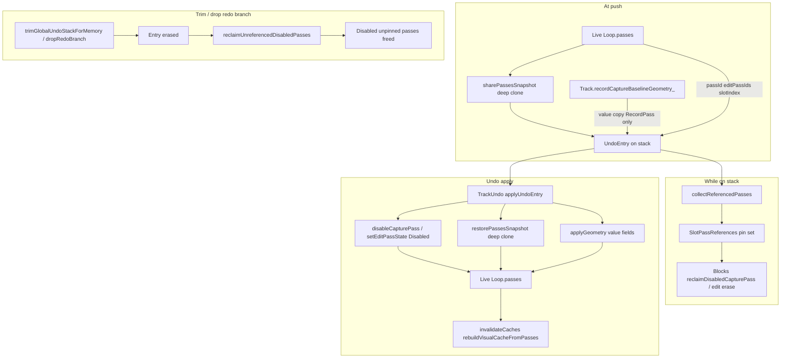

# Phase 2 review additions — Undo ownership audit and migration safety

**Kind:** Architecture review additions  
**Date:** 2026-07-14  
**Status:** Task 0 codebase audit **complete** (2026-07-14). Design-session sign-off pending.  
**Parent:** [loop_undo_ownership_refinement.md](loop_undo_ownership_refinement.md)

---

## Motivation

The proposed move from a track-owned undo stack to per-loop undo stacks is architecturally sound and aligns with the project's long-term ownership model.

However, recent regressions suggest that the primary risk is **not the physical location of the undo stack**, but the lifetime and ownership of the objects referenced by each `UndoEntry`.

Several previous undo failures have been caused by ownership drift between capture state, pass ownership, geometry snapshots, playback reconstruction and reclaim logic rather than by the stack container itself.

Phase 2 should therefore begin with an ownership audit before any storage migration.

---

## Architecture principle

Phase 2 is fundamentally a **reference ownership migration**, not merely a storage migration.

The critical question is therefore not:

> "Where does the undo stack live?"

but instead:

> "Who owns every object referenced by an UndoEntry throughout its lifetime?"

Only once those ownership relationships are fully understood should the physical stack move into `Loop`.

### Ownership model — before and after

**Before (Phase 1):**

```
Track
 ├── Passes          (via Loop pool)
 ├── Undo            (GlobalUndoStack on Track)
 └── Loops
```

**After (Phase 2):**

```
Track
 └── Coordinates Loops

Loop
 ├── Passes
 ├── Capture
 ├── Undo
 ├── Geometry
 └── Playback state
```

**Prerequisite:** record capture baseline geometry moves to Loop so push paths do not read Track-local state before this model is complete.

### Ownership invariant

**Undo history belongs to the Loop.**

Changing Slot assignment must **never** modify or invalidate Loop history.

This invariant holds in Phase 2 (per-loop stacks on the 1:1 pool) and must hold when SlotAssignment is introduced later: reassigning, unloading, or clearing a **Slot** must not trim, merge, or wipe a **Loop**'s undo stack unless the Loop itself is deleted.

---

## Task 0 — Undo ownership audit (blocking)

**Required before Task 1 (data model).** Codebase audit completed 2026-07-14 against `dev` @ `644de4f`.

### Objective

Verify that every object referenced by an `UndoEntry` has a single well-defined owner whose lifetime remains valid until the entry is discarded.

---

### Full `UndoEntry` ownership table

Sources: [`include/GlobalUndoStack.h`](../../include/GlobalUndoStack.h), [`src/TrackUndo.cpp`](../../src/TrackUndo.cpp), [`src/Loop.cpp`](../../src/Loop.cpp) (`sharePassesSnapshot`, `restorePassesSnapshot`), [`src/PassReclaim.cpp`](../../src/PassReclaim.cpp).

| Field | Set at push | Runtime owner after push | Mutable after push? | Lifetime until entry discarded | Reclaim pinned? |
|-------|-------------|--------------------------|---------------------|--------------------------------|-----------------|
| `id`, `kind` | `pushUndoEntry` | `GlobalUndoStack` entry (future: `Loop` stack) | No | Stack entry lifetime | N/A |
| `slotIndex` | All push paths | **Compatibility field** — routes `track.getLoop(slotIndex)` in apply during 1:1 era | No | Stack entry lifetime | Used by `collectReferencedPasses` to bucket refs; legacy split-on-load |
| `loopId` | All push paths from `loop.loopId` | **Persistent musical identity** — stored on entry and wire | No | Stack entry lifetime | Not used on apply today; future routing via SlotAssignment → Loop |
| `passId` | Record/overdub push | **Live** `Loop.passes` capture row (same `PassId`) | Row state toggles Active↔Disabled on undo/redo; row must exist | Until entry trimmed or pass reclaimed | **Yes** — `collectReferencedPasses` pins capture pass id |
| `beforeSnapshot` | `ClearSlot` push (`sharePassesSnapshot`) | **`UndoEntry` via `shared_ptr<PersistedLoopSnapshot>`** — independent deep clone | No (immutable clone) | Until entry erased / stack trimmed | **Yes** — all pass ids in snapshot passes pinned |
| `afterSnapshot` | **Lazy** on first `ClearSlot` undo (`sharePassesSnapshot`) | Same as `beforeSnapshot` | Set once on undo; then immutable | Until entry erased | **Yes** when non-null |
| `beforeGeometry` | Record push, `ClearSlot` push; or copied from Track baseline at record push | **Value copy** (`UndoLoopGeometry`) in entry | No | Stack entry lifetime | N/A (value) |
| `afterGeometry` | **Lazy** on Record undo; `ClearSlot` undo | Value copy in entry | Set on first undo (Record/ClearSlot) | Stack entry lifetime | N/A |
| `beforeLoopStartTick` / `beforeLoopLengthTicks` | `LoopBoundaryChange` push | Value copy in entry | No | Stack entry lifetime | N/A |
| `afterLoopStartTick` / `afterLoopLengthTicks` | **Lazy** on `LoopBoundaryChange` undo | Value copy in entry | Set on undo | Stack entry lifetime | N/A |
| `editPassIds` | Note/CC edit push | **Live** `Loop.passes.editPasses` rows (same ids) | Row state toggles Active↔Disabled | Until entry trimmed or edit pass reclaimed | **Yes** — each id pinned |
| `editPassIndex`, `editPassType` | Edit push | Metadata in entry | No | Stack entry lifetime | N/A |
| `beforeTrackState`, `afterTrackState`, `hasTrackState` | `ClearSlot` push / lazy on undo | Value copy in entry | `afterTrackState` set on undo | Stack entry lifetime | N/A |
| `beforeSlotEnabled`, `beforeSlotMuted`, `hasSlotFlags` | `ClearSlot` push from `TrackManager` | Value copy in entry | No | Stack entry lifetime | N/A (side effects via `TrackManager` on undo) |
| `hasRedoPayload` | Set `true` in apply paths | Entry flag | No after set | Stack entry lifetime | N/A |

**Not stored in `UndoEntry` (playback reconstruction):** materialized MIDI, `playbackOrder`, `visualCache`, `projectionCycleStartTick`. These are **derived** from `Loop.passes` + geometry after apply via `invalidateCaches()`, `rebuildVisualCacheFromPasses()`, `restorePassesSnapshot()` — not entry-owned.

---

### Push-path capture baseline — Phase 2 prerequisite (blocking)

**Accepted prerequisite (2026-07-14):** Record baseline geometry must become **Loop-owned** (or be captured directly from `Loop` at the correct lifecycle point) **before** per-loop undo stack ownership is enabled.

This is the **only remaining push-time dependency on Track-local state** identified during the Task 0 ownership audit.

| Today | Required before Stage 1 |
|-------|-------------------------|
| `Track::recordCaptureBaselineGeometry_` set in `Track::startRecording` | Loop-scoped baseline on the recording `Loop` |
| `TrackUndo::pushRecordPassAdded` reads Track fields → copies to `entry.beforeGeometry` | `pushRecordPassAdded` reads **only** from target `Loop&` (or `captureGeometry(loop)` at commit if semantics match) |
| Track fields cleared after push | Remove `Track::recordCaptureBaselineGeometry_` / `hasRecordCaptureBaselineGeometry_` |

**Why record-start, not commit-only:** `startRecording` captures geometry **before** loop mutations (empty-slot length reset, `loopStartTick = 0`, etc.). Commit-time `captureGeometry(loop)` alone would not preserve pre-record baseline unless equivalent state is stored on the Loop at record entry.

**Suggested shape (design session):**

```
Loop
    recordCaptureBaselineGeometry_   // UndoLoopGeometry
    hasRecordCaptureBaselineGeometry_
```

Set in `Track::startRecording` on the active loop; consumed in `pushRecordPassAdded` from `track.getLoop(slotIndex)`.

**Gate:** This prerequisite ships as its own small change (native tests for record undo geometry) **before** enabling per-loop undo stacks.

---

### Snapshot clone path (ClearSlot)

| Operation | Function | Clone depth |
|-----------|----------|-------------|
| Push `beforeSnapshot` | `Loop::sharePassesSnapshot()` | New `shared_ptr`; `deepClonePasses` — capture pass **chunk refs** cloned via `deepCloneChunkRefs`; edit rows copied by value |
| Undo restore | `restorePassesSnapshot` | **Second** deep clone from snapshot into live `Loop.passes` |
| Redo restore | `restorePassesSnapshot(afterSnapshot)` | Same |

Global pass undo (**RecordPassAdded**, **OverdubPassAdded**, edit closed) does **not** use snapshot restore — it toggles pass **Disabled/Active** on live rows. Comment in `applyUndoEntry` (RecordPassAdded): disabled passes kept on timeline for redo.

**Invariant correction:** Global undo uses `sharePassesSnapshot` / `restorePassesSnapshot`, not `LoopEventStore::shareForSnapshot` / `cloneShared`. The latter applies to **NoteEditSession** undo (`docs/Guides/LOOP_MIDI_STORAGE_AND_VALIDATION.md`).

---

### Lifetime diagram



---

### Reclaim safety verification

| Entry kind | Pinned by `collectReferencedPasses` | Can reclaim break undo? |
|------------|--------------------------------------|-------------------------|
| **RecordPassAdded** / **OverdubPassAdded** | `entry.passId` | **Yes** if pin missing — `disableCapturePass` / `enableCapturePass` return false → stale entry dropped |
| **NoteEditPassClosed** / **CC** | each `editPassIds` | **Yes** if edit row reclaimed — `setEditPassState` fails |
| **ClearSlot** | all pass ids in `beforeSnapshot`; `afterSnapshot` when captured | **Yes** if snapshot chunks freed — restore corrupt/missing |
| **LoopBoundaryChange** | nothing | **No** for undo itself (geometry-only); unrelated disabled passes may still be reclaimed |

Reclaim orchestration: [`TrackManager::reclaimUnreferencedDisabledPasses`](../../src/TrackManager.cpp) scans **track-wide** stack today → must scan **all loop stacks** per track after Phase 2.

Trim/drop triggers reclaim: `dropRedoBranch`, `trimUndoStackForMemory`, stale entry erase in `undoForLoop`/`redoForLoop`, `eraseUndoEntriesForSlot`.

---

### Playback reconstruction after undo

| Apply path | Reconstruction trigger | Deterministic? |
|------------|------------------------|----------------|
| Pass disable/enable | `rebuildVisualCacheFromPasses`, `invalidateCaches`, optional `rematerializeEditView` if note edit active | **Yes** — driven by pass state + geometry values in entry |
| ClearSlot restore | `restorePassesSnapshot` + `applyGeometry` + `invalidateCaches` | **Yes** — independent of prior playback cursor |
| LoopBoundaryChange | Direct tick field write + `reconcileLoopLengthWithPublishedContent` | **Yes** |
| ClearSlot side effects | `TrackManager` slot flags, `resetPlaybackStateForSlot`, `startPlaying` | Depends on transport — geometry/pass data still deterministic |

**Open overdub capture:** `undoForLoop` discards live capture before stack pop — not stored in `UndoEntry`.

---

### Required invariants — audit result

| Invariant | Status | Notes |
|-----------|--------|-------|
| **Undo history belongs to Loop; slot assignment must not invalidate it** | **REQUIRED** | Phase 2 + future SlotAssignment |
| Snapshot push uses deep clone | **PASS** | `sharePassesSnapshot` → `deepClonePasses` / `deepCloneChunkRefs` |
| Restore does not alias live chunks | **PASS** | `restorePassesSnapshot` deep-clones again |
| No Track-local refs **in** entry after push | **PASS** | Baseline geometry is value-copied |
| Push may read Track-local temporaries | **BLOCKING PREREQ** | Only gap: record baseline — must be Loop-owned before Stage 1 (see prerequisite section) |
| Reclaim cannot free pinned undo data | **PASS** when pins correct | Failures surface as stale-entry skip + warning logs |
| Geometry restore deterministic | **PASS** | Value fields + `reconcileLoopLengthWithPublishedContent` |
| Record/overdub undo same after SD round-trip | **PASS** | Metadata load preserves `passId`; bodies hydrated deferred; pass toggle does not need snapshot bodies |
| `loopId` matches slot on apply | **NOT ENFORCED (by design)** | Apply uses `slotIndex` during 1:1 era; `loopId` is identity anchor for persistence/future SlotAssignment routing |

---

### Phase 2 migration risks (from audit)

1. **R1 — Record baseline geometry (prerequisite, not parallel):** Loop-owned baseline **must ship before** per-loop undo stacks. See prerequisite section above.
2. **R2 — Reclaim scope:** `collectReferencedPasses` must aggregate **every loop stack** on the track (and only that track's loops) — missing one stack reproduces pass-id undo failures.
3. **R3 — Lazy redo payload:** `afterSnapshot` / `afterGeometry` / boundary `after*` fields exist only after first undo — persistence must serialize post-undo state; boot load before any undo has empty after-fields (expected).
4. **R4 — Trim vs redo branch:** `dropRedoBranch` on new push frees unpinned disabled passes — correct, but ClearSlot entries with only `beforeSnapshot` pinned until first undo.
5. **R5 — Identity fields during migration (`slotIndex` + `loopId`):**
   - **`slotIndex`** — **compatibility field** during migration and 1:1 era. Retained on wire for legacy stack split, apply routing (`track.getLoop(slotIndex)`), and reclaim bucketing. Not the long-term musical identity.
   - **`loopId`** — **persistent musical identity**. Retained on wire and on every push. Do not drop in Phase 2.
   - **Future apply routing** may resolve `Loop` via `SlotAssignment` (`slotIndex → assignedLoopId → Loop`) rather than direct pool indexing — Phase 2 does not implement SlotAssignment but must not block it.
   - Do not add new logic that assumes `slotIndex == loopId` permanently.

See [slot_loop_identity_decoupling_refinement.md](slot_loop_identity_decoupling_refinement.md).

---

### Identity fields — migration vs future routing

| Field | Role in Phase 2 | Future |
|-------|-------------------|--------|
| `slotIndex` | Compatibility: apply, reclaim bucket, legacy footer split | UI assignment; may change without moving Loop data |
| `loopId` | Persistent musical identity on entry + persistence | Primary key for undo, passes, snapshots, library |

**Today:** `applyUndoEntry` → `track.getLoop(entry.slotIndex)`.

**Future (not Phase 2):** `slotIndex` → SlotAssignment → `loopId` → `Loop` (library lookup).

Phase 2 keeps both fields so migration and future decoupling remain compatible.

---

### Future direction — Slot vs Loop identity (out of Phase 2 scope)

Long-term, **Slot** (UI assignment) and **Loop** (musical object) decouple into a Loop Library + SlotAssignment model. DEC-024 Phase 2 aligns with that direction (undo on Loop) but **does not implement** it.

**Phase 2 non-goals (explicit):**

- Loop library
- Slot reassignment
- Multiple slots referencing one Loop
- Loop archival
- Workspace loop catalog

**Unchanged in Phase 2:** existing **1:1 Slot → Loop** pool relationship. Phase 2 only moves undo ownership to `Loop`.

**Phase 2 compatibility rules** (from slot/loop decoupling refinement):

- Loop owns musical state and undo history — not Slot.
- **`loopId`** = persistent musical identity (keep on entry + persistence).
- **`slotIndex`** = compatibility field during migration (keep on wire; apply/reclaim routing in 1:1 era).
- Prefer `Loop&` / `loopId` in new APIs; avoid slot-owned undo naming.
- Do not add new assumptions that `slotIndex == pool index == loopId` without explicit comment.
- Future apply may resolve Loop via **SlotAssignment**, not direct slot indexing — Phase 2 must not foreclose that.

Full architecture: [slot_loop_identity_decoupling_refinement.md](slot_loop_identity_decoupling_refinement.md).

---

### Design-session deliverables — status

| Deliverable | Status |
|-------------|--------|
| Ownership table for every `UndoEntry` field | **Done** — see above |
| Lifetime diagram for snapshot and pass references | **Done** — see mermaid |
| Reclaim cannot invalidate active undo entries | **Verified** — pin table; Phase 2 must extend scan to per-loop stacks |
| Playback reconstruction deterministic after undo | **Verified** — derived caches rebuilt from passes/geometry |
| No entry depends on transient Track state **after push** | **Verified** — push-time Track baseline is the only gap; **Loop-owned baseline prerequisite** blocks Stage 1 |

**Gate:** (1) Loop-owned record baseline shipped; (2) design-session sign-off on R2–R5 before Stage 1 firmware.

---

## TrackUndo responsibility (unchanged execution owner)

Moving stack ownership should **not** imply moving undo execution logic into `Loop`.

Recommended responsibility split:

```
Loop
    owns undo history

TrackUndo
    owns undo execution

UndoEntry
        │
        ▼
TrackUndo::apply(...)
        │
        ▼
Loop state
```

`TrackUndo` remains responsible for applying undo and redo side effects.

`Loop` becomes responsible only for owning the history.

This keeps runtime behaviour centralized while aligning data ownership with the Loop model.

### Selection ownership (unchanged)

**Selection ownership is unchanged in Phase 2.**

`TrackManager` remains responsible for resolving the **selected Loop** (selected track + slot → `Loop&`). Phase 2 does **not** move UI selection state onto `Track` or `Loop`.

Undo/redo and display callers continue to resolve `Loop&` through existing selection paths, then call `TrackUndo::*ForLoop(track, loop)`.

---

## Persistence-first design decision

The persistence format should be finalized **before** runtime ownership changes.

The save format should describe the runtime ownership model rather than the runtime adapting itself to an existing serialization layout.

Recommended outcome:

```
Track
    contains N loop payloads

Loop
    contains undo history
```

The runtime implementation should naturally follow the persistence model.

Wire-format decision is an explicit architecture gate (see main Phase 2 plan).

---

## Safer two-stage migration

Instead of immediately removing the existing Track-owned stack:

### Stage 1

- **Prerequisite:** Loop-owned record capture baseline geometry (see audit doc prerequisite section).
- Add per-loop undo stacks.
- Finalize persistence read/write for per-loop stacks (including legacy split-on-load).
- Migrate push/apply/read call sites to loop stacks.
- Leave the Track-owned stack temporarily unused.
- Verify all native tests and HITL scenarios.

### Stage 2

- Remove the obsolete Track-owned stack.
- Remove Phase 1 compatibility helpers (`countApplied*ForSlot`, stack-tip slot gating).
- Remove migration-only code.

This produces cleaner git history, simplifies regression bisection, and reduces migration risk.

---

## Related

- [slot_loop_identity_decoupling_refinement.md](slot_loop_identity_decoupling_refinement.md) — future Slot vs Loop / Loop Library (out of Phase 2 scope)
- [loop_undo_ownership_refinement.md](loop_undo_ownership_refinement.md) — DEC-024 Phase 1/2 direction
- [LOOP_MIDI_STORAGE_AND_VALIDATION.md](../Guides/LOOP_MIDI_STORAGE_AND_VALIDATION.md) — snapshot push/restore invariants
- [DEC-024](../DECISION_LOG.md#dec-024--loop-owned-undo-ownership-direction)
