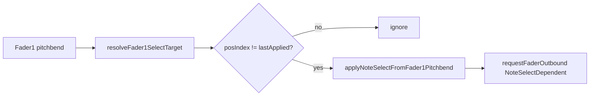

# Handoff — NOTE_EDIT fader feedback: selection-driven refresh

**Date:** 2026-07-01  
**Branch:** `load-save-sets-loops`  
**OpenSpec change:** [`openspec/changes/note-edit-fader-feedback-regression/`](../../openspec/changes/note-edit-fader-feedback-regression/)  
**Prior handoff:** [`docs/plans/note_edit_fader_feedback_option_d_aggressive_refresh_handoff.md`](note_edit_fader_feedback_option_d_aggressive_refresh_handoff.md)  
**Build env:** `teensy41-capture-serial`  
**Capture port:** `/dev/cu.usbmodem154944801`

---

## Status summary

| Milestone | Status |
|-----------|--------|
| Option D timing levers (quiet gate, stale-echo, dirty flags) | **Removed** — superseded by this refactor |
| Plan A: `sendDependentFaderFeedbackNow` on selection change | **Superseded** by Plan B |
| Pipeline for session/GPIO/length-mode F1-bracket paths | **Retained** |
| Plan B: pipeline for dependent refresh (`NoteSelectDependent`) | **Shipped** (local) |
| Plan C: restart-on-selection + delta partial plans | **Shipped** (local) |
| Sync drain after `NoteSelectDependent` apply | **Shipped** (local) |
| Nav-slot-index apply gate (`lastAppliedSelectNavSlotIndex_`) | **Shipped** (local) |
| Same-tick sibling select (`resolveNoteIdxAtSlot`) | **Shipped** (local) |
| Geometry driver F1 override | **Shipped** (local) |
| Capture verification | **Pending** — flash + co-located note sweep |

---

## Problem (capture-backed)

Slow fader-1 selection moves were swallowed because F2/F3/F4 outbound armed `selectFaderFeedbackIgnoreUntilMs_` (1500 ms) even though fader-1 motor was never moved. `shouldIgnoreFaderInput` then dropped incoming fader-1 input when `userDelta < SELECT_MOVEMENT_THRESHOLD` (100). Fast moves overrode; slow moves did not.

Layered compensations (quiet timer, dirty flags, coalesce, grace period, stale-echo lockout) added complexity without fixing the root cause.

---

## Solution

**Single rule:** when pitch-mapped nav **slot index** differs from `lastAppliedSelectNavSlotIndex_`, apply selection from `slots[posIndex]` and run a **FULL** `NoteSelectDependent` pipeline (F2 + F3 + F4).

- Slot change → always FULL dependent burst (including same-tick siblings)
- Same slot index → `apply=0` (micro-wiggle within slot)
- Bracket tick / `findSlotIndexForSelection` → **not** used in apply gate
- `resolveNoteIdxAtSlot` → always `slot.noteIdx`
- In-flight `NoteSelectDependent` → **RESTART** (cancel stale burst), not COALESCE
- After each `apply=1`, **sync-drain** before next pitchbend is handled
- GPIO / session open → `syncLastAppliedSelectNavSlotFromSelection` seeds `lastApplied`



**Cross-talk guard retained:** value-based `shouldIgnoreFaderInput` + `armSelectFaderFeedbackIgnore` only on real fader-1 motor sends (`sendFader1BracketFeedback`).

---

## Removed

| Item | File |
|------|------|
| `processFaderSelectQuiet`, `kFader1QuietMs`, `SelectPhase` | `NoteEditFaderOutboundPlan.h`, `NoteEditManager.cpp` |
| Dirty flags (`evaluateDependentFaderRefreshDirty`, `planForSelectDependent`, geometry snapshot) | `NoteEditManager.cpp/.h` |
| `sendDependentFaderFeedbackNow` synchronous burst (Plan A) | `NoteEditManager.cpp/.h` |
| Grace/stale-echo lockout in `applyNoteSelectFromFader1Pitchbend` | `NoteEditManager.cpp` |
| `armSelectFaderFeedbackIgnore` on F2/F3/F4 pipeline steps and `completeOutboundPipelineAtDone` tail | `NoteEditManager.cpp` |

---

## Primary files

| Area | Files |
|------|-------|
| Selection + send | [`src/NoteEditManager.cpp`](../../src/NoteEditManager.cpp) — `handleSelectFaderInput`, `requestFaderOutbound(NoteSelectDependent)`, `applyNoteSelectFromFader1Pitchbend` |
| Pipeline (F1-bracket family) | [`include/Utils/NoteEditFaderOutboundPlan.h`](../../include/Utils/NoteEditFaderOutboundPlan.h), `processFaderOutbound` |
| Tests | [`test/test_note_edit_fader_feedback/test_note_edit_fader_feedback.cpp`](../../test/test_note_edit_fader_feedback/test_note_edit_fader_feedback.cpp) |

---

## Verification gates

```bash
pio test -e native
pio run -e teensy41-capture-serial
# ask user before upload
pio run -e teensy41-capture-serial -t upload

.venv/bin/python scripts/capture_session.py --port /dev/cu.usbmodem154944801
# slow F1 sweep + note select in NOTE_EDIT
rg 'select_apply|outbound_step=' captures/<session>.log
.venv/bin/python scripts/analyze_fader2_select_feedback.py captures/<session>.log
```

**Pass criteria:**

| Check | Target |
|-------|--------|
| Every `select_apply apply=1` | Followed by `SEND_F2` + `SEND_F3` (+ `SEND_F4` when note selected) |
| Slow F1 sweep | No multi-second gaps without dependent send |
| `QUIET_REFRESH` | Absent (path removed) |
| `COALESCE` on `NoteSelectDependent` | Absent — use `RESTART` instead |
| `select_apply reason=nav_slot` | Present when `prior_slot != slot` |
| `select_apply prior_slot=` | Logged on every apply decision (capture-serial) |
| `dependent_plan mode=FULL` | On every nav-slot `apply=1` (no `NOTE_ONLY` on siblings) |
| `(2/2 notes at this position)` | Present when selecting second sibling at same 16th |
| `outbound_step=DRAIN_DONE` | Present after each `apply=1` dependent burst |
| `#DBG outbound_ctx f4` | `pitch` matches selected note on reselect |
| `#DBG geometry_override` | Present when F1 crosses geometry lockout with `userDelta >= 100` |
| `#DBG outbound_ctx f4 duplicate=1` | Logged on reselect with unchanged F4 CC (motor trigger still fires) |
| Zero `RESTART` without `SEND_F4` | On fast F1 oscillation (`apply=1` pairs) |
| Stall regression | No duplicate same-tick `SEND_F2` spam |

---

## Architecture checkpoint

| Question | Answer |
|----------|--------|
| Ownership change? | No |
| State transition change? | Yes — select path uses `NoteSelectDependent` pipeline; quiet/dirty timing removed; user approved |
