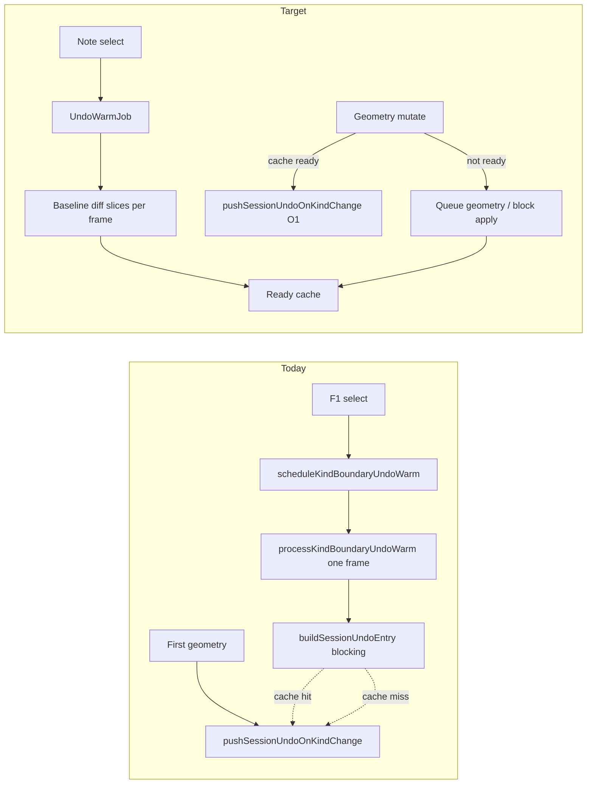

# NOTE_EDIT kind-boundary undo warm — incremental build refinement

**Status:** Proposed (2026-08-05)

**Problem:** First coarse or pitch geometry move after note select can stall the UI for hundreds of milliseconds while `buildSessionUndoEntry` runs on the fader or geometry apply path. Display skips an update; subsequent moves feel smooth once the kind-boundary undo row exists.

**Evidence:** [`captures/session_20260805_231739.log`](../../captures/session_20260805_231739.log) — first pitch CC at 39.145s, `GeometryPipeline` at 39.808s (~663ms gap). Coarse first move in the same session applied in ~7ms when the warm cache hit.

**Related shipped work:** `scheduleKindBoundaryUndoWarm` after F1 select (`EditManager::applySelectNav`), single-frame `processKindBoundaryUndoWarm` calling blocking `buildSessionUndoEntry`, cache consumed in `pushSessionUndoOnKindChange` when `kindBoundaryUndoCacheRevision_ == sessionPreviewRevision_`.

**Cursor / ownership context:** [`docs/plans/firmware_ownership_lifetime_review.md`](firmware_ownership_lifetime_review.md) (NOTE_EDIT + PLAYING stability). Does **not** change undo routing or commit authority — only **when and how** the kind-boundary snapshot is prepared.

---

## Architectural principle

Kind-boundary undo must still represent session state **before** the first geometry mutation of a new kind. Preparation can be incremental and deferred; **application** (`pushSessionUndoOnKindChange` → undo stack push) stays synchronous and must not run until the warm job is `Ready` or a synchronous fallback completes.

This mirrors capture/overdub **SD persist** slicing (`stepDeferredLoopPersist`, `processDeferredSaveState`) — FSM + cursor + per-frame budget — but operates on **RAM undo rows**, not SD I/O.

---

## What `buildSessionUndoEntry` does today

Owner: [`buildSessionUndoEntry`](../../src/NoteEditSessionUndo.cpp) (called from `EditManager::pushSessionUndoOnKindChange`, `processKindBoundaryUndoWarm`, commit paths).

| Phase | Work | Likely cost |
|-------|------|-------------|
| **A. Focus snapshot** | `snapshotFocusForSessionUndo` | Low |
| **B. Session flat read** | `editSession.store.readEvents()` → lazy `copyEventsTo` | Medium on large loops |
| **C. Baseline diff probe** | `noteEditFocusHasPendingBaselineMapDiff` — scan `baselineMap` × session | Medium–high |
| **D. Overlap resolve** | `resolveOverlapNotesForPreCommit` (if overlap scratch non-empty) | Medium |
| **E. Flat copy for diff** | `flatForBaselineDiff.assign(resolvedFlat)` | Medium |
| **F. Edit rows** | `buildPreCommitEditPasses` → `buildPreCommitBaselineLiveDiffOverlapPasses` + mover rows | Medium–high (second baseline scan) |
| **G. Heap admit** | `canHeapAdmitSessionUndoEntry` / `pushEntry` | Low unless reject |

Fast path when `!needsBaselineMapDiff`: phases D–F skipped; entry is focus + selection + empty `editRows`. **Phase 1 timing will confirm** whether first-move lag is undo build vs pitch prep (`recordBaselinePitchLaneRestoreOverlapCandidates`, `syncNoteEditFocusLastFromSessionStore`) vs geometry pipeline.

---

## Recommended implementation order

Minimize risk: profile first, structure second, slice only the proven dominant stage, warm early, defer global scheduler until necessary.

### Phase 1 — Instrument `buildSessionUndoEntry` (profile, behavior-preserving)

**Goal:** Factual per-phase timings in capture logs — no behavior change.

**Work:**

1. Add `SESSION_CAPTURE` (or `PERF_TELEMETRY` if aligned with existing `DIAG,timing`) markers around phases A–G in `buildSessionUndoEntry`.
   - Suggested line shape: `#CAP,<us>,UNDO_WARM,phase,<name>,<elapsed_us>,<baseline_count>,<session_pairs>`
   - Use `micros()` deltas; name phases: `focus_snap`, `read_events`, `baseline_probe`, `overlap_resolve`, `flat_copy`, `edit_rows`, `total`.
2. Mirror one aggregate line from `processKindBoundaryUndoWarm` and `pushSessionUndoOnKindChange` (cache hit vs miss vs sync fallback).
3. Optional native: host test that calls `buildSessionUndoEntry` on a fixture and asserts phases run (no timing asserts on host).

**Files:** `src/NoteEditSessionUndo.cpp`, optionally `src/Utils/DebugSessionCapture.cpp` if adding a helper macro.

**Gate:** Manual capture — first pitch + first coarse after select; grep `UNDO_WARM` and record which phase dominates.

**Proceed?** YES — read-only instrumentation.

---

### Phase 2 — `UndoWarmJob` with explicit stages (blocking per stage, behavior-preserving)

**Goal:** Separate **preparation** from **application** without changing undo semantics. Each stage still runs to completion in one call — no slicing yet.

**Work:**

1. Introduce `KindBoundaryUndoWarmJob` (or `UndoWarmJob`) on `EditManager`:
   - Stages enum: `Idle`, `PinSession`, `SnapshotFocus`, `BaselineProbe`, `OverlapResolve`, `BuildEditRows`, `Ready`, `Failed`.
   - Job fields: pinned `SessionMidiEventVec`, pinned `NoteEditFocus` / `EditorSelection` / `editPassIdsAtPush`, `sessionPreviewRevisionAtPin`, partial `SessionUndoEntry`, stage outputs (`needsBaselineMapDiff`, `needsOverlapResolve`).
2. Extract stage functions from `buildSessionUndoEntry` (same logic, callable in sequence):
   - `undoWarmJobPinSession`
   - `undoWarmJobSnapshotFocus`
   - `undoWarmJobRunBaselineProbe`
   - `undoWarmJobResolveOverlap` (optional stage)
   - `undoWarmJobBuildEditRows`
3. `stepKindBoundaryUndoWarmBlocking(job, track)` — runs all stages in one call; result identical to today’s `buildSessionUndoEntry` output.
4. Wire `processKindBoundaryUndoWarm` → job runner; `pushSessionUndoOnKindChange` unchanged (still uses cache or sync `buildSessionUndoEntry` fallback until Phase 3).
5. Invalidate job on: session close, select change (`shouldResetGeometryKindUndoOnSelectChange`), `sessionPreviewRevision_` drift vs pin, capture fold.

**Files:** `include/NoteEditSessionUndo.h` (job struct + stage API), `src/NoteEditSessionUndo.cpp`, `include/EditManager.h`, `src/EditManager.cpp`.

**Tests:** Extend `test_note_edit_session_undo` — job blocking path matches direct `buildSessionUndoEntry` for fixtures (overlap, no-overlap, empty focus).

**Gate:** `pio test -e native`; capture shows same undo behavior, `UNDO_WARM` phases still sum to prior total.

**Proceed?** YES after Phase 1 confirms profile.

---

### Phase 3 — Slice dominant stage only (baseline diff cursor + per-frame budget)

**Goal:** Spread the expensive baseline scan across main-loop frames; **do not** slice until Phase 1 identifies the dominant phase (expected: **C + F**, baseline map × session).

**Work:**

1. Add cursor over `baselineMap` (stable iteration order — document whether `std::map` key order or explicit index vector).
2. `stepKindBoundaryUndoWarmSlice(job, track, budgetUs)`:
   - Resume from `job.stage` + `baselineCursor`.
   - Process baseline keys until `micros() - sliceStart >= budgetUs` or map exhausted.
   - Accumulate partial `EditPass` rows into `job.partialEntry.editRows`.
3. Budget constants (initial — tune from Phase 1):
   - Transport active: **300 µs** (align `Config::maxPersistenceMicrosActive`)
   - Transport idle: **2000 µs** (align visual idle slice headroom)
4. `beginGeometryMutation` / `pushSessionUndoOnKindChange`:
   - If job `Ready` and revision matches → O(1) cache take (today’s path).
   - If job in progress → return `false` from `beginGeometryMutation` (geometry stays queued on playing path) **or** synchronous fallback only when user opts / job `Failed` (log warning).
5. `processKindBoundaryUndoWarm` becomes slice driver (called from `ControlSurfaceManager::update` and before `processPendingPlayingGeometry`).

**Files:** same as Phase 2 + `include/Globals.h` or `NoteEditSessionUndo.h` for budget constants.

**Invariants:**

- Pinned session flat must not change mid-job; invalidate if store mutates.
- Undo row content must match blocking `buildSessionUndoEntry` for same pin (native parity test).

**Tests:** Native test with artificial large `baselineMap` — assert N slices produce same `editRows` as one-shot build.

**Gate:** Capture — first pitch/coarse after select: no >50ms gap between fader ingress and `GeometryPipeline` when warm completed before user moves; if user moves early, display may wait but main loop stays responsive.

**Proceed?** YES only after Phase 1 names dominant stage; if overlap resolve dominates, slice that stage instead (same pattern).

---

### Phase 4 — Start warm on note selection (not first geometry mutation)

**Goal:** Most users never hit the delay — warm begins as soon as selection is stable, not when kind changes.

**Today:** `scheduleKindBoundaryUndoWarm` already runs from `applySelectNav` when `shouldResetGeometryKindUndoOnSelectChange`. Gap: warm is **one blocking frame** later; fast fader input can beat it; revision bump invalidates cache.

**Work:**

1. On select (and NOTE_EDIT session open with existing selection): `scheduleKindBoundaryUndoWarm` → transition job to `PinSession` immediately; do **not** wait for kind change.
2. Run `stepKindBoundaryUndoWarmSlice` every `ControlSurfaceManager::update` while job active and not `Ready`.
3. After F1 motor outbound completes (`SessionOpen` / `NoteSelect` pipeline Done), prioritize warm slices before non-urgent idle work (ordering: MIDI → `processPendingPlayingGeometry` → **undo warm slice** → deferred display playback flush).
4. Re-schedule warm when:
   - Selection identity changes
   - `sessionPreviewRevision_` changes **after geometry** (invalidate; optional re-warm on idle)
   - Not on every `bumpSessionPlaybackPreviewRevision` (playback-only defer must not invalidate warm pin)
5. Document: warm pin uses `sessionPreviewRevision_` at select time; geometry edits bump revision and require re-warm before **next** kind boundary (acceptable — user already editing).

**Files:** `EditManager.cpp` (`applySelectNav`, `prepareNoteEditSessionOpen` / session open path), `ControlSurfaceManager.cpp` (`update`, `sendNoteEditSessionFaderFeedback` completion).

**Gate:** HITL — select note while PLAYING, wait 1s, first coarse/pitch move shows immediate display update; rapid move within 100ms of select may queue until `Ready` (acceptable if loop stays responsive).

**Proceed?** YES after Phase 3 slice path works.

---

### Phase 5 — Cooperative scheduler (only if needed)

**Goal:** Arbitrate undo warm vs persistence drain vs visual cache slices — **only** if Phase 3–4 show frame starvation from competing background jobs.

**Defer until:** Profile shows undo warm slices colliding with `processDeferredSaveState` or `rebuildVisualCacheIdleSlice` on the same frames under real use.

**Sketch (not implemented yet):**

- Single `IdleMaintenanceBudget` per frame passed to `Track::processDeferredIdleMaintenance`, `processKindBoundaryUndoWarmSlice`, and optionally persistence mid-pass.
- Priority: transport MIDI > playing geometry apply > undo warm > playback merged defer > SD persist > visual cache.

**Proceed?** NO until evidence — avoid scheduler complexity per project decision ladder.

---

## Call-site map (today)

| Function | Role |
|----------|------|
| `EditManager::applySelectNav` | `scheduleKindBoundaryUndoWarm` on selection change |
| `ControlSurfaceManager::update` | `processKindBoundaryUndoWarm` |
| `ControlSurfaceManager::processPendingPlayingGeometry` | warm before geometry apply (playing) |
| `EditManager::beginGeometryMutation` | `pushSessionUndoOnKindChange` |
| `EditManager::pushSessionUndoOnKindChange` | cache hit or `buildSessionUndoEntry` |
| `buildSessionUndoEntry` | canonical row builder |

---

## Pre-implementation review

### Ready

- Problem evidenced in capture log (663ms first pitch).
- Existing warm hook on select; incremental path extends rather than replaces undo routing.
- Persistence slice pattern (`stepDeferredLoopPersist`, µs budgets) is the template.
- Playing geometry queue (`processPendingPlayingGeometry`) already blocks apply when `beginGeometryMutation` fails.

### Resolved (plan)

| Topic | Decision |
|-------|----------|
| Slice scope | Dominant stage only (likely baseline diff), after Phase 1 profile |
| Undo before mutate | Job must reach `Ready` or sync fallback; no optimistic geometry without undo |
| Revision key | `sessionPreviewRevision_` at pin; playback-only bumps do not invalidate |
| Scheduler | Phase 5 deferred |

### Open before coding

1. **Phase 1 first** — confirm dominant phase; do not slice overlap resolve if baseline diff is &lt;10% of total.
2. **Pin strategy** — copy flat once vs `shared_ptr` to store snapshot; prefer copy once at `PinSession` for simplicity (measure in Phase 1).
3. **`beginGeometryMutation` failure UX** — playing path already queues; stopped path should log once and retry next frame (no silent drop).
4. **OpenSpec** — `/opsx:propose` only if undo row semantics change; this plan is behavior-preserving refinement.

### Proceed?

**YES** for Phase 1 instrumentation without user gate. Phases 2–4 require Phase 1 profile + native parity tests.

---

## Verification

| Phase | Automated | Manual |
|-------|-----------|--------|
| 1 | Optional native smoke | Capture grep `UNDO_WARM`; table of phase ms |
| 2 | `test_note_edit_session_undo` parity job vs `buildSessionUndoEntry` | Same HITL as today |
| 3 | Large baseline fixture slice parity | NOTE_EDIT + PLAYING rapid coarse/pitch; no reboot |
| 4 | — | Select → wait → move (instant); select → immediate move (queued, responsive UI) |

---

## Files (expected touch list)

| File | Phases |
|------|--------|
| `src/NoteEditSessionUndo.cpp` | 1–3 |
| `include/NoteEditSessionUndo.h` | 2–3 |
| `src/EditManager.cpp` | 2–4 |
| `include/EditManager.h` | 2–4 |
| `src/ControlSurfaceManager.cpp` | 3–4 |
| `test/test_note_edit_session_undo/` | 2–3 |
| `src/Utils/DebugSessionCapture.cpp` | 1 (optional helper) |

**Protected:** Do not change `applySessionUndoEntry`, global undo routing, or `commitAllPendingNoteEditActions` in this plan.

---

## Risk summary

| Risk | Mitigation |
|------|------------|
| Stale pin if session mutates during warm | Invalidate job on store write; revision check |
| Slice order nondeterminism | Fixed baseline key order; native parity tests |
| User moves before `Ready` | Queue playing geometry; slice runs every frame |
| False fast path | Phase 1 timing proves whether `needsBaselineMapDiff` is false on first pitch |
| Scope creep into global scheduler | Phase 5 explicitly deferred |

---

## Implementation checklist

- [ ] **Phase 1** — `UNDO_WARM` timing in `buildSessionUndoEntry`; capture profile on `session_*` HITL
- [ ] **Phase 2** — `UndoWarmJob` stages; blocking runner; native parity
- [ ] **Phase 3** — Baseline cursor + µs budget slices; geometry waits for `Ready`
- [ ] **Phase 4** — Warm starts on select; slice every `update`; revision invalidation rules
- [ ] **Phase 5** — (optional) cooperative idle budget only if profile requires
