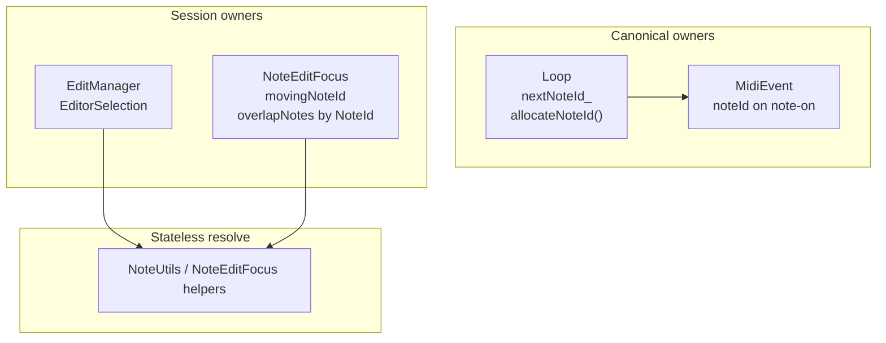
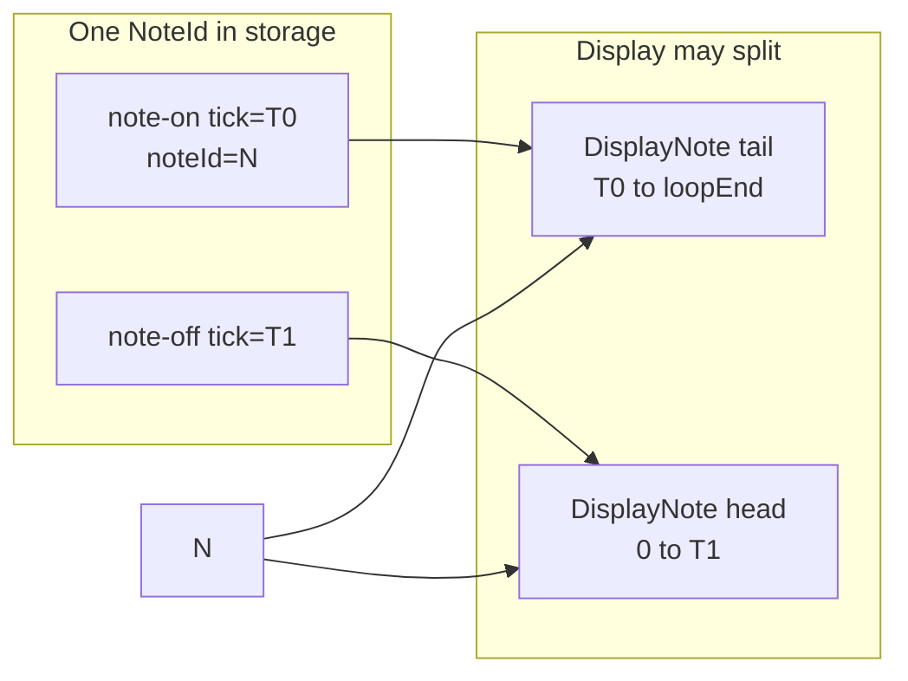
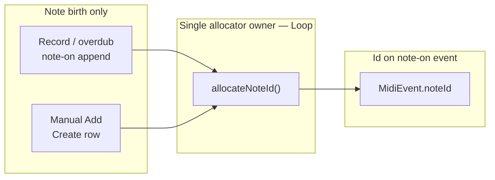
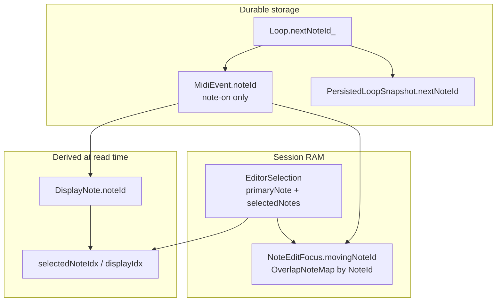

> **Execution authority:** [`openspec/changes/note-edit-stable-note-id/`](../../openspec/changes/note-edit-stable-note-id/) — this file is backup/reference only.

# Stable NoteId — ownership and indexing service

## NoteId vocabulary (no “mint”)

| Term | Meaning |
|------|---------|
| **Allocate** | Take the next serial number from `Loop::nextNoteId_` (same idea as `nextPassId_` for edit passes) — `allocateNoteId()` |
| **Assign** | Write that number onto a **note-on** `MidiEvent.noteId` when the note is created |
| **Assign guard rail** | On session open, find note-ons with `noteId == 0` and assign missing ids (safety net) |

**Not used in this plan:** “mint” — borrowed jargon for “create a new unique id”; replaced with **allocate** + **assign** to match repo style.

---

## Architectural intent

Today the note editor identifies notes by **geometry** ([`NoteRef`](include/EditPass.h): channel, pitch, startTick, endTick). That couples editor state, UI state, and storage layout. Normal editing (move, pitch, length, overlap restore, wrap handling) **changes geometry**, forcing every consumer to continually rediscover “the edited note.”

This change introduces a stable **`NoteId`** representing the **lifetime of a logical note**.

| Layer | Rule |
|-------|------|
| **Geometry** | Mutable |
| **Identity** | Immutable (`NoteId` on note-on) |
| **Storage** | Remains MIDI-event based (`LoopEventStore` + passes) |
| **Display** | Remains fully reconstructed (`NoteUtils::reconstructNotes` → `DisplayNote`) |

`NoteId` exists solely to provide stable identity for:

- selection ([`EditorSelection`](include/NoteEditSessionState.h))
- edit replay ([`EditApply`](src/EditApply.cpp), [`EditPass`](include/EditPass.h))
- undo (note-edit session + global pass undo)
- motor fader synchronization
- future multi-select

It is **not** intended to change the storage architecture.

---

## Architectural invariants

These are the contract for future refactors. Violating any of these is a design bug.

1. **Loop** owns `NoteId` allocation.
2. **Loop** is the **only** allocator (`allocateNoteId()`).
3. **`EditorSelection`** stores only **`NoteId`s** (plus `trackId`, `loopId`, `bracketTick`) — never notes, pointers, or list indices as identity.
4. **Geometry never defines identity** — `NoteRef` removed for note targeting.
5. **Display indices are derived** — never stored in selection or undo as identity.
6. **`DisplayNote` is reconstructed** — not a second source of truth.
7. **`NoteId` never changes** on an existing logical note (move/pitch/length keep the same id).
8. **`NoteId` is never reused** within a loop — retired ids stay retired.
9. **Every edit resolves `NoteId` at mutation time** — `findNoteOnById` / `deleteNoteById` at apply, not cached global indices in undo rows.
10. **Caches never own identity** — see [Cache ownership](#cache-ownership) below.
11. **MIDI event storage is the single source of truth** — ids live on note-on events in the store.

---

## Main architecture

Identity originates in **`Loop`**, flows through reconstruction and selection, and resolves back to **`LoopEventStore`** at mutation time. This is the canonical diagram for the change:

```text
Loop
   │
allocateNoteId()
   │
   ▼
MidiEvent.noteId
   │
reconstructNotes()
   │
   ▼
DisplayNote.noteId
   │
   ▼
EditorSelection.primaryNote
   │
   ▼
EditPass.targetNoteId
   │
   ▼
findNoteOnById()
   │
   ▼
LoopEventStore
```

| Step | Rule |
|------|------|
| `allocateNoteId()` | **Only** on logical note **birth** (see regression list below) |
| `MidiEvent.noteId` | Stored on **note-on only** — canonical identity; see [decision rationale](#decision-rationale-midieventnoteid-on-note-on-not-a-parallel-object-graph) |
| `reconstructNotes()` | **Derives** `DisplayNote.noteId` — never allocates |
| `EditorSelection` | **References** ids — never owns notes or allocates |
| `EditPass.targetNoteId` | **References** id for replay — Create rows carry id on `addedEvents` note-on |
| `findNoteOnById()` | **Resolves** id → live note-on in store at apply/undo time |
| `LoopEventStore` | **Single source of truth** — all mutations land here |

**EditApply** and session undo sit on the `findNoteOnById()` → `LoopEventStore` path; they do not introduce new ids except when replaying a **Create** row (id already on the stored `addedEvents` note-on).

---

## NoteId allocation regression list

Use this as the **primary native + HITL regression contract** for phase B. Any path that allocates outside “Creates NEW” or fails to preserve id on “Does NOT” is a bug.

### Creates NEW `NoteId`

| Operation | When id is allocated | Code path | Regression check |
|-----------|---------------------|-----------|------------------|
| **Recording** | Each **note-on** appended to capture during `RECORDING` | [`Track::recordMidiEvents`](src/Track.cpp) → `allocateNoteId()` on NOTE_ON | After record stop: every sealed note-on has `noteId != 0`; ids unique and monotonic |
| **Overdub** | Each **note-on** appended during `OVERDUBBING` (same capture path as record) | [`Track::recordMidiEvents`](src/Track.cpp) | After overdub stop / fold: captured note-ons in session or passes have ids; no duplicate ids |
| **Manual Add Note** | User creates note at bracket (encoder / NOTELEN create) | [`createNoteAtTick`](src/EditStates/EditSelectNoteState.cpp) → `EditActionType::Create` → note-on in `addedEvents` | New note-on gets **one** new id; note-off has **no** id; id stable on later edits |

**Safety net (not user birth):** `assignMissingNoteIds()` on session open — allocates **only** when `noteId == 0` on an existing note-on (guard rail). Log WARNING per assign. Native test: session with id-less note-ons → open edit → all note-ons assigned, `nextNoteId_` advanced correctly.

### Does NOT create NEW `NoteId`

| Operation | Expected behavior | Code path | Regression check |
|-----------|-------------------|-----------|------------------|
| **Move** | Same `noteId` on note-on; start/end ticks change | [`sessionMidiEvents()`](src/EditManager.cpp) / move apply | `noteId` unchanged before/after move; fader/selection still targets same id |
| **Pitch** | Same `noteId`; pitch field changes | pitch edit apply | id unchanged; geometry updated |
| **Length** | Same `noteId`; end tick / note-off pairing changes | length edit apply | id unchanged on note-on |
| **Velocity** | Same `noteId`; velocity on note-on changes | velocity update path | id unchanged |
| **Quantize** | Same `noteId`; ticks snapped | quantize apply | id unchanged per note |
| **Overlap Restore** | **Reuses** original `NoteId` from `OverlapNote` / focus entry | [`NoteMovementUtils`](src/Utils/NoteMovementUtils.cpp) overlap restore | Restored note-on carries **same** id as before hide/shorten; **no** `allocateNoteId()` call |
| **Undo** | Restores events + selection with **same** ids from snapshot | [`restoreFromSnapshot`](src/NoteEditSessionUndo.cpp), global pass undo | `primaryNote` and event `noteId`s match pre-undo state; no new ids minted |
| **Redo** | Re-applies same snapshot / pass rows | redo stack replay | Same ids as first application; Create redo does not re-allocate |

**Also does NOT allocate:**

| Operation | Notes |
|-----------|--------|
| **Delete** | Removes note-on + paired off; id may enter undo snapshot but **no new id** |
| **`reconstructNotes()`** | Read-only derive → `DisplayNote.noteId` |
| **Wrap display split** | Two `DisplayNote` rows, **one** `noteId` |
| **Fader select / motor sync** | Updates `EditorSelection` only — references existing ids |
| **Note-off events** | Never carry `noteId`; pair to note-on by channel+pitch+LIFO |

### Suggested native test suite (`test_note_id_allocation` or extend `test_edit_apply`)

1. Record fixture → assert all note-ons have unique monotonic ids  
2. Move/pitch/length fixture → assert `noteId` unchanged on targeted note-on  
3. Manual Add → assert new id > max existing; subsequent move keeps id  
4. Overlap restore fixture → assert restored note-on id equals pre-hide id  
5. Session undo round-trip → assert `EditorSelection.primaryNote` and event ids restored  
6. `assignMissingNoteIds` → assert assigns only zeros; does not touch non-zero ids  

---

**Identity can outlive storage temporarily.**

After **Delete**, the note-on and note-off may be **removed from the live store**, but the logical note may still be restored via:

- **Global undo** (pass-level restore)
- **Note edit undo** (session snapshot restore)

Only when **no undo path** can restore the note does the `NoteId` become **permanently retired**. The allocator **never reuses** retired ids.

```text
Storage (live)          Logical note (identity)
─────────────          ───────────────────────
note-on + note-off  →  NoteId N  (while in store)

Delete              →  events gone from store
                       NoteId N still in undo snapshot

Undo restore        →  same NoteId N, events back

Final deletion      →  no undo path left
(no longer reachable)  NoteId N retired forever
```

---

## Logical note lifecycle

```text
Logical Note

        Created (user record / overdub / manual Add)
            │
            ▼
    allocateNoteId() + assign on note-on
            │
            ▼
        Stored
    (note-on + note-off in LoopEventStore / session store)
            │
            ▼
        Selected
    (EditorSelection.primaryNote)
            │
            ▼
        Edited
    (move / pitch / length — same NoteId)
            │
            ▼
    Wrap split (display only)
    (two DisplayNotes, one NoteId)
            │
            ▼
        Deselected
            │
            ▼
        Deleted
    (events removed after pair-resolution)
            │
            ▼
    Removed from live storage
            │
            ▼
──────────────────────────────
Undo paths (identity preserved)
──────────────────────────────

Global Undo  ──▶  Restored (same NoteId)

Note Edit Undo  ──▶  Restored (same NoteId)

Redo delete  ──▶  Deleted again (still same NoteId)

Final deletion (no undo)  ──▶  NoteId retired forever
```

---

Today selection and fader feedback also key off **ephemeral list indices** (`selectedNoteIdx`, `displayIdx`), which shift when the inventory rebuilds — causing false “selection changed” fader motor events. Stable `NoteId` fixes that alongside the geometry problem above.

---

## Design decisions (user-confirmed 2026-07-01)

| Topic | Decision |
|-------|----------|
| **NoteRef → NoteId** | **Full replace** — `NoteRef` removed for note targeting; **`NoteId` only** (live + committed `EditPass` rows). `ControlChangeRef` stays until phase D. |
| **Note object identity** | **One `NoteId` per note** — stored on **note-on only**. Note-off pairs via LIFO / scan. Wrap display split (tail on→loop end + head 0→off) shares the same id; **delete removes both MIDI events**. |
| **Note-off field** | **No** mirrored `noteId` on note-off — saves bytes; lookup from note-on. |
| **Migration** | **None** — dev code; SD v6 clean break; wipe and re-record. |
| **Multi-select** | Ship **`EditorSelection`** now with `std::vector<NoteId> selectedNotes` + `primaryNote`; single-select is `isSingle()`. |
| **All serial ids** | **`uint32_t`** — `NoteId`, `TrackId`, `PassId`, `LoopId` (existing), etc. |
| **Session-open ids** | **Assign guard rail** — `assignMissingNoteIds` on note-edit session open (see below); debug log on assign |
| **`SelectNavSlot`** | Carries **`NoteId`** per slot (phase B) — not `EditorSelection` (see below) |
| **Global undo** | **No `NoteRef`** on `TrackUndo` paths — confirmed |

### Decision rationale: `MidiEvent.noteId` on note-on (not a parallel object graph)

**Rejected:** a separate `Note` table, sidecar id map, or parallel object graph keyed by `NoteId` alongside `LoopEventStore`.

**Chosen:** `uint32_t noteId` on the **note-on** [`MidiEvent`](include/MidiEvent.h) inside the existing event stream.

**Rationale:** The canonical representation of a note in this firmware is still the **note-on event** (paired with note-off for length). Storage remains chunked MIDI events in [`LoopEventStore`](include/LoopEventStore.h) + passes — not a DAW-style note object layer. Putting `NoteId` on the note-on:

- Keeps **one source of truth** — identity travels with the event through capture, session store, materialize, and SD v6
- Avoids sync between a parallel graph and the event store (no second structure to invalidate on move/delete/fold)
- Matches how pairing already works (note-on is the anchor; note-off resolves by channel+pitch+LIFO)
- Keeps playback hot paths unchanged — global event index + raw `MidiEvent` vectors; `NoteId` is for editor/undo/selection only

`DisplayNote`, `EditorSelection`, and `EditPass.targetNoteId` **reference** this field; they do not duplicate durable identity.

---

## Naming model — `Id` vs `Handle` vs `Ref`

### What this repo already uses

| Suffix | Meaning | Examples |
|--------|---------|----------|
| **`Id`** | Stable serial, allocator-owned, survives edits | [`PassId`](include/EditPass.h), [`LoopId`](include/LoopPasses.h), [`EditPassId`](include/EditPass.h), `UndoEntryId` |
| **`Ref`** | Geometry snapshot (CC only after note phase B) | [`ControlChangeRef`](include/EditPass.h) until phase D — **`NoteRef` removed** |
| **Index** | Ephemeral list position | `displayIdx`, `selectedNoteIdx`, `LoopEventStore` global index |

### Industry / common practice

- **DAW and sequencer codebases** overwhelmingly use **`*Id`** for stable entity identifiers (`NoteId`, `ClipId`, `TrackId` in Ableton's LOM-style APIs, Bitwig, many Rust audio crates).
- **`*Handle`** is common in C++ when the identifier is an **indirection into a table that can be invalidated** (ECS entity handles, graphics resource handles). It signals “resolve before use; may be stale.”
- **`*Ref`** in this project already means **baseline geometry** on committed edit rows — using `NoteHandle` for serial ids would collide mentally with that split.

**Recommendation:** adopt the repo pattern — **`NoteId`** for this change. Reserve **`Ref`** for committed edit-pass CC baselines until phase D.

### Future object ids (out of this OpenSpec)

The `NoteId` architecture is **intentionally reusable** for future editable object types (e.g. `ControlChangeId` in phase D) but introduces **no abstractions** for them today.

| In scope here | Out of scope (own OpenSpecs later) |
|---------------|-------------------------------------|
| `NoteId`, `EditorSelection` note fields | `JamId`, scene ids, jam entity ids |
| `LoopId` on `EditorSelection` (exists today) | `ControlChangeId` implementation — **phase D only** (stub reference OK) |
| `TrackId = uint32_t` naming hygiene (phase 0) | Track reorder / stable track entity beyond index |

Do not expand this change with Jam/M10 id design. **`ClipId`** is not project vocabulary — use **`LoopId`** for stored MIDI slots.

---

## Architecture checkpoint

| Question | Answer |
|----------|--------|
| Ownership change? | **Yes** — `Loop` allocates ids; `MidiEvent` gains fields; `EditorSelection` replaces flat `NoteEditSelection` |
| State transition change? | **Yes** — id assignment at capture seal and edit Create |

Design session before implementation (not a fader-feedback patch).

---

## `EditorSelection` (replaces `NoteEditSelection`)

Owned by **`EditManager`**. Scoped to which loop is being edited:

```cpp
using TrackId = uint32_t;
using NoteId = uint32_t;
constexpr NoteId kInvalidNoteId = 0;
constexpr TrackId kInvalidTrackId = UINT32_MAX;  // or 0 — pick one in OpenSpec, match LoopId style

struct EditorSelection {
  TrackId trackId = kInvalidTrackId;
  LoopId loopId = kInvalidLoopId;

  std::vector<NoteId, InternalHeapFirstAllocator<NoteId>> selectedNotes;
  NoteId primaryNote = kInvalidNoteId;

  uint32_t bracketTick = 0;  // nav grid — retained from NoteEditSelection

  bool isEmpty() const { return selectedNotes.empty(); }
  bool isSingle() const { return selectedNotes.size() == 1; }
  bool isMultiple() const { return selectedNotes.size() > 1; }
};
```

| Field | Role |
|-------|------|
| `trackId` + `loopId` | Address **which loop** on **which track** |
| `selectedNotes` | Full selection set — chord / multi-select ready |
| `primaryNote` | Fader-1 mover, motor sync anchor, delete default target |
| `bracketTick` | 16th-step nav position (orthogonal to note ids) |

**Fader feedback gate:** fire when **`primaryNote`** changes or when `selectedNotes` set changes (not `displayIdx`).

**Phase 1 behavior:** always `selectedNotes = { one }`, `primaryNote = that id`. UI still single-select; vector API is stable for later.

**`primaryNote` at same 16th slot (chord):** **first selected** — when fader-1 enters a slot with multiple notes, the first note in **pitch-low → pitch-high** order becomes `primaryNote` / `selectedNotes[0]` until user moves to sibling (existing [`SelectNavigation`](src/Utils/SelectNavigation.cpp) already sorts same-step by pitch ~L52–58).

**Cached geometry:** `NoteBaseline` on `focus` (`commitBaseline`, `last`) — derived from `primaryNote` via `resolveNoteById`; **no `NoteRef` in selection or focus identity**.

### `EditorSelection` ownership invariant

```
EditorSelection never owns notes.

It owns NoteIds only.

Pointers, indices, and DisplayNotes are always resolved when required.
```

Do not cache `DisplayNote*`, store indices as selection identity, or persist list positions in undo selection snapshots.

### `displayIdx` / list index — derive only, no stored `Idx` in selection

**Problem:** `NoteId` (stable identity) vs `displayIdx` / `selectedNoteIdx` (ephemeral position in a rebuilt list) are different concepts. Storing both in selection caused fader/drag bugs.

**Decision (user):** **Do not store list index in `EditorSelection`.** Derive at use time from `primaryNote` + sorted inventory.

| Concept | Name | Stored? | Role |
|---------|------|---------|------|
| Stable note identity | **`NoteId`** | Yes — on note-on + in `EditorSelection` | Selection, edit, undo, fader anchor |
| Sorted selectable inventory | **built per nav action** | No — ephemeral vector | Fader-1 iteration, OLED draw input |
| Position in that inventory | **derived index** | No — compute when drawing | `indexInSelectableInventory(primaryNote, inventory)` only |

**Sorted inventory for select / fader-1:** rebuild from `filterSelectableDisplayNotes(...)` with stable sort:

1. `startTick` (storage tick)
2. `pitch` (low → high) for same tick / same 16th step

[`SelectNavigation::buildSelectNavigationSlots`](src/Utils/SelectNavigation.cpp) already does this for 16th steps. Fader-1 small movement within a chord walks slots in pitch order.

**Migration path (displayIdx refactor first — phase A):**

1. Gate motor sync / apply on **selection identity** (ref today → `primaryNote` in phase B) — not list index alone  
2. Remove `displayIdx` from persisted selection; derive list index for OLED only  
3. **Windowed inventory** — sorted selectable list = notes **visible in piano-roll window** only; rebuild when window scrolls (see Phase A acceptance)  
4. Remove dead overlap/chord list-selection helpers superseded by fader + `SelectNavigation`  
5. Phase B: `SelectNavSlot.noteId` + `EditorSelection.primaryNote`


---

## Ownership split (modules)

Secondary view — **which modules own state** vs the [Main architecture](#main-architecture) identity flow above:


### 1. Id allocation — **`Loop`**

```text
Loop owns NoteId allocation.

Loop::allocateNoteId() is the ONLY allocator.

Ids are:
  • monotonic
  • unique within one Loop
  • never reused
  • never modified (on an existing logical note)
```

**`assignMissingNoteIds()`** (session-open guard rail) **never generates ids itself** — it only calls `Loop::allocateNoteId()` for each note-on with `noteId == 0`, then assigns the result.

| Responsibility | Where |
|----------------|--------|
| `nextNoteId_` | [`Loop`](include/Loop.h) — `allocateNoteId()` |
| Persist counter | [`PersistedLoopSnapshot`](include/StorageLoopIo.h) — **v6, no migration** |
| Assign on record/overdub append | [`Track::recordMidiEvents`](src/Track.cpp) — primary |
| Assign stragglers at stop/fold | [`Loop::sealCapture`](src/Loop.cpp), [`foldLiveCaptureIntoNoteEditSession`](src/EditManager.cpp) — safety net |
| Assign on edit Create | user Add → note-on in `addedEvents` |
| Assign on session open | `assignMissingNoteIds()` — guard rail only |

**Storage:** `uint32_t noteId` on **note-on `MidiEvent` only** (`0` = invalid).

### 2. Selection — **`EditManager`** via **`EditorSelection`**

Replaces [`NoteEditSelection`](include/NoteEditSessionState.h). `selectedNoteIdx` / `displayIdx` become **derived** for OLED only.

### 3. Resolve helpers — stateless, no Manager

Extend [`NoteUtils`](include/Utils/NoteUtils.h) / [`NoteEditFocus`](include/NoteEditFocus.h). **No new resolve class today** — keep lookup responsibilities in one place; avoid scattering id→event resolution across unrelated helpers.

**Reserved helper surface** (functions, not a service class):

| Helper | Role |
|--------|------|
| `findNoteOnById` | `NoteId` → note-on `MidiEvent` / store index |
| `resolveDisplayNoteById` | `NoteId` → `DisplayNote` from reconstructed list |
| `deleteNoteById` | Remove note-on + paired off (after pair-resolution) |
| `filteredDisplayNoteIndexForNoteId` | Ephemeral OLED / nav index |

Identity propagation: see [Main architecture](#main-architecture). Mutation always ends at **`LoopEventStore`** via `findNoteOnById()` — not a second duplicate flow diagram here.

---

## Cache ownership

```
Caches never own identity.

Caches are always rebuildable.

They mirror canonical storage.

Destroying every cache must never lose information.
```

Applies to:

| Cache | Owner | Rebuild from |
|-------|-------|--------------|
| `baselineMap` / overlap maps | `NoteEditFocus` | session store + `NoteId` keys |
| `Track` note cache (`CachedNoteList`) | `Track` | `reconstructNotes` on store |
| Filtered selectable inventory | ephemeral per nav | `filterSelectableDisplayNotes` + window filter |
| `SelectNavigation` slots | ephemeral per fader pass | window-filtered notes + bracket |

Invalidate caches on store mutation (`invalidateCaches()` after flat edits); never treat cache index as `NoteId`.

---

## Note object — one id, wrap display, delete



- **Storage:** one note-on (carries `NoteId`) + one note-off.
- **Display:** [`NoteUtils::reconstructNotes`](include/Utils/NoteUtils.h) may emit two `DisplayNote` rows for wrap — **same `noteId`** on both.
- **Delete:** `deleteNoteById(N)` removes note-on and paired note-off regardless of display split.

---

## Relationship to `LoopEventStore` global event index

**Different layers** — `NoteId` does not replace global event index.

| | Global event index | NoteId |
|---|-------------------|--------|
| Identifies | One **event** | One **note object** |
| Stable across move? | No | Yes |
| Playback hot path? | Yes | No |
| Selection identity? | No | Yes |

Resolve at use time: `NoteId → findNoteOnById → globalIndex` (mutation only; never store in undo/selection).

---

## Delivery sequence (user-confirmed order)

| Phase | Work | Notes |
|-------|------|-------|
| **0** | **`TrackId` + `NoteId` type aliases (`uint32_t`)** | Public/API surfaces only; no behavior change |
| **A** | **displayIdx refactor + fader selection** (current branch) | Stabilize gates; derive list index; **no `NoteId` yet** |
| **B** | **NoteId schema + EditorSelection** | Separate OpenSpec change after A stable |
| **C** | **Follow-up:** record/overdub in edit + display merge | Empty track → record; else overdub; manual insert allowed |
| **D** | **Follow-up:** `ControlChangeId` | After note path stable |

---

## Prerequisite: OpenSpec change (before Phase 0 implementation)

**Task 0 (process):** Create `openspec/changes/note-edit-stable-note-id/` with `proposal.md`, `design.md`, `tasks.md`, spec deltas — **migrate full content** from this plan, including **architectural contract** sections (intent, invariants, lifecycle, allocator guarantees, identity flow, cache/selection ownership).

**OpenSpec `design.md` must lead with:** Architectural intent → Invariants → **Main architecture** → **Allocation regression list** → Lifecycle → implementation touchpoints.

**After OpenSpec exists:** copy this plan to [`docs/plans/note_edit_stable_note_id_enhancement.md`](docs/plans/note_edit_stable_note_id_enhancement.md) as backup; keep OpenSpec as execution authority.

Update active OpenSpec / `CURRENT_WORK` when change is registered. Architecture checkpoint = **approved** via this design session.

---

## Phase A exit / acceptance criteria

Phase B starts only when all pass.

### Native

- `pio test -e native` green  
- `test_note_edit_fader_feedback` — selection gate tests pass  

### HITL — slow fader-1 sweep (canonical baseline + edit)

**Preset:** base record + **2 overdubs** (default HITL: [`HITL-Test-Flow.mdc`](.cursor/rules/HITL-Test-Flow.mdc) with second overdub enabled).

**Procedure:** Enter NOTE_EDIT on that loop → slow continuous fader-1 sweep **left → right** across full loop display.

**Pass:**

- Every **visible** note in the piano-roll window is **selected exactly once** over the full sweep (motor sync / `select_apply` / DNTE fires per note; no skipped notes, no stuck selection on one note)  
- Chord slots: pitch-low → pitch-high order within same 16th step  
- `select_ignored_rate` ≈ 0 (echo-only ignores)  

### Windowed sorted inventory

When detailed piano-roll shows **only X bars** from loop start (long-loop window — [`DisplayWindowUtils`](include/Utils/DisplayWindowUtils.h), [`PlaybackWindow`](include/PlaybackWindow.h)):

- Selectable sorted list = `filterSelectableDisplayNotes` **then** `filterDisplayNotesToWindow(notes, windowStart, windowLength, loopLength)`  
- Fader-1 nav slots built from **window-filtered** list only  
- **Rebuild** inventory + slots when window scrolls (`windowStartBar` / playhead recenter changes)  
- Notes outside window are **not** in fader sweep until scrolled into view  

### Dead code removal (phase A)

Remove unused overlap/chord **list-index** selection paths superseded by fader + `SelectNavigation`:

| Candidate | Location |
|-----------|----------|
| `notesAtBracketTick` / `notesAtBracketIdx` chord cycling | [`EditManager::moveBracket`](src/EditManager.cpp) |
| `selectNextNoteSequential` if encoder path unused for fader-era select | [`EditSelectNoteState`](src/EditStates/EditSelectNoteState.cpp) |
| Any helper that selects from overlapping note **list index** without nav slots | grep + delete if unreferenced |

**Keep:** `SelectNavigation::buildSelectNavigationSlots`, fader-1 resolve path, `filterSelectableDisplayNotes`.

### Phase A identity gate (pre-`NoteId`)

Until phase B: gate on **`NoteRef` equality** or derived ref from selection — **not** `displayIdx` / `selectedNoteIdx` delta alone.

---

## Session-open id policy: assert vs assign

| | **Assert** (`noteId == 0` → debug fault / log) | **Assign guard rail** (`assignMissingNoteIds`) |
|---|-----------------------------------------------|-----------------------------------------------|
| **Pro** | Catches bugs immediately; no silent repair | Resilient; edit-pass replay unused today but safe when enabled; stragglers after fold/seal get ids |
| **Con** | Hard stop on any missed id assignment path | Can mask allocator bugs if not logged |
| **Fit** | Strict CI / test builds | Product firmware + dev wipe |

**Decision:** **Assign guard rail** on `openNoteEditSession` / session store materialize — scan note-ons with `noteId == 0`, allocate from `loop.nextNoteId_` and assign, **log WARNING** per assign. Optional **debug assert** after assign if any still zero.

Edit-pass materialize replay is **unused in practice today**; guard rail costs little and keeps `findNoteOnById` safe when edit rows ship.

---

## `SelectNavSlot.noteId` vs `EditorSelection.primaryNote`

| | **`SelectNavSlot`** | **`EditorSelection`** |
|---|---------------------|----------------------|
| **What** | One **16th-step nav entry** in the full sweep map | **Current user selection** (session state) |
| **Cardinality** | Many slots (whole window / loop grid) | One `primaryNote` (+ `selectedNotes[]` for multi) |
| **Lifetime** | Rebuilt each fader nav pass | Persists until user moves selection |
| **Carries** | `relativeTick` + **`noteId`** (or empty) | `trackId`, `loopId`, `bracketTick`, ids |

**Why not only `EditorSelection`?** Fader-1 needs the **full navigable map** (empty steps + chords) to resolve pitchbend → slot → note. `primaryNote` is the **output** after resolving a slot, not a substitute for the slot list.

**Phase B flow:**

```
buildSelectNavigationSlots(windowFilteredNotes) → slots[].noteId
fader pitchbend → resolve slot → if slot.noteId != primaryNote → update EditorSelection
```

---

## SD v6 wire format (phase B detail)

**Reject** slot files with v5 `NoteRef`-sized edit rows / old `MidiEvent` size.

### `MidiEvent`

- Add `uint32_t noteId` on struct (note-on only meaningful; 0 = invalid)  
- `sizeof(MidiEvent)` increases — bump slot file / workspace format version  

### `EditPass` on disk ([`writePersistedEditPass`](src/StorageLoopIo.cpp))

Replace line:

```cpp
ioWrite(&editPass.target, sizeof(editPass.target));  // was NoteRef ~10 bytes
```

With:

```cpp
ioWrite(&editPass.targetNoteId, sizeof(editPass.targetNoteId));  // uint32_t
```

**Unchanged on wire:** `id`, pass type/index, state, action/property type, `startTick`, `endTick`, `pitch`, `velocity`, `addedCount`, `addedEvents[]` (each `MidiEvent` now includes `noteId`).

### `PersistedLoopSnapshot`

- Add `uint32_t nextNoteId` after `nextPassId` (exact layout in OpenSpec design)  

---

## `buildSessionStoreEditPasses` + session undo (phase B detail)

[`buildSessionStoreEditPasses`](src/NoteEditSessionUndo.cpp) diffs baseline vs session flat events:

| Diff | Row emitted |
|------|-------------|
| Note in baseline, gone in session | `Delete` + `targetNoteId` from baseline note-on |
| Note in session, not in baseline | `Create` + `addedEvents` (note-on with **newly allocated** id) |
| Geometry change | `Update` + `targetNoteId` + payload fields |

**Session undo entry:** `EditorSelection` (ids + `bracketTick`), `NoteEditFocus` with `NoteId` keys, `editRows` with `targetNoteId`.

**`applySessionEditRows`:** replay via `applyNoteEditPassSequence` using id lookup only.

---

## Phase C — record / overdub while in note edit (expanded)

**Product rules:**

| Rule | Behavior |
|------|----------|
| Record in edit | **Allowed** |
| Track empty | **Record** pass (new capture) |
| Track not empty | **Overdub** (not record-to-replace) |
| Manual note insert while transport/recording | **Allowed** (`createNoteAtTick` / NOTELEN create) |
| Display | Merge **live capture** into NOTE_EDIT piano-roll path (not session-only) |
| Selection | Captured notes get `noteId` at append; selectable after visible in merged display |

**Acceptance:** NOTE_EDIT + overdub shows capture notes on roll in real time; fold on overdub stop still works; manual insert during overdub visible + selectable.

---

## Plan hygiene

- Remove duplicate / stray sections at end of plan file on backup copy  
- Confirm **global undo** (`TrackUndo`) uses pass ids only — **no `NoteRef`** on note delete/undo paths  
- Open items: `ControlChangeId` phase D only  

---

## Resolved decisions (2026-07-01)

| # | Topic | Decision |
|---|--------|----------|
| 1 | Capture assign timing | Append-time primary; seal/fold batch for stragglers |
| 4 | Chord / same 16th slot | **`primaryNote` = first selected** (pitch-low order in slot) |
| 5 | `ControlChangeId` | **Follow-up** after note path stable |
| 6 | `TrackId` | **Yes** — **phase 0** naming hygiene (before displayIdx / NoteId work) |
| 7 | Delete by `NoteId` | Remove note-on + paired off **only after** pair-resolution / note-off logic has run (same ordering as stop/finalize: resolve or synthesize off, then remove both; do not delete note-on while off handling is still pending) |
| 8 | Record-while-edit display | **Follow-up** change (explicit slice C above) |
| 8b | Sequencing | **displayIdx / fader refactor first**; NoteId after; fader still needs debugging |
| 9 | `editSession.store` + ids | Events **keep existing `noteId`** on mutate; move/pitch/length update same id; delete removes events; create **allocates new** id from `loop.nextNoteId_` |
| 2 | **`NoteRef` → `NoteId`** | **Full replace** — one identity everywhere for notes (see below) |
| 3 | OpenSpec | **Separate** `note-edit-stable-note-id` change |
| 10 | Native tests | **Update** factories and assertions for `noteId` |

---

## Full replace: `NoteRef` → `NoteId`

**Decision:** remove **`NoteRef`** as note target identity. **`NoteId` only** for live selection, focus, overlap maps, and committed **`EditPass`** rows.

### `EditPass` row shape (phase B)

```cpp
struct EditPass {
  // ...
  NoteId targetNoteId = kInvalidNoteId;  // replaces NoteRef target
  uint32_t startTick = 0;   // payload (move/create)
  uint32_t endTick = 0;     // payload (length/move/create)
  uint8_t pitch = 0;        // payload (pitch)
  uint8_t velocity = 0;
  MidiEventVec addedEvents; // Create: note-on/off with assigned noteId on on
};
```

| `actionType` | `targetNoteId` |
|--------------|----------------|
| **Create** | `kInvalidNoteId` — identity only in `addedEvents` note-on |
| **Delete** | id to remove |
| **Update** | id to mutate; new values in row payload fields |

**Replay:** `findNoteOnById(events, row.targetNoteId)` — no geometry search.

### Removed / replaced

| Today (`NoteRef`) | After (`NoteId`) |
|-------------------|------------------|
| `EditPass.target` (`NoteRef`) | `EditPass.targetNoteId` |
| `NoteEditSelection.ref` | `EditorSelection.primaryNote` + `selectedNotes` |
| `focus.moving` (`NoteRef`) | `focus.movingNoteId` |
| `OverlapNoteMap` keyed by `NoteRef` | keyed by `NoteId` |
| `baselineMap`: `NoteRef` → `NoteBaseline` | `NoteId` → `NoteBaseline` |
| `findNoteOnIndex` / `applyDeleteNote(ref)` | `findNoteOnById` / `applyDeleteNoteById` |
| `noteRefFromDisplay`, `filteredDisplayNoteIndexForNoteRef` | `noteIdFromDisplay`, `filteredDisplayNoteIndexForNoteId` |
| `lastFader1SelectRef` | `lastFader1SelectNoteId` |

**Keep (until phase D):** `ControlChangeRef` on CC edit rows — replaced later by `ControlChangeId`.

**Remove:** `struct NoteRef` and note-targeting helpers once phase B lands (dev wipe — no dual-read).

### Length-change replay example

```
EditPass row:
  targetNoteId = 42
  propertyType = Length
  endTick = 120          ← new end (payload)
```

`applyChangeLength` → `findNoteOnById(events, 42)` → update paired note-off to `120`. Same id across chained move + length + pitch rows.

---

## Delivery slices (phase B — NoteId, after phase A)

1. **Types + allocators** — `NoteId`, `Loop::nextNoteId_`, `MidiEvent.noteId`, assign on note-on append
2. **EditPass + EditApply** — `targetNoteId`; rewrite `applyNoteEditPass` / session undo diff to use ids; remove `NoteRef` note paths
3. **Resolve + delete** — `DisplayNote.noteId`, `findNoteOnById`, `deleteNoteById` (after pair-resolution)
4. **`EditorSelection` + focus** — overlap/`baselineMap` by `NoteId`; session undo stores ids
5. **Fader feedback** — gate on `primaryNote` (after phase A)
6. **SD v6** — `nextNoteId` + `EditPass` row wire with `targetNoteId`; dev wipe; update all tests

---

## Open items (minor)

1. Move plan to `docs/plans/` **after** OpenSpec change created (backup only).  
2. `ControlChangeId` — phase D.  
3. `kInvalidTrackId` sentinel — align with `LoopId` in OpenSpec design (`0` vs `UINT32_MAX`).

---

## Follow-up: record-while-edit display (phase C)

See **Phase C — record / overdub while in note edit** section above for full rules and acceptance.

## Where `NoteId` goes — concrete touchpoint map

### Canonical storage (durable — survives session close, undo, SD)

| Location | Field / API | Role |
|----------|-------------|------|
| [`include/MidiEvent.h`](include/MidiEvent.h) | `uint32_t noteId` on struct | **Primary storage** — set on **note-on only** (`0` = invalid) |
| [`include/Loop.h`](include/Loop.h) | `nextNoteId_` | Monotonic allocator (like `nextPassId_`) |
| [`include/StorageLoopIo.h`](include/StorageLoopIo.h) | `PersistedLoopSnapshot::nextNoteId` | SD v6 round-trip for allocator |
| [`src/StorageLoopIo.cpp`](src/StorageLoopIo.cpp) | `sizeof(MidiEvent)` blob write/read | Chunk stream + edit-pass `addedEvents` — **format version bump** |

**Id assignment — one owner, two birth boundaries:**

Assigning `NoteId` is **not** split across “Edit Create” vs “Note edit Add”. Those looked like two paths in an earlier draft but are the **same user action** at different names:

| Name | What it is |
|------|------------|
| **`NoteEditKind::Add`** | UI / session enum — classifies the gesture for undo and edit-mode routing |
| **`EditActionType::Create`** | Stored **`EditPass`** row shape — `addedEvents` with note-on + note-off |

**Today’s only user Add path** (encoder or NOTELEN create):

```
createNoteAtTick → EditPass{ Create, addedEvents } → commitEditAction → saveNoteEditPass → rematerialize session store
```

See [`EditSelectNoteState::onButtonPress`](src/EditStates/EditSelectNoteState.cpp) and [`MidiButtonActions::handleCreateNoteAtBracket`](src/MidiButtonActions.cpp). There is **no** separate “append new note to session store without EditPass” for user Add.

**Single allocator owner:** `Loop` via one helper, e.g. `assignNoteIdOnNoteOn(MidiEvent&, Loop&)` / `allocateNoteId()`, called only at **note birth boundaries**:

| Boundary | When | File |
|----------|------|------|
| **Capture birth** | Record/overdub note-on append | [`Track::recordMidiEvents`](src/Track.cpp) — **O(1) per note-on** (`nextNoteId_++`) |
| **Capture birth (defensive)** | Stragglers without id at stop/fold | [`Loop::sealCapture`](src/Loop.cpp), [`foldLiveCaptureIntoNoteEditSession`](src/EditManager.cpp) — batch scan |
| **Edit birth** | User Create note | [`createNoteAtTick`](src/EditStates/EditSelectNoteState.cpp) |

**Recommendation: assign on append (primary), batch at stop/fold (safety net).**

| Approach | Cost | Verdict |
|----------|------|---------|
| **Append-time** | One `uint32_t` increment + field write per note-on, already inside `recordMidiEvents` | **Negligible** — no extra main-loop pass, no scan |
| **Seal-only batch** | O(events) scan once at stop | Cheap at stop, but **misses edit overdub path** (see below) |
| **Seal-only concern** | User worried about delaying main loop during recording | Valid for **batch scans**, not for **append-time** |

**Why seal-only is not enough:** overdub stop while in note edit calls [`foldLiveCaptureIntoNoteEditSession`](src/EditManager.cpp) and **does not** call `sealCapture` / `commitCapturePass` ([`Track::stopOverdubbing`](src/Track.cpp) ~L1340). Capture is flattened straight into `editSession.store`. Ids must already be on events from append, or be assigned in the fold path.

---

## Record / overdub while in note edit — display vs NoteId

**These are separate problems.**

### Broken display (what you observed)

During **NOTE_EDIT**, display reads only [`editAwareMidiEvents()`](src/Track.cpp) → **`editSession.store`**, not live [`loop.capture.store`](include/Loop.h):

```611:620:src/DisplayManager.cpp
    if (editManager.getEditSessionType() == EditSessionType::Note) {
        ...
            const std::vector<DisplayNote> filtered =
                filterSelectableDisplayNotes(track.editAwareMidiEvents(), focus,
                                             track.getMidiChannel(), loopLength);
```

Live overdub/record events stay in **capture** until overdub stop → **`foldLiveCaptureIntoNoteEditSession`**. The note-edit display path does **not** merge capture preview (unlike the non-edit live record path ~L520–608). **`NoteId` does not fix invisible capture notes on the piano roll during edit+overdub** — that needs a display merge (or fold-into-session preview), tracked separately from stable-id work.

### What NoteId still needs during edit+overdub

After fold, captured notes land in session store. They need ids **before or during fold** so selection/overlap/fader logic can target them. Assign-on-append covers this with zero stop-time cost.

**Optional later:** if you want to **select live-captured notes before overdub stop**, ids must exist on capture events during overdub → append-time is required; seal-only is too late.

---

## Open note-ons (no note-off yet) — risk and policy

### Is assigning `NoteId` on note-on before note-off a problem?

**No — that is the normal case.** A note **object** begins at note-on. During live capture most notes are open for many ticks before note-off (or before stop synthesizes one). `NoteId` identifies the **object**, not a completed pair.

```
note-on (noteId=N)  ──...open...──▶  note-off (no id)   ← valid lifecycle
```

### What the firmware already does without `NoteId`

| Situation | Existing behavior |
|-----------|-------------------|
| **Display / reconstruct** | [`reconstructNotesImpl`](src/Utils/NoteUtils.cpp) — if note-off never arrives, `endTick = loopLength - 1` on remaining stack entries (~L414–427) |
| **Record stop** | [`finalizePendingNotes`](src/Track.cpp), then [`LoopStopFinalize`](include/Utils/LoopStopFinalize.h) at seal inserts **synthetic note-offs** for open tails |
| **Overdub stop (edit)** | [`closeOpenNotesAtLoopWrap`](src/Track.cpp) before fold |
| **Live display tails** | [`findOpenNoteOns`](include/Utils/NoteUtils.h) + playhead tail extension in [`DisplayManager`](src/DisplayManager.cpp) |

`NoteId` does **not** change these responsibilities — stop/fold paths must **keep** closing open notes.

### Pairing when note-off is missing or arrives later

**Rule:** `NoteId` lives on **note-on only**. Note-off pairs by **channel + pitch + LIFO** after that note-on (same as today’s `findNoteOffForRef`).

| Phase | Pairing |
|-------|---------|
| **During capture (open)** | Resolve geometry via note-on + virtual end (`loopLength - 1` or playhead tail for display) |
| **After stop synthetic off** | New note-off has **no** `noteId`; paired to note-on by existing LIFO scan |
| **Delete by `NoteId`** | Find note-on by id → find paired off if any → remove both; if no off, remove note-on only |
| **Move / pitch / length** | Mutate note-on (and paired off when present); `NoteId` unchanged |

### If note-off never appears (failure / edge case)

| Layer | Required behavior |
|-------|---------------------|
| **Storage** | Note-on with `noteId` remains valid; not an invalid id |
| **Display** | `reconstructNotes` virtual end at loop boundary (existing) |
| **Playback** | Rely on stop/finalize to insert synthetic off; if that failed, open note may sustain — **pre-existing risk**, not introduced by `NoteId` |
| **Selection / edit** | `resolveNoteById` returns `DisplayNote` with virtual end when off missing; `EditorSelection.primaryNote` still valid |
| **Delete** | `deleteNoteById` removes note-on; scan/remove orphan off if present |

**No rollback of `NoteId`** when off is missing — the id still names one logical note.

### Optional hardening (plan slice, not required for v1)

- `assignNoteIdsOnNoteOns` at fold/seal **after** synthetic offs inserted (order matters for pairing tests only, not id assignment)
- Debug assert in `deleteNoteById`: log when off missing after stop finalize (detect finalize regression)
- Do **not** mirror `noteId` onto synthetic note-offs unless profiling shows pairing is too slow (user preference: off carries no id)


**Not note birth (no new NoteId):** see [NoteId allocation regression list](#noteid-allocation-regression-list). Summary: move, pitch, length, velocity, quantize, overlap restore, undo, redo — **preserve** existing ids.



**Does NOT get `NoteId` on event type:** note-off, CC, clock, pitch bend — only note-on.

---

### Derived / reconstructed (built from events — not a second source of truth)

| Location | Field | Role |
|----------|-------|------|
| [`include/Utils/NoteUtils.h`](include/Utils/NoteUtils.h) `DisplayNote` | `NoteId noteId` | Copied from note-on during `reconstructNotes`; **same id** on wrap tail + head rows |
| [`src/Utils/NoteUtils.cpp`](src/Utils/NoteUtils.cpp) `reconstructNotesImpl` | read `evt.noteId` on note-on | Propagate to `DisplayNote`; pair note-off without id |
| [`include/Track.h`](include/Track.h) `CachedNoteList` | via `DisplayNote` | Cache invalidates on store change — ids come from reconstruct |

---

### Session / selection state (RAM — `EditManager` domain)

| Location | Today | With `NoteId` |
|----------|-------|---------------|
| [`include/NoteEditSessionState.h`](include/NoteEditSessionState.h) | `NoteEditSelection` + `NoteRef ref` | → **`EditorSelection`** only (`NoteId`s) |
| [`include/EditManager.h`](include/EditManager.h) | `selectedNoteIdx`, `lastFader1SelectRef` | derived list index; `lastFader1SelectNoteId` |
| [`include/NoteEditFocus.h`](include/NoteEditFocus.h) | `NoteRef moving`, `OverlapNoteMap` by `NoteRef`, `baselineMap` by `NoteRef` | **`NoteId`** keys throughout |
| [`include/EditPass.h`](include/EditPass.h) | `NoteRef target` | **`NoteId targetNoteId`** — remove `NoteRef` struct |
| [`include/NoteEditSessionUndo.h`](include/NoteEditSessionUndo.h) | `NoteEditSelection` | `EditorSelection` |

---

### Edit apply / mutation (resolve `NoteId` → events at use time)

| Location | Change |
|----------|--------|
| [`src/EditApply.cpp`](src/EditApply.cpp) | Replace all `NoteRef` lookup with **`findNoteOnById` / `targetNoteId`** |
| [`src/Utils/NoteMovementUtils.cpp`](src/Utils/NoteMovementUtils.cpp) | `movingNoteId` unchanged on drag; drop pitch+start+end rematch (~L703–735) |
| [`src/NoteEditFocus.cpp`](src/NoteEditFocus.cpp) | `noteRefFromNoteId`, `filteredDisplayNoteIndexForNoteId`, overlap helpers by id |
| [`src/EditManager.cpp`](src/EditManager.cpp) `applySelectNav` | Populate `EditorSelection`; gate sync on `primaryNote` |

---

### Fader / nav / display (consume ids — do not allocate)

| Location | Change |
|----------|--------|
| [`src/NoteEditManager.cpp`](src/NoteEditManager.cpp) | Fader-1 select resolves slot → `NoteId`; motor sync on `primaryNote` delta |
| [`include/Utils/SelectNavigation.h`](include/Utils/SelectNavigation.h) | **`NoteId noteId`** on `SelectNavSlot` (empty = invalid id); phase A keeps `noteIdx` until B |
| [`src/DisplayManager.cpp`](src/DisplayManager.cpp) | Reads derived `selectedNoteIdx` for draw — unchanged surface if index rebuilt from `primaryNote` |
| [`src/EditStates/EditSelectNoteState.cpp`](src/EditStates/EditSelectNoteState.cpp) | Encoder select sets `EditorSelection` via id resolve |

---

### Explicitly unchanged (until phase D)

| Location | Why |
|----------|-----|
| [`ControlChangeRef`](include/EditPass.h) | CC rows — **`ControlChangeId`** in phase D |
| [`LoopEventStore`](include/LoopEventStore.h) global index | Event access coordinate |
| [`LoopEventStore` chunks](include/LoopEventStore.h) | Same layout + larger `MidiEvent` struct |



6. **Later:** `ControlChangeId` + CC slice of `EditorSelection` (phase D)

