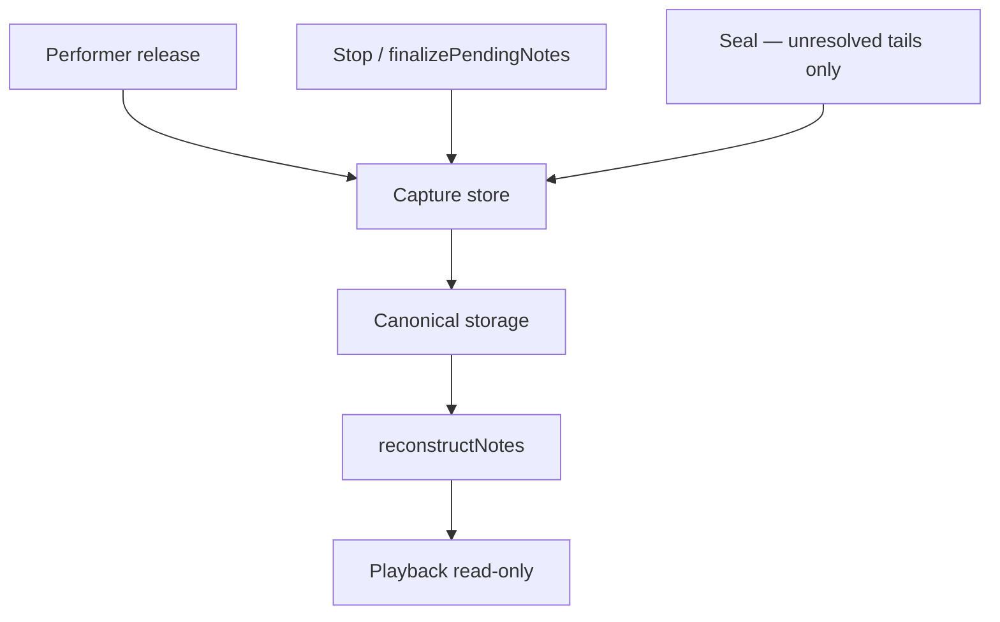

# Overdub wrap note-off pairing bugfix (follow-up)

**Status:** Architecture review + addendum incorporated — ready for implementation  
**Prior work:** [`overdub_wrap_note_off_capture_bugfix.md`](overdub_wrap_note_off_capture_bugfix.md) (Phases 1–6 in working tree)  
**Evidence log:** [`captures/session_20260713_132536.log`](../captures/session_20260713_132536.log)

---

## Problem

After the Phase 1–6 refactor, note on/off resolution still fails when a note is held across loop wrap during overdub: the note-off joins the **first overdub note-on** (e.g. N@0) instead of the **tail note-on before wrap** (e.g. N@2112).

Log snapshot (note 12 ch4, overdub #1 stop):

| Event | Tick |
|-------|------|
| N | 2112 |
| F | 2208 |
| F | 2303 |

Stop at **26.227s** before grid NoteOff at **26.485s** — note still pending. Hot-stop: `non-canonical storage (check=2)` → `LinearNoteOff`.

---

## Verified observations vs hypotheses

| Category | Item |
|----------|------|
| **Verified (code / log)** | Live overdub uses `tickPhaseInLoop`; `finalizePendingNotes` routes through `noteOff()` with temporary `TRACK_RECORDING` and uses unwrapped `currentTick - startLoopTick` (with L-1 clamp). |
| **Verified (code / log)** | Phase 5 removed `wrappedHeadOff` from `recordMidiEvents`. |
| **Verified (log)** | 132536 SEVT shows F@2208 then F@2303 for note 12 at overdub stop. |
| **Hypothesis (Step 4)** | Seal still believes one or more notes are open after finalize — ownership did not transition correctly. |
| **Hypothesis (Step 4)** | If capture append fails or is bypassed before `pendingNotes` is cleared, seal may observe an open tail in storage while `pendingNotes` is already empty. |

---

## Architecture review (incorporated)

### Accepted

1. **Tick mapping divergence is the primary bug** — `finalizePendingNotes()` must use the same phase as live overdub (`tickPhaseInLoop`), never unwrapped `currentTick - startLoopTick` + clamp to L-1.
2. **`wrappedHeadOff` is canonical storage**, not repair — document as an intentional invariant (tail on + head off violates linear monotonic order by design).
3. **Investigate seal ownership** before adding seal guards — ask *why does seal still think it owns this note?* not *how do we stop seal closing twice?*
4. **Stronger ownership invariant** — exactly one terminating NoteOff owner per logical note (performer release **or** stop/finalize **or** seal).
5. **Dedicated capture API for stop** — do not route stop through `recordMidiEvents()` with temporary track-state hacks.
6. **Single shared phase helper** — all capture paths call `IntervalProjection::tickPhaseInLoop`.
7. **Expand tests** — add performer-release-after-stop regression.
8. **Ownership transition invariant** — explicit contract between finalize and seal (see below).
9. **Temporary diagnostics** during Step 4 — instrument ownership transitions; remove or downgrade once verified.

### Deferred / rejected (pending investigation)

- **`removeCaptureNoteOffAt()`** — do **not** restore unless investigation proves an unavoidable L-1 source that cannot be eliminated at origin. With playback read-only, the old L-1 synth from `closeOpenNotesAtLoopWrap` is gone; remaining L-1 sources are seal default close and `recordMidiEvents` overflow clamp.

---

## Ownership model (target)



**Invariant:** Every logical note has exactly **one** terminating NoteOff owner. Seal closes only notes still logically open after finalize.

| Owner | When | Tick source |
|-------|------|-------------|
| Performer release | Live overdub/record | `tickPhaseInLoop` (same as today for overdub) |
| Stop / finalize | Record/overdub stop | `tickPhaseInLoop(offAbsTick, …)` — **must match live** |
| Seal | After finalize, tail still open | `openTailCloseTick` from playhead phase (not blind L-1) |

Playback never mutates capture.

### Ownership transition invariant (finalize → seal contract)

After `finalizePendingNotes()` returns:

1. Every note that was in `pendingNotes` has been removed from `pendingNotes`.
2. Every removed pending note has a corresponding capture `NoteOff` appended to the capture store (same phase tick live capture would use).
3. `sealCapture()` must **not** close those notes again.

This contract is verifiable in native tests and optional debug builds. Step 2 implements it by clearing `pendingNotes` only after successful append.

---

## Root causes

### 1. Phase mismatch in `finalizePendingNotes` (**confirmed**)

[`Track::finalizePendingNotes`](../../src/Track.cpp) sets `trackState = TRACK_RECORDING` and calls `noteOff()` → `recordMidiEvents()`, which uses:

```cpp
tickRelative = currentTick - loop.startLoopTick;  // no modulo
// clamped to loopLength - 1 when >= loopLength
```

Live overdub uses `tickPhaseInLoop(...)`. After ≥1 loop cycle these diverge (e.g. phase **2208** vs clamp **2303**).

### 2. State-dependent stop routing (**confirmed**)

`finalizePendingNotes()` currently routes stop closure through `noteOff()` by temporarily forcing `TRACK_RECORDING`.

**Potential consequence (to verify in Step 4):** If capture append fails or is bypassed before `pendingNotes` is cleared, `sealCapture()` may observe an open tail in storage while `pendingNotes` is already empty.

Current code in [`Track::noteOff`](../../src/Track.cpp) erases `pendingNotes` after calling `recordMidiEvents` regardless of whether append succeeded — this is the mechanism to verify, not an assumed runtime outcome.

### 3. `wrappedHeadOff` removed in Phase 5 (**confirmed**)

Canonical head offs after wrap need the monotonic guard bypass when `tickRelative < priorOn.tick` and key is still in `pendingNotes`. Phase 5 removed this as “repair”; it is required storage semantics.

### 4. Remaining unknown — why does `sealCapture()` still believe the note is open?

Log shows F@2208 then F@2303 for note 12. The architectural question is **ownership transition**, not patching a assumed double-close:

> Why does seal still think it owns this note?

**Do not add seal guards blindly** until this is answered.

**Working hypotheses (verify in Step 4):**

| Hypothesis | Check |
|------------|-------|
| Finalize never appended a close; pending cleared anyway | Trace append success vs `pendingNotes.erase` order |
| Finalize appended at wrong/non-canonical tick; seal scanner still sees open tail | Run `finalizeWrapWindowOnStore` on post-finalize store state |
| Seal `openTailCloseTick` wrong (e.g. `startLoopTick == UINT32_MAX`) | Log `sealCapture` close tick at stop |
| Seal scan bounds miss post-finalize events | Read `finalizeWrapWindowOnStore` `eventCount` snapshot |

**Known L-1 sources (no playback synth):**

1. [`LoopStopFinalize::finalizeWrapWindowOnStore`](../../include/Utils/LoopStopFinalize.h) — default `closeTick = loopLength - 1` when tail still in `activeTailOnIndex`
2. [`recordMidiEvents`](../../src/Track.cpp) overflow clamp — `tickRelative >= loopLength → L-1`

---

## Architecture gate

| Question | Answer |
|----------|--------|
| Owner module | `Track::finalizePendingNotes`, new `Track::appendCaptureNoteOffAtPhase`, `Track::recordMidiEvents`, `Loop::sealCapture` |
| Primary invariant | One terminating NoteOff owner; finalize→seal ownership transition; canonical wrap = tail N + head F |
| Ownership change? | **NO** — strengthen existing chain |
| Transition change? | **NO** |
| Playback | **Read-only** — no `closeOpenNotesAtLoopWrap` |

---

## Implementation priority

### Step 1 — Failing regression tests

Extend [`test/test_capture_note_off_rules/test_capture_note_off_rules.cpp`](../../test/test_capture_note_off_rules/test_capture_note_off_rules.cpp):

1. **`test_overdub_grid_tail_wrap_pairs_tail_on_not_first_on`** — full grid + N@2112 + F@55; reconstruct must not span from N@0.
2. **`test_finalize_pending_uses_loop_phase_not_clamped_absolute`** — `start + 2*loopLen + 2208` → F@2208, not F@2303.
3. **`test_finalize_seal_ownership_transition`** — grid + N@2112; after finalize at phase 2208, seal with same `openTailCloseTick` must append **zero** seal NoteOffs for that pitch (ownership transition contract).
4. **`test_performer_release_after_stop_ignored`** — pending cleared + finalize appended off; subsequent `noteOff` must not append second off.

### Step 2 — Shared phase helper + dedicated stop capture API

Add on `Track` (names follow action+scope):

```cpp
uint32_t capturePhaseTick(uint32_t absTick) const;  // wraps tickPhaseInLoop for active loop
bool appendCaptureNoteOffAtPhase(uint8_t channel, uint8_t note, uint32_t phaseTick);
```

Refactor `finalizePendingNotes`:

- Remove `TRACK_RECORDING` state hack.
- For each pending key: append via `appendCaptureNoteOffAtPhase`; clear key **only on success**.
- Bump `captureDisplayRevision`; `invalidateCaches()`.

Live overdub `recordMidiEvents` uses the same `capturePhaseTick` helper for NoteOn/NoteOff.

### Step 3 — Restore `wrappedHeadOff` as canonical storage rule

In `recordMidiEvents` NoteOff branch (overdub only):

- If `wrappedHeadOff` (phase < prior same-pitch on **and** key in `pendingNotes`): allow append without monotonic bump.
- Else if `phase <= prior.tick`: bump to `prior.tick + 1` (non-wrap guard only).

Document in [`LOOP_MIDI_STORAGE_AND_VALIDATION.md`](../Guides/LOOP_MIDI_STORAGE_AND_VALIDATION.md):

> Wrapped head NoteOff events intentionally violate `NoteOn <= NoteOff` in linear storage. Normal pairs are monotonic; wrap pairs are tail N + head F.

**Do not** restore `removeCaptureNoteOffAt` in this step.

### Step 4 — Seal ownership investigation (before any seal guard)

**Question:** Why does `sealCapture()` still believe the note is open?

1. Reproduce with native fixture mirroring 132536 store + stop sequence.
2. Inspect store contents **between** finalize and seal.
3. Fix at source (Steps 2–3 may already resolve):
   - Finalize didn't append → Step 2.
   - Wrong phase tick → Step 2.
   - Seal scan / `openTailCloseTick` bug → minimal fix in `sealCapture` only with evidence.
4. Add seal guard **only if** a proven race remains after source fix.

#### Temporary diagnostics (remove or debug-only after verification)

**Debug assertion (example):**

```cpp
// After finalize loop iteration — debug builds only
DIAG_ASSERT(
    !(pendingCleared && !captureEventWritten),
    "Pending note cleared before capture append");
```

**Stop-cycle counters (SESSION_CAPTURE / SC_REC or equivalent):**

```
pending_notes_finalized=N
capture_noteoffs_appended=N
seal_noteoffs_appended=M   // expect M=0 when finalize satisfied ownership transition
```

Log these counts per stop to confirm ownership handoff before changing seal logic.

### Step 5 — `noteOff` after stop (ownership transition)

When not recording/overdubbing: if key not in `pendingNotes`, do not treat as error (already closed by finalize). Rate-limited debug only.

Ensures performer release after stop does not create orphan offs.

### Step 6 — Verification

- `pio test -e native`
- `pio run -e teensy41-capture-serial`
- HITL / log replay: note 12 SEVT — ownership transition holds; wrap pairs with tail on before wrap.

### Step 7 — Docs

- Update [`overdub_wrap_note_off_capture_bugfix.md`](overdub_wrap_note_off_capture_bugfix.md) Phase 5 note: `wrappedHeadOff` retained as canonical; `removeCaptureNoteOffAt` intentionally not restored.
- Update [`CURRENT_WORK.md`](../runtime/CURRENT_WORK.md).

---

## Open questions — resolution plan

| Question | Resolution |
|----------|------------|
| Why does L-1 synth still exist? | Only seal (unresolved tail) and overflow clamp; investigate in Step 4; no playback source |
| Why does seal think note open? | **Step 4 ownership investigation** — not assumed until traced |
| Remove `recordMidiEvents` from stop? | **Yes** — Step 2 dedicated API |
| Single phase location? | **Yes** — `Track::capturePhaseTick` → `tickPhaseInLoop` |
| Avoid `removeCaptureNoteOffAt`? | **Preferred** — restore only if Step 4 finds unavoidable L-1 |

---

## Out of scope

- Playback wrap `double_on` ([`session_20260709_224935.log`](../captures/session_20260709_224935.log))
- Second-overdub duplicate N@1344 (follow-up if reproduced after fix)
- Reintroducing `19aa47a` wrap scans in `playMidiEvents`

---

## Pre-implementation review

### Ready

- Log evidence and phase mismatch proven in code
- Architecture review aligned with ownership model
- Test list defined including ownership transition and post-stop release
- Verified vs hypothesis clearly separated

### Resolved (review)

| Topic | Decision |
|-------|----------|
| Stop routing | Dedicated `appendCaptureNoteOffAtPhase`, not `recordMidiEvents` + state hack |
| `wrappedHeadOff` | Canonical storage rule, not repair |
| `removeCaptureNoteOffAt` | Defer; prevent at source first |
| Seal follow-up | Ownership investigation, not double-close patch |
| Phase helper | Single `capturePhaseTick` for all capture paths |
| Finalize→seal contract | Explicit ownership transition invariant |

### Proceed?

**Ready for implementation.**

Remaining uncertainty is intentionally isolated to **Step 4 (seal ownership investigation)**. Steps 1–3 and 5 are independently testable and should significantly reduce the search space before any seal-specific changes become necessary.
