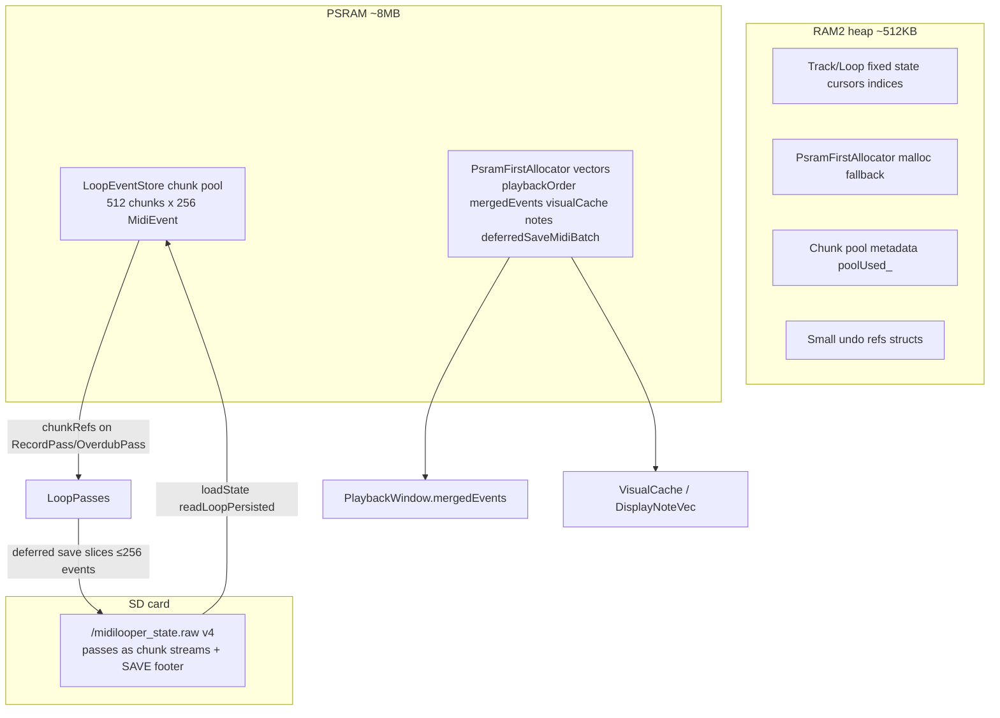
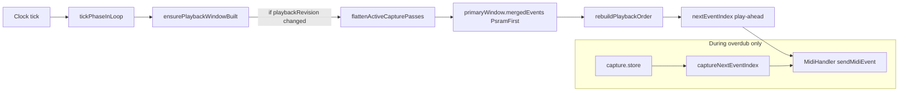
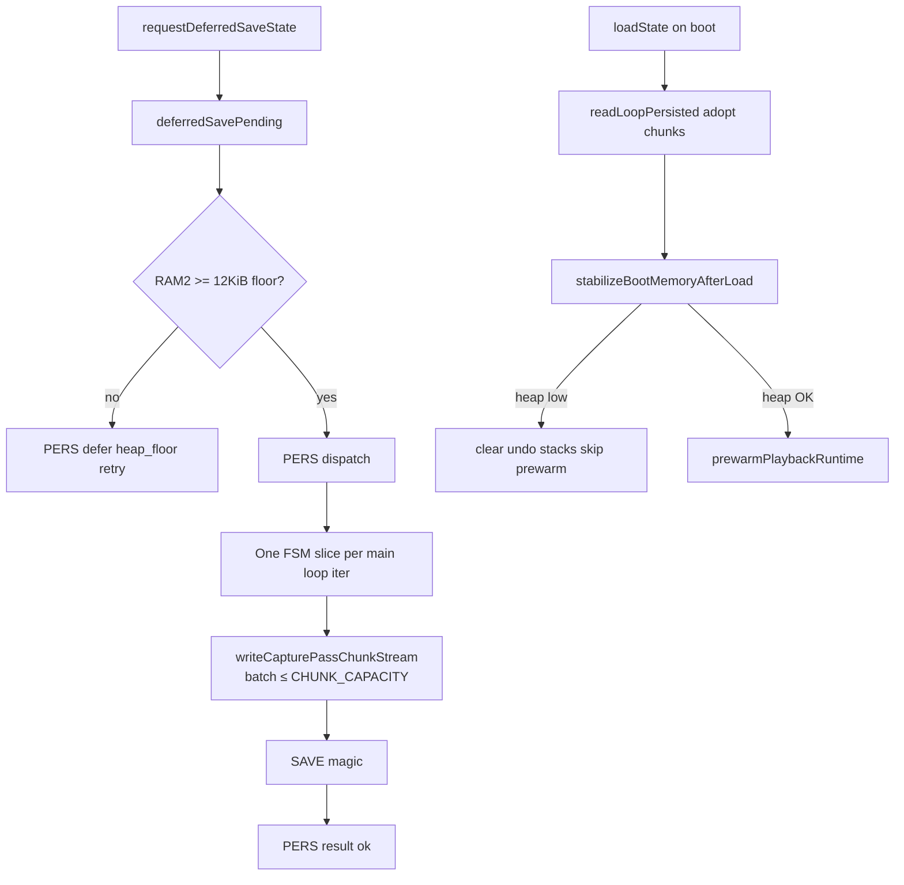

# Record/overdub MIDI — memory, playback, display, and SD timeline

Agent-oriented timeline of how record and overdub MIDI moves through capture, PSRAM chunk storage, playback, OLED display, deferred SD save, and boot reload. Grounded in firmware after **`long-record-memory-headroom`** shipped.

**Related guides:**

- [`docs/Guides/LOOP_MIDI_STORAGE_AND_VALIDATION.md`](../Guides/LOOP_MIDI_STORAGE_AND_VALIDATION.md) — capture lifecycle, chunk pool, undo, stop-path rules
- [`docs/Guides/DEFERRED_RUNTIME_PERSISTENCE.md`](../Guides/DEFERRED_RUNTIME_PERSISTENCE.md) — deferred save FSM and call sites

**Out of scope here (mentioned only):** NoteEditSession overlay, idle-deferred full `validateAndCleanupMidiEvents`, future [`long-loop-piano-roll-window`](../../openspec/changes/long-loop-piano-roll-window/) display navigation.

---

## Glossary

| Term | Meaning |
|------|---------|
| **Capture** | Live record/overdub append buffer (`Loop::capture.store`, `capture.phase`) |
| **passes** | Canonical timeline on `Loop`: **recordPass**, **overdubPasses[]**, **editPasses[]** |
| **chunkRefs** | List of PSRAM chunk IDs pointing at 256-event `MidiEvent` blocks |
| **primaryWindow** | `LoopPlaybackRuntime::primaryWindow` — cached `mergedEvents` + playback metadata |
| **visualCache** | `Loop::visualCache.notes` — `DisplayNote` list rebuilt from active capture passes |
| **play-ahead** | Sorted `playbackOrder` + `nextEventIndex` / `captureNextEventIndex` cursors |

---

## Memory map (static layer)



### Key constants

From `include/LoopEventStore.h`, `include/Globals.h`:

| Guard | Value | Effect |
|-------|-------|--------|
| `CHUNK_CAPACITY` | 256 events | Max events per chunk + per SD save slice batch |
| `POOL_CHUNK_COUNT` | 512 | Global PSRAM pool |
| `CHUNK_RESERVE` | 16 | Held back at `sealCapture` |
| `RAM2_SAFETY_FLOOR_BYTES` | 12 KiB | Deferred save admission |
| `HEAP_RESERVE_BYTES` | 32 KiB | Edit-pass admission |
| `PLAYBACK_WINDOW_MAX_BARS` | 8 | Metadata on `PlaybackWindow` (scaffolding — see playback section) |

---

## End-to-end timeline (one record + overdub cycle)

```mermaid
sequenceDiagram
  participant Clock as ClockManager
  participant Midi as MidiHandler
  participant Track as Track
  participant Cap as capture.store
  participant Loop as Loop/passes
  participant Play as PlaybackRuntime
  participant Disp as DisplayManager
  participant SD as StorageManager
  participant Main as main loop

  Note over Clock,Main: T0 — Record arm/start
  Clock->>Track: tick advances
  Midi->>Track: noteOn/noteOff
  Track->>Cap: appendCaptureEvent
  Cap->>Cap: PSRAM chunk append O(1)
  Track->>Cap: CapturePreview incremental
  Disp->>Cap: resolveDisplayNotes live path

  Note over Clock,Main: T1 — Record stop
  Track->>Loop: commitCapturePass
  Loop->>Cap: sealCapture wrap-window finalize
  Loop->>Loop: detachChunksTo pendingCapturePass
  Loop->>Loop: publishPendingCapturePass → recordPass
  Loop->>Loop: playbackRevision++
  Track->>Track: finalizeLoopAtStop wrap window
  Track->>SD: requestDeferredSaveState(heap sample)
  Track->>Track: pushRecordPassAdded undo

  Note over Clock,Main: T2 — Playing back committed pass
  Clock->>Track: playMidiEvents
  Track->>Play: ensurePlaybackWindowBuilt
  Play->>Loop: flattenActiveCapturePasses → mergedEvents
  Play->>Play: rebuildPlaybackOrder PSRAM
  Track->>Midi: sendMidiEvent via nextEventIndex

  Note over Clock,Main: T3 — Overdub start
  Track->>Loop: beginCapture Overdub
  Midi->>Cap: appendCaptureEvent dedupe vs passes
  Track->>Track: play committed mergedEvents + live capture.store

  Note over Clock,Main: T4 — Overdub stop
  Track->>Loop: commitCapturePass → overdubPasses[]
  Track->>SD: requestDeferredSaveState
  Track->>Track: pushOverdubPassAdded undo
  Loop->>Loop: rebuildVisualCacheFromPasses

  Note over Clock,Main: T5 — Idle persistence + display
  Main->>SD: processDeferredSaveState one slice
  SD->>SD: StorageLoopIo chunk stream ≤256 events
  Main->>Disp: update if not isDeferredSaveActive
  Disp->>Loop: prefer visualCache.notes

  Note over Clock,Main: T6 — Boot reload
  SD->>Loop: loadState → readLoopPersisted
  SD->>SD: stabilizeBootMemoryAfterLoad
  SD->>Track: prewarmPlaybackRuntime
```

---

## Phase: capture → commit (hot path)

**Files:** `src/Track.cpp` (`recordMidiEvents`), `src/Loop.cpp` (`appendCaptureEvent`, `commitCapturePass`)

| Step | What happens | Memory |
|------|----------------|--------|
| MIDI in | `Track::noteOn` stores pending pair; `recordMidiEvents` stamps tick | RAM2 small maps |
| Append | `capture.store.append` grows PSRAM chunks | PSRAM pool |
| Live display | `CapturePreview` + `captureDisplayRevision`; record path avoids full flatten per frame | PSRAM preview notes |
| Stop seal | `LoopStopFinalize` on wrap window only (not full loop) | In-chunk / staging store |
| Detach | `capture.store.detachChunksTo(pendingCapturePass_.chunkRefs)` — moves chunk IDs, no copy | Chunk refs vector |
| Publish | Chunk refs land in `recordPass` or `overdubPasses[]`; live capture cleared | `passes` structs in RAM2; event data in PSRAM |

**Rule:** Stop path does **not** call full `validateAndCleanupMidiEvents`. Full validate is deferred via `Track::processDeferredIdleMaintenance` when transport is idle (`src/main.cpp`).

---

## Phase: playback window + play-ahead

**Files:** `src/Track.cpp` (`ensurePlaybackWindowBuilt`, `playMidiEvents`), `include/PlaybackWindow.h`



### Current behavior

- `flattenActiveCapturePasses` merges **all active** `recordPass` + `overdubPasses` chunk refs into one sorted `MidiEventVec` — not a bar-filtered subset.
- `effectiveWindowBars` / `windowStartBar` on `PlaybackWindow` and `PlaybackCursor` are **scaffolding** (set to `PLAYBACK_WINDOW_MAX_BARS = 8` in `ensurePlaybackWindowBuilt`); they do **not** slice events by bar window today.
- **Play-ahead** = sorted `playbackOrder` + monotonic `nextEventIndex` / `captureNextEventIndex`, reset on loop wrap (`lastTickInLoop`).
- `prewarmPlaybackForSlot` only touches `getPlaybackOrder()` allocation — does not pre-build `mergedEvents`.

During overdub, `playMidiEvents` plays committed `mergedEvents` first, then live `capture.store` events via `captureNextEventIndex`.

---

## Phase: display

**Files:** `src/DisplayManager.cpp`, `src/Loop.cpp` (`rebuildVisualCacheFromPasses`, `buildLiveEventView`)

| Mode | Source | RAM note |
|------|--------|----------|
| Live record (not playing) | `capture.store.size` + `CapturePreview` | Incremental; no per-frame full flatten |
| Live overdub / playing | `buildLiveEventView` = `materializeToFlat` + capture merge | PSRAM temporaries |
| Playback / stopped | Prefer `visualCache.notes` from `flattenActiveCapturePasses` → `reconstructDisplayNotes` | Avoids second full reconstruct when heap tight after stop |
| OLED draw | `drawPianoRoll` maps **full** `loopLength` to screen width | Long loops compress; see `long-loop-piano-roll-window` |

Display updates are **skipped** while `StorageManager::isDeferredSaveActive()` (SD file open) so SPI/OLED work does not compete with persistence.

---

## Phase: SD save + reload

**Files:** `src/StorageManager.cpp`, `src/StorageLoopIo.cpp`



- Runtime save triggers: record/overdub stop, undo/redo, clear, autosave (`Track::finalizeCommitSideEffects`).
- `saveState()` is maintenance-only: drains the same deferred FSM synchronously (no second on-disk format).
- SD stores **chunk streams** (≤256 events per read batch), not a full-loop flat buffer in RAM2.

### Main-loop ordering (`src/main.cpp`)

After MIDI/clock/playback service:

1. `Track::processDeferredIdleMaintenance` (deferred full validate when queued)
2. `StorageManager::processDeferredSaveState` (one slice)
3. `processEditAutosave` / pass reclaim (when not timing-critical)
4. `DisplayManager::update` (only when deferred save is **not** in-flight)

---

## Heap pressure timeline (64-bar HITL)

From `captures/host_midi_automation_baseline_20260623_112324.json` (64 + 64 + 64 record/overdub):

| Moment | Typical RAM2 | What allocates |
|--------|--------------|----------------|
| Mid 64-bar record | Falls as length-scaling buffers grow | Note cache, playback order, materialize temps — **PSRAM-first** after memory-headroom |
| `record_stop` entry | ≥ 12 KiB (observed 16 KiB) | Stop path avoids full flatten |
| Post-stop idle | Low but above floor | `visualCache` rebuild; deferred save slices |
| During `PERS` slices | Stable | Batch ≤ 256 events in PSRAM; display paused |
| After `PERS,result,ok` | Recovers | Display resumes; undo/redo safe |

---

## Key entry points (quick index)

| Concern | Primary API / file |
|---------|-------------------|
| Live capture append | `Loop::appendCaptureEvent` |
| Stop commit | `Loop::commitCapturePass` → `sealCapture` / `publishPendingCapturePass` |
| Playback merge | `Loop::flattenActiveCapturePasses` → `PlaybackWindow::mergedEvents` |
| Play-ahead cursor | `Track::playMidiEvents`, `loop.nextEventIndex` |
| Display notes | `DisplayManager::resolveDisplayNotes`, `Loop::visualCache` |
| Queue save | `StorageManager::requestDeferredSaveState` |
| Run save slice | `StorageManager::processDeferredSaveState` |
| Boot load | `StorageManager::loadState`, `readLoopPersisted` |
