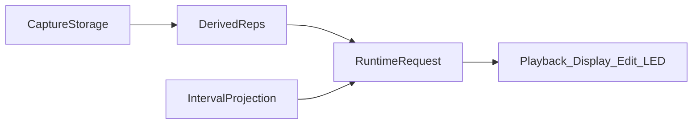
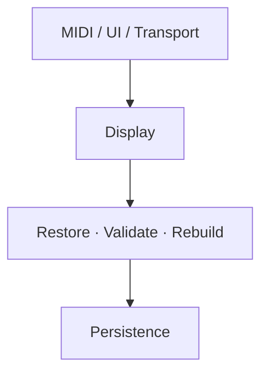

# Runtime process building blocks overview

High-level runtime map for **agents and humans**: who owns what, how data flows, and which invariants must not be broken. **Not architecture authority** — depth lives in [RuntimeArchitecture.md](../00-authority/Architecture/RuntimeArchitecture.md), Guides, and OpenSpec.

Last updated: 2026-07-16

Format: building blocks, owner, up to ~5 sentences of fit; diagrams and overviews may be multiple per section.

---

## For agents (read first)

**When to load:** After [PROJECT_STATE.md](../runtime/PROJECT_STATE.md) + [CURRENT_WORK.md](../runtime/CURRENT_WORK.md), before diving into domain Guides. Use this to orient; then follow [AGENT_CONTEXT_MAP.md](../AGENT_CONTEXT_MAP.md) for the required deep docs for your domain.

**How to use (2 minutes):**

1. Skim **Core runtime principles** and **Shared runtime spine** below.
2. Jump to the **domain section** that matches the task (table).
3. Note **Owner** — extend that owner; do not invent a parallel Manager or hot-path shortcut.
4. Check **Not built yet** / section **Gap** lines before assuming a Session or queue already exists.
5. Only then open Guides / OpenSpec / code.

### 60-second mental model

```text
Storage (passes / capture) owns truth
        → Derived representations (lazy, disposable, revisioned)
        → Runtime Request = representation × interval
        → Consumers (playback / display / edit / LED) — read only

Orchestration (main loop) decides WHEN deferred work runs.
Owners decide WHAT they do in that slice.
Sessions budget long work. Persistence is queued + budgeted — never SD from the hot path.
```

### Domain → owner (jump table)

| Task domain | Start here | Owner to extend |
|-------------|------------|-----------------|
| Record / overdub / stop | [Capture](#capture--record--overdub) | `Loop` timeline; `Track` stop/commit |
| MIDI out / playhead | [Playback](#playback) | `Track` |
| Note move / pitch / overlap | [Note edit](#note-edit) | `EditManager` |
| Undo / redo | [Undo](#undo--redo) | session stack then `GlobalUndoStack` |
| Piano roll / OLED | [Display](#display--derived-views) | `Loop` builds; `DisplayManager` draws |
| Multi-loop / select | [Slots](#slots--focus) | `TrackManager` activate; `LoopPool` lifetime |
| Clock / arm / quantize | [Transport](#transport--clock) | `ClockManager` |
| Buttons / faders / MIDI in | [Input](#input) | `MidiHandler` + action managers |
| SD save / Current workspace | [Persistence](#persistence) | `StorageManager` only |
| Boot / load slots | [Boot](#boot--slot-restore) | `StorageManager` restore |
| Validate / rebuild off hot path | [Idle](#idle--budgets) | `Track::processDeferredIdleMaintenance` |
| HITL / `#CAP` | [HITL](#hitl--telemetry) | `DebugSessionCapture` |
| Heap safeguard (abnormal only) | [Memory pressure](#memory-pressure-safeguard) | `MemoryMonitor` + reclaim APIs |

### Hard don'ts (high-frequency mistakes)

| Don't | Do instead |
|-------|------------|
| Full `validateAndCleanupMidiEvents` on record/overdub stop | Wrap-window `LoopStopFinalize`; defer full validate to idle |
| Write SD / open files on capture or playback hot path | `admit*` → `processDeferredSaveState` under budget |
| Playback or display mutate `capture.store` / passes | Request representations; ownership transitions only at commit |
| New `*Manager` for persistence or stop | Extend `StorageManager` / `Track` / `Loop` (see ARCHITECTURE_RULES) |
| Put full validate back on stop to “speed boot/piano roll” | Fix SD restore + visualCache path ([boot load plan](prioritized_boot_load_isolation_refinement.md)) |
| Assume `SlotLoadSession` / `CaptureCommitSession` exist | See [Not built yet](#not-built-yet) — sync stop + one-slot restore today |

---

## Core runtime principles

Ordered Storage → Representation → Runtime → Scheduling → Persistence:

- Storage owns truth.
- Capture is append-only.
- Published data is immutable.
- Derived representations are disposable.
- Runtime Requests isolate consumers.
- Playback is read-only.
- Consumers never own storage.
- Long-running work executes as Sessions.
- Expensive work is deferred.
- Persistence is budgeted.

---

## Shared runtime spine

Four layers (DEC-016): Capture Storage → Derived Representations → Interval Projection → Runtime Request → consumers.



Consumers never traverse capture storage directly. They request runtime representations through the **Runtime Request** layer, which combines derived representations with interval projection into consumer-specific views.

---

## Sessions (common pattern)

**Building blocks:** `NoteEditSession`, `StorageSession` (jobs), future `SlotLoadSession`, future `CaptureCommitSession`, session undo stacks

Long-running operations are modeled as **Sessions** that advance incrementally during the cooperative runtime, so expensive work can be budgeted without blocking real-time processing. A session owns temporary state for one operation; publish/commit makes results visible to storage or consumers.

---

## Runtime orchestration

**Building blocks:** `main.cpp` cooperative `loop()`, runtime budgets (`PersistenceBudget`, idle slices), deferred work gates



Detailed order (`main.cpp`) — authoritative:

```text
loop()
  MemoryMonitor pressure classify → reclaim only if Low+
  MIDI / UI / transport
  DisplayManager::update
  Track::processDeferredIdleMaintenance  (per track)
  [if !timingCritical]
    processDeferredLoopSlotRestore
    processDeferredUndoSnapshots
    processEditAutosave
    reclaimUnreferencedDisabledPasses
  [after restore empty] beginUsbHost
  StorageManager::processDeferredSaveState  (budgeted writers)
```

Orchestration defines execution order, latency priorities, and which deferred work may run. It applies µs/slice budgets, coordinates idle maintenance, and keeps hot paths (clock, MIDI in/out, playback) deterministic. Advisory services (such as `MemoryMonitor`) classify runtime state before each iteration and may influence deferred work, but they are not the primary execution flow.

**Owner:** `main.cpp` for order; domain owners still own the work they step.

---

## Infrastructure services

**Building blocks:** revision tracking, deferred work queues, runtime budgets (`PersistenceBudget`, idle validate policy), `DebugSessionCapture` / HITL telemetry, advisory `MemoryMonitor` / `MemoryPressurePolicy`

These are cross-cutting services shared across runtime domains. They do **not** own musical timeline state (passes, capture, notes); they schedule budgets, emit telemetry, track revisions, and — under abnormal conditions — classify heap pressure and gate reclaim.

---

## Revisions

**Building blocks:** storage / pass-publish dirtiness, event-representation revision, `Loop::visualCache.revision` / `capturePreview.revision`, playback runtime / session-preview revisions, `Track::invalidateCaches()`

```text
Storage revision (passes / capture / session store)
        │
        ▼
Event representation revision
        │
        ├─────────────┐
        ▼             ▼
Playback repr.    Display repr.
```

Runtime mutations bump revisions up the chain. Derived representations rebuild lazily when their input revision is newer; consumers reuse an existing representation while revisions remain valid. That is why stale-while-revalidate and idle rebuild work without rebuilding everything every frame. Revisions propagate only toward derived representations — runtime consumers invalidate and rebuild derived data; they never mutate or invalidate capture storage itself.

**Owner:** each representation documents its own revision field; storage mutations invalidate via `invalidateCaches()` and related hooks.

---

## Ownership transitions

Ownership changes only at explicit commit points:

- capture → published pass (seal / publish)
- session → committed data (e.g. close note-edit pass, revision commit)
- queued work → persisted data (`StorageManager` writers)
- selected / pending slot → active slot (quantized launch commit)

Runtime consumers observe state but do not perform ownership transitions. Playback, display, and LEDs request representations; seal, publish, persist, and slot activation stay with their owners.

---

## Capture / record / overdub

**Building blocks:** `Loop` (capture + passes), `LoopEventStore` (chunks), `LoopPasses`, `Track` (stop/commit), `LoopStopFinalize`

**Invariants**

- Capture remains append-only while recording.
- Published passes become immutable.
- Stop publishes sealed capture into pass storage.
- Expensive full-loop validation is deferred (wrap-window only on the hot stop path).

Live MIDI appends into `capture.store`. Stop seals via `sealCapture` → `publishPendingCapturePass` into passes, then wrap-window finalize only. Hot playback merges/materializes passes; full validate runs later on idle.

**Owner:** `Loop` owns the timeline; `Track` owns stop/commit orchestration.

---

## Playback

**Building blocks:** `Track` / `TrackManager`, `PlaybackWindow`, `IntervalProjection`, merge/materialize APIs

**Invariants**

- Playback is read-only.
- Playback never mutates capture storage.
- Playback consumes runtime representations only (via Runtime Request).
- Playback performs no ownership transitions (no seal/publish/slot lifetime).

Derived event representation (materialized passes ± active capture; NOTE_EDIT uses session store) × rolling playback interval → MIDI out.

**Owner:** `Track` plays; does not own storage or display rebuilds.

---

## Note edit

**Building blocks:** `EditManager` / `NoteEditSession`, `NoteEditFocus` + overlap notes, `EditApply`, fader/button FSM (`EditNoteState`)

Faders drive geometry on the live session store; committed rows become `passes.editPasses[]`. Materialize overlays editPasses onto capture passes for playback and display. Consumers still go through Runtime Request (session store or materialized passes × interval), not raw chunk walks.

**Owner:** `EditManager` owns live RAM and session lifecycle.

**Gap:** derived overlap / move geometry pipeline (`edit-session-action-geometry`) still paused behind UIP HITL.

---

## Undo / redo

**Building blocks:** `GlobalUndoStack`, `NoteEditSessionUndoStack`, `TrackUndo`, `handleUndo` routing

Session undo wins while NOTE_EDIT is active; then global (**RecordPassAdded** / **OverdubPassAdded** / **NoteEditPassClosed** / clear-slot). Snapshots share refs; restore always clones.

**Owner:** stacks on `Track` / session; entry via button actions.

---

## Display / derived views

**Building blocks:** `Loop` visualCache / capturePreview, `DisplayManager`, `NoteUtils::reconstructNotes` / `projectDisplayNotes`, idle rebuild slices

Display consumes a two-step Runtime Request: project to `DisplayNote` list, then filter by detailed window. PLAYING policy is stale-while-revalidate — last good cache plus playhead/capture preview; full rebuild on idle when revision changes. Display draws representations; it does not mutate passes.

**Owner:** `Loop` builds representation; `DisplayManager` draws.

---

## Slots / focus

**Building blocks:** `LoopPool`, `SlotStateMachine`, `TrackManager`, `SelectNavigation`

**Ownership boundaries**

| Component | Owns |
|-----------|------|
| `LoopPool` | Slot lifetime (Loop shells) |
| `TrackManager` | Slot activation / select / launch commit |
| `SlotStateMachine` | Transition sequencing (selected vs pending vs playing) |
| `SelectNavigation` | UI focus within NOTE_EDIT note lists |

Multi-loop = multiple `Loop` timelines per track. UI/edit may focus the selected slot while transport plays another until quantized commit.

---

## Transport / clock

**Building blocks:** `ClockManager`, `Clock` / `ClockSourceStateMachine`, `TrackStateMachine`, pending record/overdub/start queues

Clock owns global tick (internal BPM or external MIDI clock). Tracks consume tick for quantize, playhead, and armed starts.

**Owner:** `ClockManager` for time; `TrackManager` drives per-tick track updates.

---

## Input

**Building blocks:** `MidiHandler`, `MidiButtonManager` / `MidiFaderManager`, `NoteEditManager`, `GpioButtonManager`, `MidiLedManager`

USB MIDI and GPIO become actions (record, undo, edit faders) that mutate Track / EditManager / TrackManager. LEDs consume display/event hints; they do not own storage.

**Owner:** `MidiHandler` routes raw MIDI; managers own action parse.

---

## Persistence

**Principle**

- Runtime mutations never write directly to SD.
- Mutations enqueue semantic persistence work.
- `StorageManager` owns batching, ordering, and budgeting of all writes.

**Building blocks:** `StorageManager`, `StorageSession` jobs, `PersistenceWorkQueue` (semantic items), `PersistenceQueue` (sealed chunks), `PersistenceBudget` / `PersistenceFailurePolicy`

Admit APIs enqueue stale work; `processDeferredSaveState` steps revision / mid-pass chunk / work-item / workspace writers under a µs budget. Mid-pass writes sealed capture chunks while recording; post-stop uses work items instead of a monolithic full-set save.

**Owner:** `StorageManager` only (DEC-008 / DEC-012).

---

## Boot / slot restore

**Building blocks:** `PendingLoopSlotRestoreQueue`, `computeBootRestorePriority`, deferred USB Host, undo snapshot hydrate

Cold path loads workspace meta first, then restores slots one-per-idle by priority (selected/active first). USB Host MIDI starts only after the restore queue drains so SDIO is not contended. Future work models this as a `SlotLoadSession` under the Sessions pattern.

**Owner:** `StorageManager` restore; `MidiHandler::beginUsbHost` gated from `main.cpp`.

**Gap:** planned `SlotLoadQueue` / `SlotLoadSession` not shipped — see [prioritized_boot_load_isolation_refinement.md](prioritized_boot_load_isolation_refinement.md).

---

## Memory pressure (safeguard)

Memory pressure provides runtime safeguards when available resources become constrained. Normal operation should not require reclaim activity; persistent reclaim indicates that another subsystem should be optimized instead. Today, internal heap typically stays near **~300 KiB** free during normal use after stop-path and allocation improvements — pressure is not a primary architectural driver.

**Building blocks:** `MemoryPressurePolicy`, `MemoryMonitor` advisory level, `tryReclaimDerivedViewCachesUnderPressure`, pass reclaim

Advisory FSM (Normal / Low / Critical) from heap, chunks free, persist depth, append-fail latch. Low reclaim may release disposable derived views and idle-disabled passes; Critical trim / persist-admission inversion still open. Architect around ownership, representations, sessions, and budgeted persistence — not around reclaim as the steady-state design center.

**Owner:** `MemoryMonitor` classifies; `TrackManager` / `Track` reclaim when advised.

**Gap:** Phase 2+ Critical undo trim and persist-admission inversion pending (safeguard depth, not the normal path).

---

## Idle / budgets

**Building blocks:** `Track::processDeferredIdleMaintenance`, `DeferredValidatePolicy`, visual-cache idle slices, deferred telemetry flush

Budgeted REVT flush, materialize, full MIDI validate, and piano-roll rebuild run only when transport is not timing-critical. Keeps record/play hot paths free of full walks. Runtime orchestration determines **when** deferred work may execute; each subsystem determines **what** work it performs during that opportunity.

**Owner:** per-`Track` idle; orchestrated from `main.cpp`.

**History (`15a35b4`):** full note-pair validate left the stop path (wrap-window only + deferred idle). That was a major contributor to recovering internal free heap after stop (historically ~120→~320 KiB; normal operation now typically ~300 KiB free). **Do not put full validate back on stop** to speed boot or piano roll — those costs are SD restore + visualCache/`reconstructNotes`, not stop-path pairing. See [LOOP_MIDI_STORAGE_AND_VALIDATION.md](../Guides/LOOP_MIDI_STORAGE_AND_VALIDATION.md) § Heap tradeoff and [prioritized_boot_load_isolation_refinement.md](prioritized_boot_load_isolation_refinement.md).

---

## HITL / telemetry

**Building blocks:** `DebugSessionCapture` (`#CAP` ring), `SESSION_CAPTURE` / `PERF_TELEMETRY`, host `capture_session.py` / `host_midi_hitl.py`

Capture-serial builds emit `#CAP` / `REVT` / transition lines; host presets verify record/overdub/edit against those markers. Serial close reboots the Teensy — expected. Telemetry is an infrastructure service; it observes runtime but does not own musical state.

**Owner:** firmware emit path; host owns automation and verify.

---

## Not built yet

| Gap | Today | Planned |
|-----|--------|---------|
| Slot load queue / session | One-slot-per-idle restore queue | [prioritized_boot_load_isolation_refinement.md](prioritized_boot_load_isolation_refinement.md) |
| Unified capture-commit session FSM | Sync stop commit on `Track` | OpenSpec `unified-capture-commit-owner` |
| Note-edit move/overlap geometry | Session store + partial overlap | `edit-session-action-geometry` (blocked on UIP HITL) |
| Critical reclaim depth (safeguard) | Low reclaim shipped | Critical undo trim / persist inversion |

---

## Where to go deeper

| Need | Doc |
|------|-----|
| Layer model | [RuntimeArchitecture.md](../00-authority/Architecture/RuntimeArchitecture.md) |
| Capture / undo / stop | [LOOP_MIDI_STORAGE_AND_VALIDATION.md](../Guides/LOOP_MIDI_STORAGE_AND_VALIDATION.md) |
| Persistence | [RUNTIME_STORAGE_AND_PERSISTENCE.md](../Guides/RUNTIME_STORAGE_AND_PERSISTENCE.md) |
| Domain doc load order | [AGENT_CONTEXT_MAP.md](../AGENT_CONTEXT_MAP.md) |
| What to implement now | [CURRENT_WORK.md](../runtime/CURRENT_WORK.md) |
