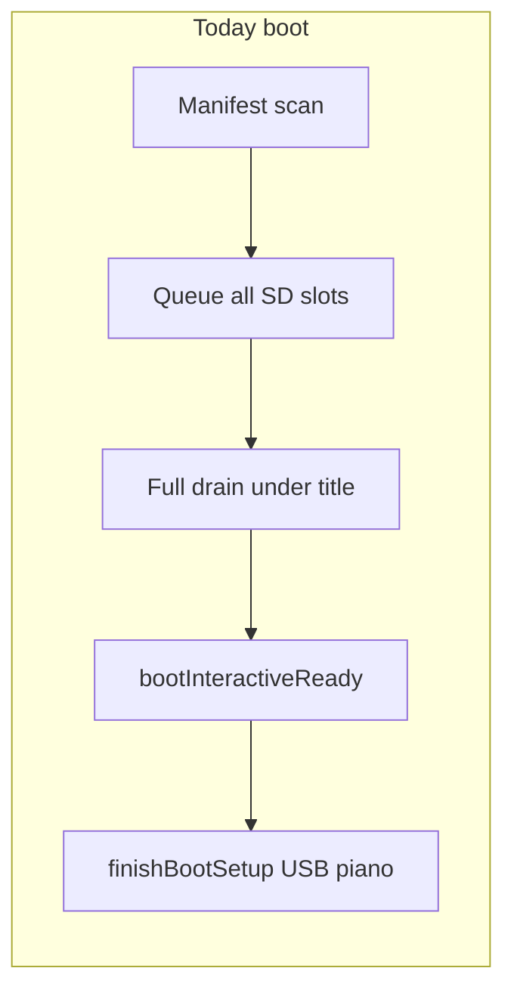
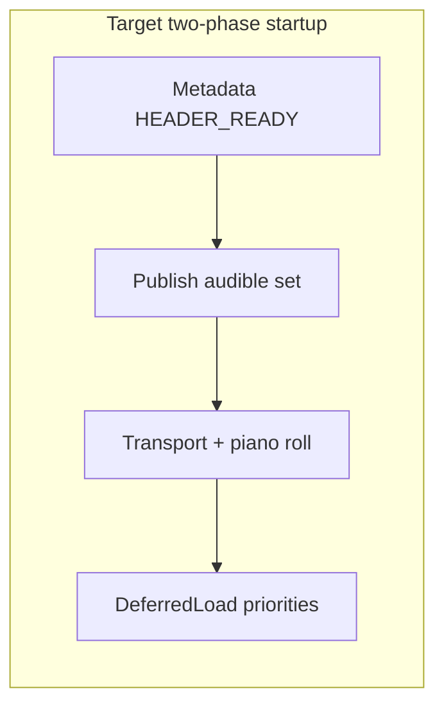

# Unified publish pipeline — deferred lazy loading

**Kind:** architecture (separate project)  
**Status:** Proposed  
**Priority:** High  
**Branch baseline:** `feature/memory-pressure-reclaim` @ `af1227c` (title-until-ready + full drain)  
**Depends on (already in tree):** published passes, chunk epochs, deferred save FSM, published/derived separation, `SlotLoadSession`

**Not this project:** Phase 4 v7 SD chunk index (format bump); that remains optional after lazy publish exists.

---

## Motivation (product)

Cold boot today restores **every** SD loop slot before the instrument is interactive:

| Evidence | Value |
|----------|--------|
| [`session_20260718_020628.log`](../../captures/session_20260718_020628.log) | ~10.5 s `load_ok` → `usb_host,begin`, 26 slots |
| Scheduling | Full drain under title (`main.cpp` while-queue) — SD-bound, not loop overhead |
| Phase 2 batch `ioRead` | Shipped; no wall-time win on device |

Goal is **not only** shorter boot: every path that introduces loop data into the live engine should share one **build → publish → derived** model (record, load, undo restore, future import/paste).

---

## Vision (unchanged from proposal)

```text
Record / Import / Undo / Load / Paste
              │
              ▼
     Build immutable pass
              │
              ▼
        Publish epoch
              │
              ▼
     Playback sees new state
```

Playback never consumes partially constructed published data. Derived caches stay disposable.

---

## Map onto current code (what already exists)

This proposal **extends** owners already in the tree. Do not invent a parallel Manager.

| Proposal concept | Current owner / symbol | Gap |
|------------------|------------------------|-----|
| Immutable published truth | `Loop` passes + `LoopEventStore` published chunk refs; `hasPublishedEvents()` | Load still monolithically publishes one whole slot file per call |
| Record publish | `Loop::commitCapturePass` | Load does **not** go through this API — separate `loadLoopSlotFromCurrentSetSd` → adopt |
| Load session lifecycle | [`SlotLoadSession`](../../include/SlotLoadSession.h): Dequeued → Reading → Validating → Publishing → Completed/Failed | Stack RAII; one full-slot read per session; not chunk-sliced across `loop()` |
| “Needs load?” | `StorageManager::needsSlotLoad` | Exists; boot still queues **all** payload slots |
| Boot priority | [`BootLoopSlotRestore.h`](../../include/Utils/BootLoopSlotRestore.h) `isAudibleBootSlot` / `computeBootRestorePriority` | Priority used for drain **order** only; interactive waits for **empty** queue |
| Interactive gate | `bootInteractiveReady()` = queue empty && `!SlotLoadSession::isActive()` | Blocks piano roll until **all** slots Published |
| On-demand focus load | `prioritizeLoopSlotRestoreForFocus` → queue / sync `requestLoopSlotRestoreFromSd` | Works when pending empty; mid-play deferred load **blocked** |
| Deferred save | `processDeferredSaveState` + `StorageSession` stages | Template for DeferredLoad budgets |
| Derived / disposable | visual cache, edit rematerialize, playback window merge | Often rebuilt eagerly after restore; not a first-class hydration stage |
| Main-loop schedule | `!timingCriticalTrackActive` wraps restore + save | **No load while PLAYING** today |





---

## Proposed slot lifecycle (align names with code)

Proposal states → closest existing / planned:

| Proposal state | Map to current / next |
|----------------|------------------------|
| UNLOADED | No published events; `needsSlotLoad` true if SD payload |
| HEADER_READY | Manifest / `hydrateLoopSlotMetadataFromCurrentSetSd` already fills length/bars without events |
| CHUNKS_READY | Staging under `SlotLoadSession` Reading — **not yet** a stable public state (today hidden until Publishing completes) |
| PUBLISHED | `SlotLoadSessionState::Publishing` → `complete()` + `hasPublishedEvents()` |
| DERIVED_READY | visualCache / edit session rematerialize / playback window — today opportunistic idle |

**Naming rule:** Prefer extending `SlotLoadSessionState` (or a parallel **slot hydration** enum on the slot) over inventing “Loaded”. Ask before new top-level domain nouns.

---

## Two-phase startup (product behavior)

### Phase A — Transport restore (audible set)

For every track: metadata, active/selected indices, timing footer.  
**Sync-publish** (or budgeted publish) only the **audible boot set** (existing `isAudibleBootSlot`: all actives + focus selected if split).

Then: `finishBootSetup` + USB + piano roll.  
`bootInteractiveReady()` becomes **audible published** (explicit flag — do **not** re-derive from `getActiveLoopIndex()` after footer; that broke USB in `012942`).

Do **not** enqueue the rest of the SD slots for automatic background drain (stricter than early audible+background).

### Phase B — Deferred hydration

`DeferredLoad` in `main` next to `processDeferredSaveState`:

- Priority 0: anything still needed for audible (should be empty after A)  
- Priority 1: currently selected slot (`prioritizeLoopSlotRestoreForFocus`)  
- Priority 2: adjacent / queued playback switch destination  
- Priority 3: remaining payloads **only if product chooses** background fill; default for this project: **on-demand only**

Each slice: open → read budgeted bytes/chunk → attach staging → on complete pass → **Publish** → optional derived rebuild.

---

## DeferredLoad vs DeferredSave

| | DeferredSave (exists) | DeferredLoad (this project) |
|--|----------------------|-----------------------------|
| Owner | `StorageManager` / `StorageSession` | Extend same owner — **no** new top-level Manager |
| When | Idle budgets; gated vs capture | Budgets; **later** allow PLAYING with tight µs budget (separate gate) |
| Output | SD written | Slot **Published** |
| Hot path | Never | Never — only publish boundary visible to playback |

Suggested main order (proposal): MIDI → Clock → Playback → DeferredSave → **DeferredLoad** → Display.  
OLED already skips while `SlotLoadSession::isActive()`.

---

## Chunk-level loading

Today: one `loadLoopSlotFromCurrentSetSd` reads the **entire** slot file inside one session.  

Target: cooperative slices inside `SlotLoadSession` (Cursor Phase 3b mid-file Reading) so PLAYING can share the bus. Publication still only when the immutable pass is complete (same invariant as `commitCapturePass`).

v7 on-disk chunk index remains **optional** and only if slice + audible boot are still too slow.

---

## Slot selection UX

Preferred:

```text
Select slot → show Loading / HEADER_READY → DeferredLoad → Publish → derived paint
```

Transport continues. Until PUBLISHED, playback for that slot stays silent / previous audible policy — do not half-play staging.

`prioritizeLoopSlotRestoreForFocus` is the admission hook; change sync-vs-queue policy so mid-play select always **queues** (or budgeted sync under cap), never blocks the select gesture.

---

## Relationship to recording / undo / import

| Operation | Today | Target |
|-----------|--------|--------|
| Record/overdub stop | `commitCapturePass` publish | Unchanged owner |
| SD load | `loadLoopSlotFromCurrentSetSd` adopt | Same publish boundary semantics; share staging→publish helpers where possible |
| Undo restore | Snapshot restore paths | Later phase: publish through same epoch rules |
| Import / paste | Not built | Future producers on same pipeline |

**Do not** force load to call `commitCapturePass` literally if ownership differs; **do** require the same “staging invisible → publish epoch → derived” contract.

---

## Implementation phases (this separate project)

| Phase | Scope | Exit |
|-------|--------|------|
| **0** | OpenSpec or architecture review doc; freeze lifecycle enum names; baseline audible count vs boot CAP | Review signed |
| **1** | Explicit slot hydration states (map HEADER / PUBLISHED / DERIVED); telemetry `#CAP` markers | Native + boot log |
| **2** | Transport restore = audible set only; ready + piano roll; **no** auto background queue of others | Boot ≪ 10 s on 26-slot set; all actives audible on first Play |
| **3** | `DeferredLoad` scheduler (save-like budgets); on-demand select/queue | Select unloaded slot while stopped publishes without reboot |
| **4** | Inactive / non-focus loads only via priority queue when requested | No silent full-set hydrate |
| **5** | Move visual/edit derived rebuild off publish critical path into hydration | Piano roll usable before full DERIVED_READY |
| **6** | Load-while-PLAYING budgeted slices (formal gate) | Select mid-play hydrates without stop |
| **7** | Undo / import / paste reuse publish helpers | Spec + native |

Phase numbers here are **this project’s**, not boot-isolation Phase 4 (v7).

---

## Explicit non-goals (v1)

- Replacing `commitCapturePass` internals  
- v7 SD format  
- Cloud import  
- Changing DEC-020 mid_pass ownership  

---

## Success criteria

- Playback only consumes published immutable passes (`hasPublishedEvents` / epoch).  
- Startup wall time dominated by **audible** slot SD publish, not full 26-slot drain.  
- Remaining slots hydrate on select/queue (and optional low-priority fill).  
- Recording and loading share publish invariants (staging invisible until publish).  
- Derived caches optional after PUBLISHED.  
- Load-while-playing is a **gated** later phase, not required for audible-boot MVP.

---

## Suggested first delivery (MVP)

1. New branch from `af1227c` (e.g. `feature/deferred-lazy-load`).  
2. Phase 1–2 only: audible-set ready + piano roll; drop boot enqueue of non-audible slots; keep `prioritizeLoopSlotRestoreForFocus`.  
3. Device gate: boot CAP `load_ok` → `usb_host,begin` vs `020628`; Play hears all actives; select another SD slot while stopped loads and paints.  
4. Park Phase 6 (play-time load) until MVP PASS.

---

## Key files

| File | Role |
|------|------|
| [`src/main.cpp`](../../src/main.cpp) | Ready gate; DeferredLoad call site; timing-critical gate |
| [`src/StorageManager.cpp`](../../src/StorageManager.cpp) | Queue, `loadLoopSlotFromCurrentSetSd`, `bootInteractiveReady`, focus prioritize |
| [`include/SlotLoadSession.h`](../../include/SlotLoadSession.h) | Load lifecycle; future slice ownership |
| [`include/Utils/BootLoopSlotRestore.h`](../../include/Utils/BootLoopSlotRestore.h) | Audible set definition |
| [`src/Loop.cpp`](../../src/Loop.cpp) | `commitCapturePass` publish model to mirror |
| [`docs/Guides/BOOT_LOAD.md`](../Guides/BOOT_LOAD.md) | Boot sequence doc |
| [`docs/plans/prioritized_boot_load_isolation_refinement.md`](prioritized_boot_load_isolation_refinement.md) | Prior boot work; park pointer here |

---

## Pre-implementation review (for implementers)

### Ready
- Audible set helpers and focus restore hooks already exist.  
- `SlotLoadSession` + mark-from-SD isolation shipped.  
- Baseline timing captures exist.

### Resolved
| Topic | Decision |
|-------|----------|
| Separate project | Yes — new branch; not mixed into memory-pressure reclaim closeout |
| Boot MVP | Audible publish → interactive; no auto drain of others |
| Load while playing | Phase 6 of this project, not MVP |
| New Manager | No — extend `StorageManager` / `SlotLoadSession` |

### Open before coding
1. Exact enum naming (extend `SlotLoadSessionState` vs slot-level hydration enum).  
2. Whether priority-3 background fill is ever enabled by default.  
3. OpenSpec change name when Phase 0 starts (`/opsx:propose`).
