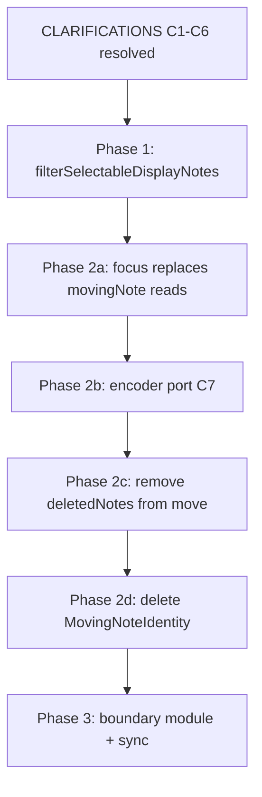

# Architecture review — NoteEditSession mutable note state

**Change:** `overlap-hidden-note-select`  
**Status:** Proposed (2026-06-19)  
**Parent:** [note-edit-modification-session](../note-edit-modification-session/)  
**Evidence:** [BUG.md](./BUG.md), HITL `20260619_212149`

This document expands the original “hidden note select” bug into an **architecture correction**
milestone. Spot fixes (delete pre-commit chains, length-mode reset, hot-path commit guards) treat
symptoms. The underlying issue is **multiple parallel models** of “which notes exist, where, and
who may touch them” during **NoteEditSession**, with **no single read contract** for UI consumers.

---

## 1. Symptom → architecture mapping

| User-visible symptom | HITL / serial evidence | Architecture gap |
|----------------------|------------------------|------------------|
| Display ≠ serial after edit passes | REVT / store correct; piano roll wrong | Display reads `getCachedNotes()` with no **overlapNotes** overlay contract |
| Delete removes long mover, resets earlier moves | `212149`: delete B → `Deleting note pitch=67 start=8`; pre-commit **ChangeLength** on M67 | Delete indexes unfiltered cache; pre-commit uses **stale focus** (wrong moving note) |
| Bracket hops over inner note then lands | Select slots include note that should be **Hidden** | Select nav builds from unfiltered reconstruction |
| Neighbor restore flaky after pitch | Child bugs: `movingNote.deletedNotes` vs **overlapNotes** | **Two overlap scratch ledgers** on fader vs encoder paths |
| Crash on overlap fader move | Hot-path `commitEditAction` rematerialize | **Commit boundary** invoked during live preview (forbidden in design) |
| Length mode stuck after select | Fader routes to length not move | EditNoteState FSM not reset on select — **orthogonal** but exposed by bad focus |

None of these are fixed permanently by filtering alone. Filtering is **Phase 1** of a **session
view model**; retiring parallel state and unifying commit boundaries is **Phase 2–3**.

---

## 2. Designed model (parent) vs shipped model

Parent [design.md](../note-edit-modification-session/design.md) (locked 2026-06-19) states:

```text
NoteEditSession.store          ← sole mutable MIDI during edit
focus.baselineMap              ← full inventory at fader-1 select (from store scan)
focus.overlapNotes             ← impacted overlap notes only (Hidden / Shortened / visible)
applyNoteEditChange            ← sole overlap writer (move | length | pitch)
commit boundary                ← pre-commit resolve → saveEdit → rematerializeEditView
```

### 2.1 What shipped

| Layer | Parent intent | Shipped behavior | Gap |
|-------|---------------|------------------|-----|
| Overlap owner | `applyNoteEditChange` only | Fader path uses **focus.overlapNotes**; encoder path still uses **`movingNote.deletedNotes`** in `EditStartNoteState` | Dual overlap engines |
| Live MIDI SOT | `session.store` | Store + partial **`movingNote`** sync via `syncMovingNoteFromFocus` | Legacy identity parallel to **focus** |
| Baseline at select | Scan **session.store** | **`rebuildNoteEditFocusAtSelect`** builds **baselineMap** from **`applyEdits(takes, edits)`**, not live store | Intentional deviation (see §3.2) |
| UI note lists | Implied: same as store | **`Track::getCachedNotes()`** everywhere — no **overlapNotes** filter, no **NoteRef** on select | Missing read projection |
| Commit boundaries | Fader-1 reselect, exit, overdub | Also ad-hoc paths: delete, length toggle, overlap materialize attempts | Boundary sprawl |
| Scratch cleanup | **overlapNotes** only | **`sessionHiddenOverlapNotes`**, **`sessionShortenedOverlapNotes`** cleared but unused | Dead parallel vectors |

Code reference — baseline source at select (committed replay, not live store):

```207:213:src/EditManager.cpp
    // commitBaseline / baselineMap come from committed Takes + Edits replay, not the live
    // session preview — otherwise a pending length preview (e.g. end 680) becomes baseline
    // on fader-1 reselect and the next ChangeLength commit is a no-op on rematerialize.
    MidiEventVec loopMidiEventsFromTakesAndEdits;
    applyEditsToFlat(loop.takes, loop.edits, loopMidiEventsFromTakesAndEdits, loopLength);
    rebuildNoteEditFocusFromStore(noteEditSession.focus, loopMidiEventsFromTakesAndEdits, channel,
```

Code reference — display uses generic cache, no session view:

```240:243:src/DisplayManager.cpp
    // NOTE_EDIT: session store (editAware) is the live edit buffer; use it for display.
    if (noteEditManager.getCurrentMainEditMode() == NoteEditManager::MAIN_MODE_NOTE_EDIT) {
        invalidateLiveDisplayCache();
        return track.getCachedNotes();
```

### 2.2 Three layers of truth (today)

```text
┌──────────────────────────────────────────────────────────────────────────┐
│ PERSISTED: Loop.takes + Loop.edits[]                                      │
│   Canonical after saveEdit; replay via applyEdits                         │
└───────────────────────────────┬──────────────────────────────────────────┘
                                │ rematerializeEditView (commit boundary ONLY)
┌───────────────────────────────▼──────────────────────────────────────────┐
│ LIVE: NoteEditSession.store (CowLoopEventStore)                           │
│   Mutated by applyNoteEditChange; Hidden overlap = pair absent          │
└───────────────────────────────┬──────────────────────────────────────────┘
                                │
        ┌───────────────────────┼───────────────────────┐
        │                       │                       │
┌───────▼────────┐   ┌──────────▼─────────┐   ┌────────▼──────────────┐
│ focus          │   │ movingNote         │   │ getCachedNotes()      │
│ overlapNotes   │   │ deletedNotes       │   │ (Track note cache)    │
│ baselineMap    │   │ (encoder path)     │   │ ALL UI consumers      │
│ commitBaseline │   │                    │   │                       │
└────────────────┘   └────────────────────┘   └───────────────────────┘
```

**Problem:** UI reads the bottom-right cache. Overlap semantics live bottom-left. Commit compares
focus to baselineMap built from a **fourth** source (takes+edits replay). Deletes and selects
index into the cache without **NoteRef** identity.

---

## 3. Resolving design tensions (normative for this change)

### 3.1 Two baselines — explicit, not accidental

Parent design says baselineMap from store scan. Implementation uses takes+edits replay **on purpose**
to prevent pending length preview from becoming **commitBaseline** (which would make the next
**ChangeLength** a no-op after rematerialize).

**Normative split (this change):**

| Field | Source | Purpose |
|-------|--------|---------|
| **baselineMap** | `applyEdits(takes, edits)` materialization at fader-1 select | **EditChange** **NoteRef** targets; overlap restore geometry vs **committed** loop |
| **focus.last** | Live **session.store** at selected note | Moving note preview geometry |
| **commitBaseline** | Entry from **baselineMap** for selected **NoteRef** | Pending commit delta detection |
| **movingNoteRange** | Updated by overlap engine (A1) | Inner / contained overlap classification |

Update parent design in a follow-up **sync** task: baselineMap at select = **committed
materialization**, not live store scan. Live store remains SOT for **playback/edit preview** only.

### 3.2 One consumer contract — `filterSelectableDisplayNotes` (D1)

No new module or type name. During NOTE_EDIT, UI consumers use existing reconstruction plus one
filter helper (parent design D1):

| Need | Mechanism | Consumers |
|------|-----------|-----------|
| Notes in **NoteEditSession.store** | `NoteUtils::reconstructNotes` on session store events → **`DisplayNote`** | Serial / REVT (store already correct) |
| Select + display list | **`filterSelectableDisplayNotes`** — reconstruction minus **overlapNotes** **Hidden**; **Shortened** at live gate | Fader-1 select, bracket, piano roll NOTE_EDIT |
| Delete / move target | **`NoteRef`** at index in filtered list | Delete, fader routing |

**Rule:** During active **NoteEditSession**, NOTE_EDIT consumers SHALL NOT call `getCachedNotes()`
directly. They use **`filterSelectableDisplayNotes`** (or equivalent on **NoteEditFocus** /
**SelectNavigation**).

Display must match the filtered **DisplayNote** list; **Hidden** overlap notes are absent from
**session.store** and must not reappear via cache staleness.

### 3.3 One write pipeline — overlap

| Path | Today | Target |
|------|-------|--------|
| Fader move / length / pitch | `applyNoteEditChange` → **overlapNotes** | Keep |
| Encoder `EditStartNoteState` | `movingNote.deletedNotes` + inline overlap | Route to `applyNoteEditChange` or disable overlap until ported (**parent task 8.1**) |
| Ad-hoc `commitEditAction` on fader tick | Removed (crash fix) | **Forbidden** — architecture gate |

### 3.4 Commit boundary state machine

```text
                    ┌─────────────┐
         enter      │  PREVIEW    │  fader ticks: applyNoteEditChange only
    ───────────────►│  (in pass)  │  overlapNotes + store mutate
                    └──────┬──────┘
                           │ boundary event
                           ▼
                    ┌─────────────┐
                    │ PRE-COMMIT  │  resolveOverlapNotesForPreCommit
                    │  RESOLVE    │  buildPreCommitEditChanges
                    └──────┬──────┘
                           │ saveEdit
                           ▼
                    ┌─────────────┐
                    │ REMATERIALIZE│ applyEdits → session.store
                    │  (store)    │ advance commitBaseline; clear overlapNotes
                    └─────────────┘
```

**Allowed boundary triggers:**

- Fader-1 select **different** note (full pre-commit for **outgoing** focus)
- Exit note edit / overdub while editing
- Explicit flush API (not fader CC)

**Delete boundary (new rule):**

1. Capture delete **NoteRef** from **`filterSelectableDisplayNotes`** **before** any commit.
2. If **focus.moving** ≠ **deleteTarget**: run **overlap-only** persist (`commitPendingOverlapNoteEdits`
   or equivalent), **rebuild focus on deleteTarget**, then **DeleteNote** on **deleteTarget**.
3. Never run full `commitAllPendingNoteEditActions` for the **wrong** moving note.

**Forbidden:** `commitEditAction` / full rematerialize during PREVIEW (fader movement).

---

## 4. Reference patterns (complex mutable edit UIs)

These are **analogies**, not dependencies. Map to existing vocabulary (**Take**, **Edit**,
**NoteEditSession**, **overlap note**, **edit pass**).

### 4.1 Git: working tree / index / HEAD

| Git | This looper |
|-----|-------------|
| HEAD | **Takes + Edits** (committed) |
| Working tree | **NoteEditSession.store** (live MIDI pairs) |
| Index / staging | **focus** (commitBaseline delta, **overlapNotes** scratch) |
| `git add` | Pre-commit resolve (fold scratch into committable **EditChange** list) |
| `git commit` | **saveEdit** + rematerialize |

**Lesson:** UI must not read “working tree” while ignoring “index” exclusions (**Hidden**). Our bug
is displaying/indexing files that staging marked removed.

### 4.2 DAW non-destructive stack (Logic / Ableton-style)

| DAW concept | This looper |
|-------------|-------------|
| Comp / take lane | **Take** (Record / Overdub) |
| Region edit list | **edits[]** (**Edit** / **EditChange**) |
| Active tool preview | **NoteEditSession** during **edit pass** |
| Muted / ghost region under edit | **overlap note** **Hidden** (absent from audible lane) |

**Lesson:** One **active edit tool** owns transient overlap; the **region list UI** reads a
**projection** of audible + selectable regions, not raw clip storage + a side ledger.

### 4.3 Command pattern + provisional document

| Pattern | This looper |
|---------|-------------|
| Command objects | **EditChange** |
| Macro / compound command | One **saveEdit** per fader-1 reselect (ordered list) |
| Provisional document | **session.store** + **overlapNotes** |
| Execute vs persist | Live apply vs **saveEdit** at boundary |

**Lesson:** **Commands** are emitted at boundary from **diff(focus.last, commitBaseline)** +
overlap **EditChange**s — not by re-simulating overlap on rematerialize (parent B1).

### 4.4 Memento in-pass undo

**NoteEditSessionUndoStack** stores full **store** snapshots — classic **Memento** for in-pass
undo. Global loop undo remains **TakeCommitted** / **NoteEditSessionCommitted**. This is acceptable
**if** all mutations go through one writer so snapshots stay coherent.

**Lesson:** Dual overlap ledgers break memento coherence (encoder restores from **deletedNotes**,
fader from **overlapNotes**).

### 4.5 CQRS-lite read model

Separate **write model** (store + focus) from **read helpers** (**`filterSelectableDisplayNotes`**
on **NoteEditFocus** / **SelectNavigation**). UI is read-only against filtered **DisplayNote**
lists — avoids N× `reconstructNotes` call sites with different filters.

**Not adopting:** CRDT/OT (multi-user), full event sourcing replay on every frame, or rewriting
**Take** storage — out of scope.

---

## 5. Consumer audit (must migrate to session view)

| Consumer | File | Current source | Target |
|----------|------|----------------|--------|
| NOTE_EDIT display | `DisplayManager.cpp` | `getCachedNotes()` | `filterSelectableDisplayNotes` |
| Fader-1 select slots | `NoteEditManager.cpp` | `buildSelectNavigationSlots` + cache | `filterSelectableDisplayNotes` |
| Bracket / `selectedNoteIdx` | `NoteEditManager.cpp`, `EditManager.cpp` | Cache index | **NoteRef** + filtered **DisplayNote** index |
| Delete | `NoteEditManager.cpp` | Cache index + wrong pre-commit | **NoteRef** delete target (§3.4) |
| Move overlap | `NoteMovementUtils.cpp` | Store + **overlapNotes** + **deletedNotes** | **overlapNotes** only |
| Encoder move | `EditStartNoteState.cpp` | **deletedNotes** | **applyNoteEditChange** (Phase 2) |
| Length / pitch states | `EditLengthNoteState`, `EditPitchNoteState` | `getCachedNotes()` | Session view when in NOTE_EDIT |
| Bar step / misc | `BarStepButtonHandler`, `MidiFaderProcessor` | Cache | Audit; use view only in NOTE_EDIT |

---

## 6. Phased delivery (replaces spot-fix sequencing)

### Phase 0 — Architecture freeze (this document)

- [x] Document gaps (this file)
- [ ] Audit consumer table; mark interim spot fixes as **debt** in parent tasks
- [ ] Halt new hot-path commits / materialize except crash guards

### Phase 1 — Select navigation filter + consumer wiring (D1–D5)

- **`filterSelectableDisplayNotes`** on **NoteEditFocus** (D1)
- Wire display, select, bracket
- Delete **NoteRef** target rule
- Native + HITL AC1–AC5

### Phase 2 — Retire parallel overlap state (parent task 8.1)

- Remove **movingNote.deletedNotes** from overlap hot path
- Port or gate **EditStartNoteState** overlap
- Delete **sessionHiddenOverlapNotes** / **sessionShortenedOverlapNotes**

### Phase 3 — Design doc sync + boundary hardening

- OpenSpec **sync**: parent baselineMap source = committed materialization
- Single `NoteEditCommitBoundary` entry (select / exit / overdub / delete policy)
- Ban list: direct `commitEditAction` outside boundary module

---

## 7. Child bug consolidation

| Child change | Relationship to this milestone |
|--------------|--------------------------------|
| [overlap-hidden-note-select](./) | **Primary** — session view + delete boundary |
| [note-move-pitch-overlap-flaky](../note-move-pitch-overlap-flaky/) | Blocked on Phase 2 single overlap owner |
| [lengthen-overlap-neighbor-restore](../lengthen-overlap-neighbor-restore/) | Same — **deletedNotes** vs **overlapNotes** |
| [change-length-commit-rematerialize](../change-length-commit-rematerialize/) | Track A/B closed; rematerialize at boundary only |
| [edit-record-display-length-mode](../edit-record-display-length-mode/) | FSM routing — fix after focus identity stable |

---

## 8. Success criteria (architecture sign-off)

| Criterion | Verification |
|-----------|--------------|
| One overlap write path for fader + encoder | Code: no **deletedNotes** push in NOTE_EDIT |
| One read path for NOTE_EDIT UI | Grep: no `getCachedNotes` in display/select/delete without `filterSelectableDisplayNotes` |
| Delete uses **NoteRef** from selectable set | HITL `212149` scenario green |
| No rematerialize on fader tick | Stress overlap move — no reboot / store wipe |
| Parent B1 parity | Native `test_note_edit_focus` + overlap round-trip HITL |
| Design/doc alignment | Parent design baseline source updated via `/opsx:sync` |

---

## 9. Interim spot fixes (technical debt)

These landed before this review. Keep for stability; **do not extend** the pattern:

| Fix | Status | Replace with |
|-----|--------|--------------|
| No hot-path `commitEditAction` | Keep | §3.4 boundary module |
| `resetLengthEditingModeOnNoteSelect` | Keep | Focus/select identity (Phase 1) |
| Delete pre-commit chain tweaks | **Replace** | §3.4 delete boundary |
| `commitPendingOverlapNoteEdits` before restore | Keep until Phase 2 | Unified pre-commit resolve |

---

## 10. Retirement ladder — one **NoteEditSession**

Three parallel paths today (not two):

```text
WRITE A (target)     applyNoteEditChange → session.store + focus.overlapNotes   [fader + target encoder]
WRITE B (legacy)     EditStartNoteState → movingNote.deletedNotes               [encoder move only]
READ C (legacy)      getCachedNotes()                                              [UI select/display/delete]
```

Target end state:

```text
NoteEditSession
├── store                         ← only mutable MIDI during edit pass
├── focus                         ← only overlap scratch + commitBaseline + last
└── undoStack

applyNoteEditChange               ← only writer (fader + encoder)
filterSelectableDisplayNotes      ← only NOTE_EDIT note list
commitAllPendingNoteEditActions   ← only full commit at boundaries
```

### Step 1 — Unify read side (Phase 1)

**Prerequisite:** [CLARIFICATIONS.md](./CLARIFICATIONS.md) **C1–C6**, **C9**, **C11**

| Action | Files |
|--------|-------|
| Add **`filterSelectableDisplayNotes`** | `NoteEditFocus.cpp`, `.h` |
| Wire display | `DisplayManager.cpp` |
| Wire select nav + bracket | `NoteEditManager.cpp`, `SelectNavigation.cpp` |
| Delete boundary with scoped pre-commit | `NoteEditManager.cpp` |
| Resolve selection identity (**C2**) | `EditManager.h`, `NoteEditManager.cpp` |

**Do not** remove **movingNote** yet — fader path still reads it.

### Step 2 — **focus** replaces **movingNote** reads (Phase 2a)

**Prerequisite:** Phase 1 green; **C8**

| Today | Replace with |
|-------|----------------|
| `movingNote.note` / `lastStart` / `lastEnd` | `focus.last` |
| `movingNote.active` | `focus.active` |
| `movingNote.origStart/End/Pitch` | `focus.commitBaseline` |
| `resolveNoteIdxAtSlot` moving check | `focus.last` pitch + start |

| Action | Files |
|--------|-------|
| Migrate fader handlers | `NoteEditManager.cpp` |
| Migrate motor feedback | `MidiFaderProcessor.cpp` |
| Update `finalReconstructAndSelect` | `NoteMovementUtils.cpp` |
| Remove `syncMovingNoteFromFocus` / `syncFocusLastFromMovingNote` | `EditManager.cpp` |

### Step 3 — Port encoder states (Phase 2b)

**Prerequisite:** **C7** resolved

| State | Today | Target |
|-------|-------|--------|
| `EditStartNoteState` | ~200 lines overlap + **deletedNotes** | `applyNoteEditChange(Move)` only |
| `EditLengthNoteState` | Already calls `changeLengthWithOverlapHandling` | Build **DisplayNote** from **focus.last** |
| `EditPitchNoteState` | Direct pair edit, no overlap | `applyNoteEditChange(Pitch)` |

| Action | Files |
|--------|-------|
| Replace `EditStartNoteState::onEncoderTurn` body | `EditStartNoteState.cpp` |
| Delete local `findOverlaps`, `applyShortenOrDelete`, restore helpers | `EditStartNoteState.cpp` |
| Port pitch encoder | `EditPitchNoteState.cpp` |
| Fix length encoder note source | `EditLengthNoteState.cpp` |

### Step 4 — Remove **deletedNotes** from fader overlap (Phase 2c)

**Prerequisite:** Step 3 or **C7=B** (encoder gated)

| Action | Files |
|--------|-------|
| Remove **deletedNotes** restore fallback in move | `NoteMovementUtils.cpp` (~1031–1070) |
| Remove pitch reindex of **deletedNotes** | `NoteMovementUtils.cpp` (~1083–1089) |
| Stop initializing **movingNote** in `changeLengthWithOverlapHandling` | `NoteMovementUtils.cpp` |

### Step 5 — Delete legacy structs (Phase 2d)

| Delete | File |
|--------|------|
| `MovingNoteIdentity::deletedNotes` | `EditManager.h` |
| `sessionHiddenOverlapNotes`, `sessionShortenedOverlapNotes` | `EditManager.h` |
| `deletedEvents`, `deletedEventIndices`, `wrapCount`, `movementDirection` | `EditManager.h` |
| Entire **`movingNote`** field (if **C8** = full delete) | `EditManager.h` |
| `createDeletedNote` overlap helpers if unused | `MidiEventUtils.*` |
| Native **`test_delete_restore`**, **`test_shorten_delete_restore`** | `test/` (**C12**) |

### Step 6 — Boundary hardening (Phase 3)

**Prerequisite:** Phase 2 green

| Action | Outcome |
|--------|---------|
| `/opsx:sync` parent baselineMap source | Doc matches **C1** |
| Single commit-boundary module | select / exit / overdub / delete (**C10**) |
| Grep ban `commitEditAction` outside boundary | No hot-path rematerialize |

### Dependency graph



Open decisions: [CLARIFICATIONS.md](./CLARIFICATIONS.md).
