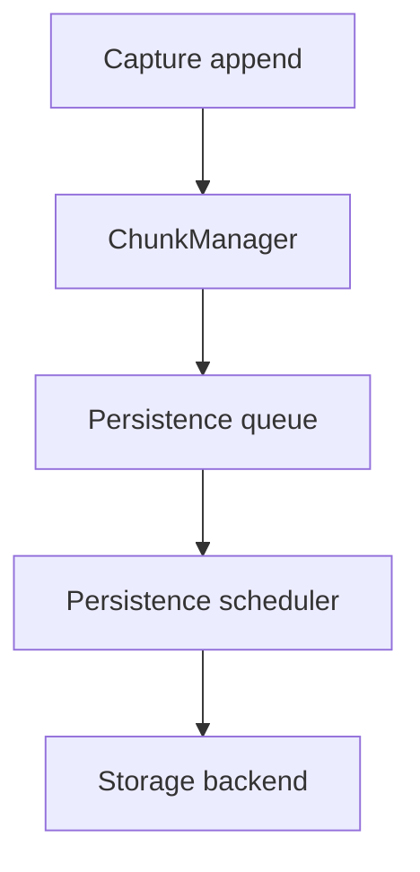

## Context

Brownfield persistence (`DEFERRED_RUNTIME_PERSISTENCE.md`) queues full workspace saves via `requestDeferredSaveState()`. `isCaptureActiveForPersistence()` returns immediately when any track is `RECORDING` or `OVERDUBBING`, blocking all slices. `stepDeferredLoopPersist()` already writes one PSRAM chunk (≤256 events) per slice — the bottleneck is scheduling, not write granularity.

64+64 evidence (`20260707_192649`): record save starts; overdub blocks writer; pool pressure; fault before `PERS,result`.

Architecture checkpoint: **ownership** and **state transitions** change — OpenSpec required, not a stop-path patch.

Agent map: [`docs/Guides/RUNTIME_STORAGE_AND_PERSISTENCE.md`](../../../docs/Guides/RUNTIME_STORAGE_AND_PERSISTENCE.md).

## Core architectural invariants

1. Runtime ownership is independent of persistence state.
2. A sealed chunk is immutable.
3. Persistence is cooperative and budget-driven.
4. Persistence preserves chunk seal order.
5. Runtime playback and recording always take precedence over persistence.
6. Memory reclamation is independent of persistence completion.

**Governing rule:** Runtime recording and playback correctness always take precedence over persistence progress.

## Goals / Non-Goals

**Goals**

- Drain sealed capture chunks to SD during open passes without starving runtime.
- Decouple pass-close from first-byte-to-SD.
- Define failure policy under pool/queue pressure (not emergent).
- Phase 0 diagnostics validate starvation before scheduler change.

**Non-Goals (v1)**

- Note edit, undo snapshot, or edit-pass continuous persistence.
- DMA SPI offload.
- New top-level `*Manager` classes — extend `LoopEventStore` and `StorageManager` (DEC-008).
- Mandating a specific SD layout version.

## Architecture layers



Runtime ownership, persistence scheduling, and storage backends are **intentionally independent**. This allows alternate formats, compression, DMA, journaling, or different media without modifying capture or playback ownership.

### Ownership summary

| Layer | Owner | Owns | Does not own |
|-------|-------|------|--------------|
| Capture | `Loop.capture` | Single mutable tail chunk append | SD bytes; pool free list |
| ChunkManager | `LoopEventStore` (target) | Seal, refs, allocation, reclaim; `Free→Recording→Sealed` | Persistence queue; pass timeline |
| Persistence queue | `StorageManager` (target) | Sealed-chunk work items; seal-order; exactly-once admission | Runtime mutability |
| Persistence scheduler | `StorageManager`, `main.cpp` | Cooperative budget; one FSM step per call | Capture timing; playback |
| Storage backend | `StorageLoopIo`, `StorageManager` | SD bytes; SAVE tokens; recovery load | RAM chunk lifecycle |

## Separate lifecycles

### Runtime (ChunkManager)

```
Free → Recording → Sealed
```

Sealed = immutable in RAM. Seal triggers (examples): chunk capacity, pass close, recording stop, future boundaries.

### Persistence (subsystem)

```
Not scheduled → Queued → Writing → Persisted
```

Per work item — not merged into runtime state.

### Persistence vs reclaim

> Persistence guarantees data is safely on storage. Memory reclamation occurs only after all runtime owners release references (`LoopPasses`, playback, undo snapshots).

## Cooperative scheduling

Persistence performs bounded work, then yields:

```
Main loop → persistence slice → yield → next iteration
```

| Today | Target |
|-------|--------|
| `if (isCaptureActiveForPersistence()) return;` | Run slice when budget remains and runtime work is complete for this iteration |
| Save starts after pass close | Sealed chunks enqueue during capture |
| Active `PersistenceBudget` (~300 µs) unused during capture | Budget caps each slice; runtime always first |

**Dependency order:** persistence queue (Phase 2) before scheduler change (Phase 3) before mid-pass writer (Phase 4).

## Storage backend

Reuse current `stepDeferredLoopPersist` chunk streaming where practical. Incremental append to open slot files during capture is the initial direction; journal or side-log layouts remain valid if invariants hold.

Pass-close (`publishPendingCapturePass`) finalizes pass metadata only — not first byte to SD.

## Undo / copy-on-write

Sealed+persisted chunks are immutable. Undo restores pass refs via existing COW rules; persisted SD may lag until writer catches up. Undo never rewrites persisted bytes in place.

## Recovery

> Recovery reconstructs the **longest valid prefix** of successfully persisted sealed chunks.

Worst-case loss ≈ one active **recording** chunk (not yet sealed). Invalid tail quarantine follows existing SAVE-token policy.

## Failure policy

Under sustained pressure, behavior is **defined** and emitted on serial (`#CAP,PERS,...`):

| Condition | Policy (v1 direction) |
|-----------|----------------------|
| Queue depth grows | `oldestDirtyChunkAge` alarm; diagnostic escalation |
| `freeChunkCount` near `CHUNK_RESERVE` | Pressure telemetry; OpenSpec defines record/overdub admission |
| Writer cannot keep up | Persistence continues cooperatively; runtime never blocked for SD throughput |

Recording must not silently fail.

## Diagnostics (Phase 0)

No behavior change. Emit: `freeChunkCount`, `usedChunkCount`, queue depth, chunks in `Writing`, max backlog, peak writer latency, slices blocked by budget, **`oldestDirtyChunkAge`**, mean/peak seal→persist latency.

`oldestDirtyChunkAge` is the primary “keeping up” signal.

## DMA

Not an architectural dependency. SD flash latency dominates. DMA may reduce CPU copy cost later.

## Risks / Trade-offs

- **Mid-pass SD append** — requires in-progress pass representation on disk; mitigated by reusing chunk-per-slice writer.
- **Pool pressure during long overdub** — diagnostics must prove queue+scheduler keep `freeChunkCount` above reserve before Phase 4 gate.
- **Overlap with `runtime-derived-representation-heap`** — heap routing may ship in parallel; persistence architecture patches there are parked.

## Migration Plan

| Phase | Deliverable |
|-------|-------------|
| 0 | Diagnostics only |
| 1 | Chunk ownership and lifecycle |
| 2 | Persistence queue |
| 3 | Cooperative scheduler (remove transport hard block) |
| 4 | Mid-pass persistence |
| 5 | Recovery prefix load |
| 6 | Full 64+64 HITL |

Validate Phase 0 via 64+64 HITL before Phase 3.

## Open Questions

- Exact backpressure when `freeChunkCount` hits `CHUNK_RESERVE` during record vs overdub — normative in `persistence-failure-policy` scenarios.
- Whether Phase 4 reuses deferred-save FSM stages or a parallel chunk-journal path — implementation choice if invariants hold.
