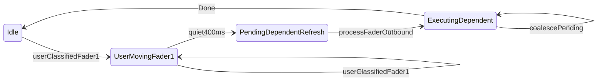

## Context

NOTE_EDIT DROID faders are owned by `NoteEditManager` (not `MidiFaderProcessor` for ch14/16 inbound). Outbound feedback uses a single frame-stepped pipeline:

- `requestFaderOutbound(Trigger)` — schedule or coalesce outbound work
- `processFaderOutbound()` — frame-stepped steps in `NoteEditFaderOutboundPlan.h`
- `processFaderSelectQuiet()` — 400 ms user-classified quiet gate before dependent F2–F4 refresh

Layered ignore windows remain: `FEEDBACK_IGNORE_PERIOD`, `selectFaderFeedbackIgnoreUntilMs_`, `armCoarseFaderFeedbackIgnore`, `armChannel15CcFaderFeedbackIgnore`.

Inbound edit geometry (`handleCoarseFaderInput`, `toggleLengthEditingMode`, `lengthEditCoarsePitchbendToLoopTick`) was fixed in `d576f85`. Phase 3 fixed timing/policy (RC5–RC10). **RC11** (loop-relative outbound tick) is open — outbound send helpers still use `storageTick % loopLength` while select/inbound use `SelectNavigation::noteRelativeTick`.

Primary files: `src/NoteEditManager.cpp`, `include/NoteEditManager.h`, `include/Utils/NoteEditFaderOutboundPlan.h`, `src/Utils/SelectNavigation.cpp`, `src/EditManager.cpp`.

### Phase 1 (historical)

Commit `d49e4c8` introduced `deferSelectFaderSyncToBracket` → `processSessionFaderSync` (steps 1–3: fader1, fader2 coarse, fader3/4) and `sessionFaderSyncStep_` input gating. Phase 1 paired coarse+fine and deduped schedulers (D1–D5). **Removed in Phase 3** — replaced by `requestFaderOutbound` / `processFaderOutbound`. References to `deferSelectFaderSyncToBracket`, `sessionFaderSyncStep_`, `isSessionFaderSyncActive`, `sendChannel15NotePositionFeedback`, and `DeferredRefresh` in older tasks are historical only.

## Goals / Non-Goals

**Goals:**

- Fader1 motor reaches select bracket after NOTE_EDIT entry (within bounded latency).
- Fader2 and fader3 motors update **together** on session entry and fader1 note select when `!lengthEditingMode`.
- NOTELEN enable sends fader2 coarse to note end before length inbound is accepted.
- No fader3-only sync path without preceding fader2 coarse.
- Preserve `d49e4c8` intent: loop-edit stale motors must not pull fader1 bracket during ignore window.

**Non-Goals:**

- Rewriting `MidiFaderManager` / `MidiFaderProcessor`.
- Encoder `NoteEditKind::Length` ↔ `lengthEditingMode` unification.
- Changing note edit store, overlap, or undo paths.

## Decisions

### Phase 1 decisions (historical — D1–D5)

Phase 1 addressed duplicate millis schedulers and fader2/fader3 split at session open. Implementation used `deferSelectFaderSyncToBracket` and `sessionFaderSyncStep_` — superseded by Phase 3 coordinator. Decisions D1–D5 remain valid as intent; live API names differ.

### D1 — Single outbound coordinator (Option A, recommended)

**Decision:** `deferSelectFaderSyncToBracket` owns entry feedback; cancel pending `pendingSelectnoteFaderUpdate` when session sync starts. `syncNoteEditSessionStateToUi` skips `sendSelectnoteFaderUpdate` while `sessionFaderSyncStep_ != 0`.

**Rationale:** Eliminates duplicate 1600 ms fires at session open. Select-after-entry uses `sendSelectnoteFaderUpdate` only when sync is idle.

**Alternatives:**

- **Option B (immediate fader1):** Send fader1 synchronously on entry; defer ch15 only — shorter dead time but reintroduces bracket-pull risk if loop-edit motor echoes before ignore arms.
- **Option C (reduce delay):** Lower `SELECTNOTE_UPDATE_DELAY` alone — does not fix fader2/fader3 split or scheduler race.

### D2 — Coarse + fine always paired

**Decision:** Merge session sync steps 2 and 3: step 2 sends `sendStartNotePitchbend` (coarse + fine); step 3 sends fader4 note-value only. `performSelectnoteFaderUpdate` already pairs coarse+fine — keep that invariant.

**Rationale:** User report: fader3 updates without fader2 — caused by step 3 sending fine without guaranteed step 2 coarse.

### D3 — Narrow session-sync input block

**Decision:** While `sessionFaderSyncStep_` is 1 (fader1 pending/sent), block fader1 only via `selectFaderFeedbackIgnoreUntilMs_`. While step ≥ 2, block ch15 faders (coarse/fine/note-value) until step completes. Do **not** block fader1 after step 1 completes.

**Rationale:** Current `handleFaderInput` early-return blocks all faders for ~4.8 s — user cannot use fader1 after its ignore window.

### D4 — Coarse `lastSentTime` via `sendFaderUpdate`

**Decision:** Route `sendSessionFader2CoarseSync` and `sendStartNotePitchbend` coarse path through `sendFaderUpdate(FADER_COARSE)` or set `lastSentTime` + `armChannel15FaderFeedbackIgnore` consistently in `sendCoarseFaderPosition`.

**Rationale:** Inconsistent `lastSentTime` breaks smart feedback detection and skip logic in `performSelectnoteFaderUpdate`.

### D5 — NOTELEN coarse-first

**Decision:** After `toggleLengthEditingMode(true)`, call `sendFaderUpdate(FADER_COARSE)` then `sendFaderUpdate(FADER_FINE)` with `lengthFineAnchorEndTick` already set; log anchor tick at INFO for serial gates.

**Rationale:** Length inbound maps pitchbend absolutely — motor must reflect note end before user touch.

## Risks / Trade-offs

| Risk | Mitigation |
|------|------------|
| Bracket pull if fader1 sent too early | Keep 1600 ms delay before step 1; prime `selectFaderFeedbackIgnoreUntilMs_` at schedule time |
| Motor settle time insufficient | Retain `SELECTNOTE_UPDATE_DELAY` between steps; do not skip step 2 for step 3 |
| `performSelectnoteFaderUpdate` skip during protection window | After sync complete, force one coarse+fine pair if skipped — **shipped in follow-up:** always call `sendChannel15NotePositionFeedback` (no skip guards) |
| `sendFaderUpdate(FADER_COARSE)` skips program change when another ch15 fader was driver | **RC5 (post-capture):** use `sendChannel15NotePositionFeedback` for NOTELEN + `enableStartEditing` — always sends PC prog 2 before coarse pitchbend |
| Regression of loop-start bracket alignment (`d49e4c8`) | Manual verify: enter NOTE_EDIT from LOOP_EDIT with fader2 at loop end — bracket stays on note, not pulled |

## Migration Plan

1. Implement coordinator + paired sync in `NoteEditManager.cpp`.
2. Guard `EditManager::syncNoteEditSessionStateToUi`.
3. Add native tests; run `pio test -e native`.
4. HITL edit baseline with new serial gates on hardware.
5. Archive change; merge spec into `openspec/specs/note-edit-fader-feedback/`.

Rollback: revert `NoteEditManager` sync changes; pre-`d49e4c8` behavior restores immediate feedback but bracket-pull risk returns.

## Open Questions

- **Sync latency budget:** Resolved in Phase 3 — frame-stepped coordinator, 400 ms user-classified quiet before dependent refresh.
- **HITL gate strictness:** Timing verifier **PASS** (`session_20260630_191718`); coordinate gate `pb == expected_pb_rel` pending Phase 8.

---

## Phase 2 — Deferred refresh pipeline (2026-06-30) — superseded

**Status:** Partially implemented then superseded by Phase 3. `DeferredRefresh` and 1000 ms stability timer removed from live code.

### Phase 2 goals

- Dependent faders (F2–F4) refresh reliably after fader1 note select when user settles.
- Active ch15 pipeline runs to `Done` without cancellation by subsequent refresh requests.
- Fader1 bracket feedback remains immediate on note select (user reports F1 works).

### D6 — Preemption policy

**Decision:** Never cancel a mid-pipeline ch15 sequence for NoteSelect refresh. If refresh is requested while `outboundStep_` is active on ch15 steps, set `pendingRefresh` with latest trigger; run one refresh immediately after current `Done`.

**Exception:** `LengthModeEnter` / `LengthModeExit` may still preempt — user is not moving fader1 during NOTELEN toggle.

### D7 — Request vs active

**Decision:** `pendingRefresh` (schedule: `pending`, `executeAt`, `trigger`) + `outboundStep_` (execution). No separate `outboundRequested` flag — `pendingRefresh.pending` suffices.

### D8 — Fader1 vs dependents timing

**Decision:** Fader1 bracket: immediate outbound on note select. F2–F4: defer until fader1 stable for ≥1000 ms (`DEPENDENT_REFRESH_STABILITY_MS`, aligned with `COARSE_STABILITY_TIME`); each new select resets `executeAt`.

### D9 — Coalescing

**Decision:** Single pending slot (latest wins). Multiple rapid selects → one full F2/F3/F4 pipeline for final selection geometry.

### D10 — Settle delay

**Decision:** Optional `OUTBOUND_MOTOR_SETTLE_MS` (default 0). Insert wait sub-state between pitchbend/CC send and motor trigger if HITL shows motor miss. Validate with `#DBG outbound_step` before hardcoding 10–30 ms.

### D11 — SessionOpen

**Decision:** Keep `WaitFader1Echo` for loop-edit bracket safety on session entry. Dependent refresh still sequential after echo cap or safety timeout.

### Phase 2 state machine

```
Fader1 note select → mark pendingRefresh (executeAt = now + 1000 ms)
  → [fader1 quiet 1000 ms] → if outbound active, hold pending until Done
  → begin ch15 pipeline (F2 PB → trigger → F3 PB → trigger → F4 → trigger) → Done, clear pending
```

### Phase 2 risks

| Risk | Mitigation |
|------|------------|
| Dependents lag up to 1 s after last select | Acceptable — matches user desired behavior; coalesce rapid selects |
| SessionOpen still needs immediate full pipeline | SessionOpen bypasses deferred scheduler; uses existing coordinator |
| LengthModeEnter blocked by pending refresh | LengthModeEnter preempts (D6 exception) |

---

## Phase 3 — Selection-driven outbound state machine (2026-06-30)

**Context:** Diagnostic path (immediate F2–F4 + PC re-arm + millis settle + pitch deadband) partially restored motors but remained erratic on fast-then-slow gestures and multi-minute stalls. Capture `session_20260630_113422.log` shows 52 s F2 gaps and many `SEND_F1`-only outbound bursts — not MIDI TX queue buildup.

### Phase 3 goals

- Separate **input classification** (user vs feedback), **selection resolution** (slot-index navigation), and **outbound execution** (frame-stepped state machine).
- Dependent F2–F4 refresh after **user-classified** fader1 quiet (400 ms), not pitch deadband.
- Remove layered millis settle/significance gates that fight motor echo.

### D12 — Slot-index navigation

**Decision:** On user-classified fader1 input, any mapped **slot-index change** SHALL call `applyNoteSelectFromFader1Pitchbend` immediately without sending dependent feedback. `SELECT_MOVEMENT_THRESHOLD` applies only to feedback classification and stale-echo lockout — not navigation suppression.

### D13 — Outbound select phase + quiet gate

**Decision:** `FaderSelectPhase`: `Idle` → `UserMovingFader1` on user-classified input; after `kFader1QuietMs` (400 ms) without user-classified input, re-apply selection from final pitch and `requestFaderOutbound(NoteSelectDependent)`. Quiet timer resets **only** on user-classified fader1 samples.

### D14 — Frame-stepped coordinator (restored)

**Decision:** Single `processFaderOutbound()` in `NoteEditManager`; triggers in `NoteEditFaderOutboundPlan.h`. PC re-arm (`armNoteEditDroidMotorBank`) before ch15 burst. SessionOpen waits fader1 echo (D11).

### D15 — No dual paths

**Decision:** Remove `scheduleFader1SettleRefresh`, immediate dependent burst on every selection change, and `enableStartEditing` outbound sends.

### D16 — Instrumentation

**Decision:** `#DBG outbound_step` + `#DBG select_slot` under `SESSION_CAPTURE`.

### Phase 3 state machine



### Phase 3 risks

| Risk | Mitigation |
|------|------------|
| 400 ms lag after last user sample | Tunable `kFader1QuietMs`; slot change updates selection live |
| Motor echo classified as user | Smart feedback ignore; quiet only on classified user input |
| Hybrid diagnostic + coordinator | Single path only (D15) |

---

## Phase 7 — Bracket / send-path hygiene (2026-06-30)

**Context:** After Phase 3 fixed F1↔F2 timing, hardware still showed bracket snap-back, display freeze on heavy F3, and send-path honesty issues. See [phase7 handoff](../../../docs/plans/note_edit_fader_feedback_phase7_handoff.md).

### D31 — Bracket-tick → F1 pitchbend

**Status:** Shipped.

**Decision:** F1 bracket outbound uses session bracket tick for pitchbend mapping.

### D36 — Session bracket on geometry moves

**Status:** Shipped.

**Decision:** `EditManager::commitBracketTickFromGeometry` sets both `sessionState.selection.bracketTick` and legacy `bracketTick` on geometry-path moves (F2/F3 edit, NOTELEN). F1 nav path unchanged (`applySelectNav`).

### D37 — Geometry F1 feedback without touching nav state

**Status:** Shipped.

**Decision:** Geometry-driven F1 bracket send (`Fader1BracketOnly` / `scheduleOtherFaderUpdates`) SHALL NOT overwrite `lastUserSelectFaderValue` / `lastSelectFaderTime`.

### D34 — Send path honesty + single motor trigger owner

**Status:** Partial (§7.6.3–7.6.4 shipped 2026-06-30; dead-wrapper cleanup remains Phase 12).

**Decision:** `sendCoarseFaderPosition` / `sendFineFaderPosition` / `sendNoteValueFaderPosition` return `bool`; `processFaderOutbound` skips trigger + `#DBG` step when send returns false. One owner for motor triggers — pipeline **or** send helpers, not both (extends D20).

### D35 — Fine throttle + display refresh

**Status:** Phase 11 (parked).

**Decision:** Coalesced `requestNoteInfoRefresh` after invalidate; rate-limit geometry `SEND_F1` bursts.

### D32 / D33 — Rate-limit geometry SEND_F1; motor priority

**Status:** Phase 11 (parked).

**Decision:** Cap F1 outbound rate during F2/F3 geometry edit; prioritize dependent outbound motor stages.

---

## Phase 8 — Loop-relative outbound tick (2026-06-30)

**Context:** HITL timing PASS on `session_20260630_191718` but `#DBG outbound_ctx` confirms RC11 — F2 motor offset ~50% when `loopStartTick ≠ 0`.

### D17 — Loop-relative outbound tick

**Decision:** `sendCoarseFaderPosition` (position and length modes) SHALL compute anchor via `SelectNavigation::noteRelativeTick(storageTick, loopStartTick, loopLength)` before `loopTickToCoarsePitchbend` / `lengthEditLoopTickToCoarsePitchbend`. Position mode uses `startTick`; length mode uses `endTick`.

**Rationale:** F1 select and F2 inbound already use loop-relative ticks; outbound must match.

**Architecture checkpoint:** Tick input fix only — no ownership or session-mode change.

---

## Phase 9 — Symmetric F1 ignore during F2 outbound (2026-06-30)

**Context:** F1 bracket send arms `selectFaderFeedbackIgnoreUntilMs_`; F2 coarse send arms only `armCoarseFaderFeedbackIgnore`. F2 motor echo can re-trigger select during dependent refresh.

### D18 — Symmetric F1 ignore during F2 outbound

**Decision:** Arm `selectFaderFeedbackIgnoreUntilMs_` at `processFaderOutbound` `SendCoarse` (or start of `sendCoarseFaderPosition` when called from pipeline). Preserve user override via `SELECT_MOVEMENT_THRESHOLD` in `shouldIgnoreFaderInput`.

**Capture gate:** No spurious `#DBG select_slot` during `SEND_F2` / `TRIGGER_F2` window.

---

## Phase 10 — F3/F4 unified dependent pipeline (2026-06-30)

### D19 — F3 relative tick + single pipeline burst

**Decision:** `sendFineFaderPosition` position mode mirrors D17 (relative start tick for fine offset). One `NoteSelectDependent` trigger runs F2 + F3 + F4 in sequence; no fader3-only path. Optional `#DBG outbound_ctx_f3` under `SESSION_CAPTURE`.

F4 note-value: no tick fix; stays in same pipeline step.

---

## Phase 11 — Parked (after Phases 8–10)

Only if still reproducing after coordinate fix:

- D35 display freeze on heavy F3
- D36/D37 bracket regressions
- NOTELEN tasks 4.2 / 6.2
- D31 if F1 offset remains after RC11 fix

---

## Phase 12 — Stale code cleanup (after Phase 8.4)

**Gate:** Do not start until Phase 8.3 capture passes (`pb == expected_pb_rel`).

### D20 — Dead API removal + single trigger owner

**Decision:** Remove dead outbound wrappers (`sendStartNotePitchbend`, `performSelectnoteFaderUpdate`, `sendFaderUpdate`, `sendFaderPosition`), ghost state (`NoteEditManager::faderHandler`, `faderProcessor`, `markFaderSent`, `lastSelectnoteSentTime`, `PITCHBEND_IGNORE_PERIOD`), and no-op `MidiFaderProcessor::scheduleOtherFaderUpdates` wrapper. Pick one motor-trigger owner (D34/D20).

**Live API names:** `requestFaderOutbound`, `processFaderOutbound`, `scheduleNoteSelectFaderSync`, `sendNoteEditSessionFaderFeedback`.
