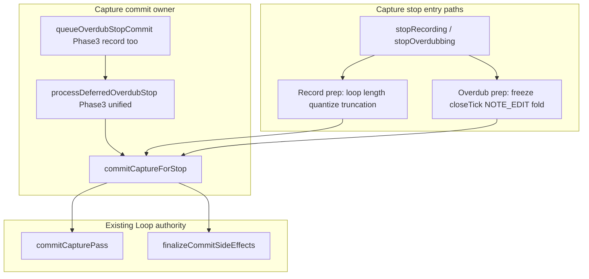

## Context

Brownfield stop paths (`src/Track.cpp`):

- **Record:** synchronous `stopRecording` / `stopRecordingToStopped` — inline quantize, `commitCapturePass`, `finalizeCommitSideEffects`, state advance, duplicate save request.
- **Overdub:** `queueOverdubStopCommit` → `processDeferredOverdubStop` FSM; `freezeOverdubCapture` on button down; `cancelDeferredOverdubStop` at six call sites.

Architecture checkpoint: **ownership** and **state transitions** change — phased OpenSpec required, not scattered patches.

Guide: [`docs/Guides/LOOP_MIDI_STORAGE_AND_VALIDATION.md`](../../../docs/Guides/LOOP_MIDI_STORAGE_AND_VALIDATION.md).

## Primary architectural invariant

> Exactly one runtime component owns an in-progress **capture commit** from the moment recording
> or overdubbing stops until the loop reaches its next stable runtime state.

That owner progresses commit stages, coordinates persistence requests, updates playback/display
state, emits telemetry, handles cancellation, and reports completion. `CommitReason` is context
only (record vs overdub).

## Capture stop vs capture commit

```text
User requests stop
    → Capture Stop (entry: stopRecording / stopOverdubbing + mode prep)
    → Capture Commit (commitCaptureForStop / deferred FSM)
    → Runtime Finalization (playback invalidation, display, persistence, telemetry)
    → Stable runtime state
```

**Capture stop** and **capture commit** SHALL NOT be merged into one mega-driver.

## Runtime model



Phases 1–2: record calls `commitCaptureForStop` synchronously; overdub FSM calls the same function at seal/finalize stages. Phase 3: record enqueues deferred FSM.

## Pipeline ownership boundary

### Capture commit pipeline owns

- flush pending notes into capture (`flushPendingNotesIntoCapture`)
- seal and publish (`commitCapturePass`)
- `finalizeCommitSideEffects`
- post-commit playback cache invalidation
- display notification
- persistence request (`requestDeferredSaveState` — single path)
- commit-stage telemetry

### Pipeline does NOT own

- capture input (`appendCaptureEvent`)
- transport control
- record/overdub button behavior
- quantization policy and loop-length calculation (record stop prep)
- freeze initiation (`freezeOverdubCapture`)
- NOTE_EDIT preparation before commit

## Naming glossary (locked Phase 0)

| Layer | Code (Phase 1+) | Phase 5 rename |
|-------|-----------------|----------------|
| Stop entry | `stopRecording`, `stopOverdubbing` | keep |
| Pipeline orchestrator | `commitCaptureForStop` | keep |
| Loop seal step | `commitCapturePass` | keep |
| Post-publish | `finalizeCommitSideEffects` | keep |
| Deferred queue | `queueOverdubStopCommit` | `queueCaptureCommit` |
| Deferred processor | `processDeferredOverdubStop` | `processDeferredCaptureCommit` |
| Stage enum | `OverdubStopCommitStage` | `CaptureCommitStage` |
| Abort | `cancelDeferredOverdubStop` | `cancelCaptureCommit` |
| Session reset | — | `resetCaptureCommitSession` |

Rejected function names: `executeCaptureCommit`, `commitCapturePipeline()`, `run*`.

Established verbs: `commit`, `finalize`, `process`, `queue`, `flush`, `cancel`.

## Behavior-preserving extraction invariant

> Phases 1 and 2 are behavior-preserving refactors.

- HITL captures identical
- Telemetry ordering unchanged
- State transitions unchanged
- No optimization or behavioral simplification
- Code organization and commit ownership only

**First behavior change: Phase 3** (record → deferred commit owner).

## Goals / Non-Goals

**Goals**

- Single capture commit owner by end of Phase 3
- Shared `commitCaptureForStop` by end of Phase 2
- Bisectable commits; clear regression boundaries

**Non-Goals**

- DEC-020 scheduler rewrite
- Identical stop entry APIs (symmetry is ownership, not surface area)
- API renames before Phase 5
- New top-level manager classes (extend `Track`)

## Relationship to DEC-020

Capture commit owner SHALL NOT block mid-pass persistence slices. Pass publish in
`commitCapturePass` continues to trigger mid-pass reset via `finalizeCommitSideEffects` as today.
Persistence starvation fixes remain in `continuous-runtime-persistence`.

## Relationship to DEC-016 (runtime architecture)

DEC-023 owns **capture commit at stop** (storage → representation boundary). DEC-016 owns
**derived representation build policy** and **interval projection** above that boundary.

| Layer | DEC-023 | DEC-016 / UIP handoff |
|-------|---------|------------------------|
| Pass publish at stop | **Owner** | Consumes `playbackRevision` bump |
| `commitCaptureForStop` | **Owner** | No |
| `mergeActiveCapturePasses` / visual cache slices | No | **Owner** |
| `projectionCycleStartTick` | Phase 2 unified post-commit hook | **Owner** (math + consumers) |
| Display window interval | No | **Owner** |

Overdub chunk / window / tick misalignment may stem from (1) commit boundary corruption — **DEC-023**;
or (2) representation/projection — **DEC-016**. Phase 2 acceptance: record and overdub share one
post-commit helper (`invalidatePlaybackWindow`, projection update, display snapshot, save request)
after `commitCaptureForStop` publishes; no duplicate hooks in overdub FSM complete stage.

Detail: [`docs/plans/unified_capture_stop_driver_refinement.md`](../../../docs/plans/unified_capture_stop_driver_refinement.md) § Relationship to DEC-016.

## Relationship to slot-performance-interaction

DEC-023 does **not** decide which button starts capture. Input routing (`handleToggleRecord` vs
`handleToggleRecordForSlot`) is consolidated in OpenSpec **`slot-performance-interaction`** (Record
button only for capture). DEC-023 ensures every stop path — including slot switch via
`finalizeCaptureAndSelectSlot` — uses the same `commitCaptureForStop` and post-commit hook.

## Verification gates

| Phase | Native | HITL |
|-------|--------|------|
| 0 | N/A | N/A |
| 1–2 | `pio test -e native` | Baseline unchanged |
| 3 | + FSM / record queue tests | Arm → record → stop; notes on display |
| 4 | + lifecycle abort tests | Transport stop during queued commit |
| 5 | Full suite | Canonical 64+64 |
