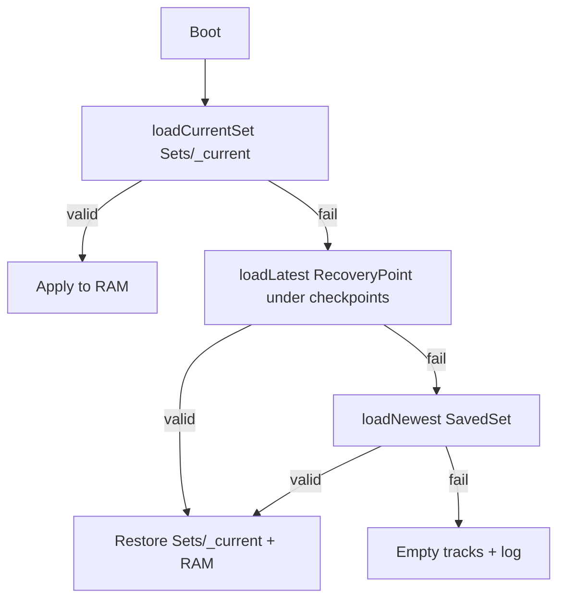

## Context

Today all runtime state is written to a single SD file `/midilooper_state.raw` (v5). The deferred
save FSM (`StorageManager::processDeferredSaveState`) streams global header, per-track slot
metadata, inline loop pool blobs, footer, undo stacks, and a `STORAGE_COMPLETE_MAGIC` footer in
bounded slices. Load is synchronous in `loadState`; failure quarantines the file to
`/state.bad.{millis}` and resets tracks.

The product model is a **persistent instrument with explicit set commits**: a **Set** is a
loadable collection of loops to jam with. A 3V backup battery enables Teensy SNVS RTC for
timestamps and date-based SavedSet IDs.

Brownfield constraints (do not violate):

- Hot path: no full flatten on stop; deferred validate only when idle (`LOOP_MIDI_STORAGE_AND_VALIDATION.md`).
- Runtime saves go through `requestDeferredSaveState` — not synchronous `saveState()` on stop path.
- Loop wire format stays `StorageLoopIo` / `PersistedLoopSnapshot` — container layout changes only.
- **EditSession** / **NoteEditSession** (live note-edit RAM) and future **JamSession** (M10
  performance RAM) are distinct from **CurrentSet** / **SavedSet** (SD loop inventory).

## Terminology

Cross-link [Naming-Vocabulary-Teensy-Looper.mdc](../../../.cursor/rules/Naming-Vocabulary-Teensy-Looper.mdc).

| Term | Meaning | Do not confuse with |
|------|---------|---------------------|
| **CurrentSet** | Always-active live loop inventory (`Sets/_current/`). Conceptual slot **000**. UX `CURRENT`. | autosave file, **EditSession** |
| **SavedSet** | Immutable user snapshot (`Sets/260625_003/` or UID `Sets/00003/`) | **EditSession**, **JamSession** |
| **SetIndex** | Monotonic allocator (`Sets/index.bin`, `nextSequence`) | RTC-only ID scheme |
| **RecoveryPoint** | Hidden checkpoint (`Sets/_current/checkpoints/_YYMMDD_HHMM/`) | HITL verification checkpoint |
| **LoopLocation** | `{ track, slot }` — slot-level import target | track strip in import UX |
| **saveNewSet** | Copy CurrentSet → new SavedSet folder (excludes checkpoints/) | deferred CurrentSet write |
| **loadSetIntoCurrent** | Copy SavedSet → `_current` + RAM; auto **saveNewSet** when dirty | loading into SavedSet folder |
| **saveCopySet** | Duplicate SavedSet → new ID | SAVE NEW |
| **updateLastSet** | Overwrite most recent SavedSet (v2 — non-goal v1) | CurrentSet write |

**Set** = persisted loop inventory. **JamSession** (future M10) = performance view/state over
loops in the loaded set; SavedSet meta does not include jam fields until M10.

## Goals / Non-Goals

**Goals:**

- CurrentSet always loads on boot; continuous deferred writes retarget to per-slot atomic files.
- User-initiated SavedSet snapshots and eight-hour failsafe SavedSet for revert anchors.
- RecoveryPoint layer nested under `Sets/_current/checkpoints/`.
- Slot-level loop import from CurrentSet or SavedSet sources.
- Single SD root `/Sets/` for catalog simplicity.
- v5 monolith one-time migration to v6 folder layout.
- RTC-backed `Last active` on CurrentSet and `createdAtUnix` on SavedSet (display only).
- Monotonic **SetIndex** at `Sets/index.bin` for SavedSet sequence — never RTC-derived.
- 2-digit zero-padded loop filenames for future 16×16 expansion.

**Non-Goals (v1):**

- Jam entity, Scenes, jam-field SD persistence (M10).
- UPDATE LAST, loop favorites.
- Lazy-load inactive slots (all 8×8 at boot).
- Open EditSession RAM restore on power loss.
- Journal-style append/replay persistence (future).
- `currentSession` or SD noun **Session** (avoid collision with edit/jam RAM sessions).

## SD layout (v6)

Single root — all persistence under `/Sets/`:

```text
/Sets/
    index.bin             # SetIndex { uint32_t nextSequence }
    _current/
        workspace.bin
        loop_00_00.bin … loop_07_07.bin
        checkpoints/
            _260625_1842/
                workspace.bin
                loop_*.bin
    00001/                # UID form when RTC invalid (sequence 001)
        set.bin
        loop_*.bin …
    260625_001/           # date form; first SavedSet is _001 not _000
    260625_003/
```

**workspace.bin (v6):** `uint32_t containerVersion`, RTC `lastActiveUnix`, BPM, looper state,
master loop length, per-track headers (state, muted), per-slot metadata (enabled, muted,
loopId), footer (selected track, active loop indices), global undo block — semantic equivalent
of today's monolith sections minus inline loop pool. SavedSet `set.bin` adds optional user label and
summary stats for browser.

**loop_TT_SS.bin:** Format `loop_%02u_%02u.bin` (e.g. `loop_00_00`, `loop_07_07`). Existing
`writeLoopPersisted` / `readLoopPersisted` payload plus per-file `STORAGE_COMPLETE_MAGIC`
footer (fail-hard if missing). Lexicographic sort matches numeric order for catalog scans.

## Decisions

### Decision 1: Single root `/Sets/`

All set containers live under `/Sets/`. Catalog enumerates SavedSet folders in **date form**
(`YYMMDD_NNN`) or **UID form** (5-digit sequence). Reserved entries filtered:

- `Sets/_current/`, `Sets/index.bin`, `Sets/_current/checkpoints/`

**Rationale:** One mental model; import browser scans one tree.

### Decision 2: Extend StorageManager — no parallel writer

Refactor the existing `DeferredSaveStage` FSM to write CurrentSet files instead of a monolith
offset. Stages become:

1. `CurrentSetMeta` — write `MidiLooper/current/workspace.bin` via temp + rename
2. `CurrentSetLoopSlot` — one slot file per slice (`loop_TT_SS.bin` temp → verify → rename)
3. Completion — update `lastActiveUnix` in meta on successful full CurrentSet flush

`requestDeferredSaveState` / `processDeferredSaveState` remain the only runtime persistence
entry points. `saveState()` drains synchronously for maintenance.

### Decision 3: Atomic per-slot write pattern

Each loop file write:

```text
Sets/_current/loop_TT_SS.bin.tmp → verify → SD.rename → loop_TT_SS.bin
```

Meta write uses the same temp → rename pattern.

### Decision 4: saveNewSet excludes checkpoints

**saveNewSet** copies `MidiLooper/current/workspace.bin` and all `MidiLooper/current/slots/loop_*.bin` to
`Sets/NNNNNN/` where `NNNNNN` comes from **SetIndex** `nextSequence`. It SHALL NOT copy
`Sets/_current/checkpoints/`.

SavedSet is a full loop inventory copy (all 64 slot files + `set.bin`) for simpler import in v1.

### Decision 5: Boot recovery chain



RecoveryPoint restore always writes back to `Sets/_current/` so CurrentSet remains the live target.

### Decision 6: RecoveryPoint triggers and prune (v1)

| Trigger | When |
|---------|------|
| Destructive slot clear | Before `clearSlot` commits |
| Full track clear | Before clear executes |
| Import loop into slot | Before target slot overwrite |
| Low-frequency periodic | Every 24 h if CurrentSet dirty (background idle) |

**Prune:** Under `Sets/_current/checkpoints/` only — retain newest 3 + most recent
pre-destructive marker.

### Decision 7: SetIndex registry, hybrid folder names, and RTC roles

**SetIndex** at `Sets/index.bin`:

```cpp
struct SetIndex {
    uint32_t nextSequence;  // next SavedSet sequence (starts at 1 → _001 / 00001)
};
```

**Reserved numbering:** sequence **0** / suffix **000** is **CurrentSet** only (`Sets/_current/`).
First SavedSet is always **001** (`260625_001` or `00001`).

**Sequence** always comes from **SetIndex** (+1 per manual or failsafe save). **Folder name format**
depends on RTC validity at save time:

| RTC at save | Folder name | Example (sequence 1) | Example (sequence 3) |
|-------------|-------------|----------------------|----------------------|
| Valid date ≥ 2026-01-01 | `YYMMDD_NNN` | `260625_001` | `260625_003` |
| Unset, reset, or before 2026-01-01 | 5-digit UID | `00001` | `00003` |

`NNN` is always 3-digit zero-padded sequence. UID is 5-digit zero-padded sequence.

**saveNewSet** flow:

1. Read `Sets/index.bin` (create `{ nextSequence: 1 }` if absent)
2. Reconcile against highest `sequence` from existing SavedSet folders (both name formats)
3. `N = nextSequence`; compute folder name from RTC rule above; create folder and copy CurrentSet
4. On successful copy only: write `index.bin` with `nextSequence = N + 1` (temp → rename)

Existing folders are never renamed when RTC later becomes valid.

**RTC** (SNVS, 3V coin cell — expected ≥ 2 years battery life):

- `lastActiveUnix` on CurrentSet meta
- `createdAtUnix` on SavedSet meta at save (0 when RTC invalid at save)
- Enables date-form folder names when ≥ 2026-01-01

**Default browser label** when user label empty:

- `createdAtUnix` valid → primary text `25 June 2026` (locale formatting TBD)
- `createdAtUnix` = 0 → primary text UID folder name (`00003`)

**RecoveryPoint** folders under `checkpoints/` may use `_YYMMDD_HHMM` when RTC available.

**Boot reconcile:** extract sequence from each SavedSet folder name; `nextSequence =
max(index.nextSequence, maxSequence + 1)`.

### Decision 8: loadSetIntoCurrent with auto saveNewSet before overwrite

When user confirms **loadSetIntoCurrent** from SavedSet B:

1. If `hasMaterialChangesSinceAnchor` on CurrentSet: run **saveNewSet** silently (next sequence)
2. Optional RecoveryPoint under `Sets/_current/checkpoints/` (crash-only; does not replace step 1)
3. Copy SavedSet B → `Sets/_current/` + RAM
4. Set `loadedFromSequence = B`, `lastAnchoredSequence = B`, clear dirty anchor

Skip step 1 when CurrentSet unchanged since last anchor (e.g. load 003, no edits, load 002).

Display: **CURRENT** always active; `From: 260625_003` subtitle; brief toast if auto-save ran.
Blocking confirm dialog is non-goal v1.

### Decision 9: Eight-hour CurrentSet failsafe SavedSet

Track last material modification time on CurrentSet and timestamp of last SavedSet creation.

When CurrentSet has changes not yet captured by any SavedSet since that modification, and
≥ 8 hours wall-clock have passed since last material CurrentSet modification, run **saveNewSet**
automatically during idle maintenance (not during RECORDING/OVERDUBBING).

Purpose: memory consolidation — user can revert to an earlier SavedSet if needed. This does not
replace continuous deferred writes to `Sets/_current/` or **RecoveryPoint** checkpoints.

### Decision 10: v5 → v6 migration

When `Sets/_current/` absent and `/midilooper_state.raw` present:

1. Run existing `loadState` parser (v5 monolith)
2. Write loaded state to `Sets/_current/` with 2-digit loop filenames
3. `quarantineStorageFile()` on legacy monolith
4. Set `containerVersion = 6` in CurrentSet meta

### Decision 11: Slot loop import

Long-press slot → IMPORT LOOP. Sources: CurrentSet, last 3 SavedSets, Browse All. Copy source
`loop_TT_SS.bin` into target **LoopLocation** → `invalidateCaches()` → `requestDeferredSaveState`.

### Decision 12: Module placement (v1)

Inside `StorageManager.cpp` initially:

- `writeCurrentSetMeta`, `writeCurrentSetLoopSlot`, `loadCurrentSet`
- `SetCatalog` — list SavedSets, **SetIndex**, **saveNewSet**, **loadSetIntoCurrent**
- `RecoveryPointManager` — create/prune under `Sets/_current/checkpoints/`

## Primary files

| File | Role |
|------|------|
| `src/StorageManager.cpp` | CurrentSet FSM, boot chain, migration |
| `src/StorageLoopIo.cpp` | Unchanged wire; per-file read/write wrappers |
| `src/Looper.cpp` | Boot: CurrentSet load before subsystems |
| `src/RtcTime.cpp` (new) | SNVS time |
| `src/DisplayManager.cpp` | Set browser, CURRENT status |
| `src/MidiButtonActions.cpp` | SAVE NEW, IMPORT LOOP gestures |
| `src/TrackManager.cpp` | RecoveryPoint before destructive ops |

## Risks / Trade-offs

| Risk | Mitigation |
|------|------------|
| `_current` appears in manual SD browse | Document reserved folder; firmware catalog filters it |
| Accidental copy of checkpoints into SavedSet | Explicit exclude in **saveNewSet**; native test |
| 64 loop files per set | One slot per deferred slice; same as monolith total payload |
| FAT case folding | Lock spelling `_current` and `checkpoints` lowercase everywhere |
| RTC unset without battery | `createdAtUnix` = 0; SavedSet sequence unaffected; UI shows date fallback |
| Partial saveNewSet before index write | Boot reconcile bumps `nextSequence` past existing folders |

## Migration Plan

1. Ship v6 firmware with migration path from v5 monolith.
2. HITL: record/overdub baseline unchanged after M1.
3. Manual: corrupt `Sets/_current/loop_00_00.bin` → boot recovers from RecoveryPoint.
4. Update `DEFERRED_RUNTIME_PERSISTENCE.md` when M1 merges.
5. Update `DELIVERABLE_TRACKING.md` row 80 on archive.

## Verification

- Native: loadSetIntoCurrent dirty auto-save, clean skip, CurrentSet meta anchor fields.
- HITL: baseline after M1; import scenario after M3.
- `pio test -e native` before archive.
