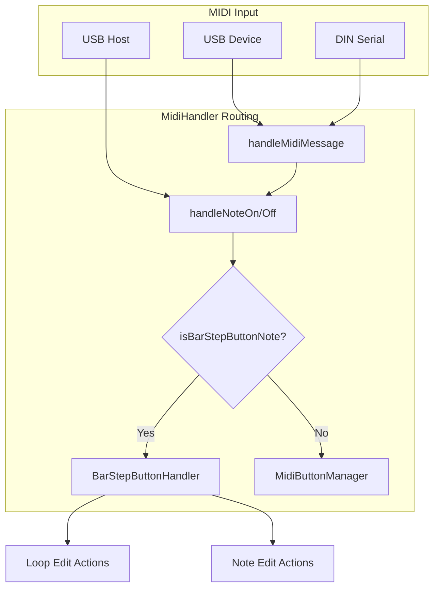

# Bar Step Button Handler Implementation

## Context

- **LED feedback**: Already working via [MidiLedManager](src/MidiLedManager.cpp) on channel 3 (16th content 0-15, tick 16-31, bars 40-47).
- **Controller mapping**: 16 buttons for 16th steps, 8 buttons for bars. When pressed, these must send notes to the Teensy. Any MIDI controller with buttons and LEDs can be used.
- **Note mapping**: 16th notes → notes 0-15, bars → notes 17-24, channel 16, usbMIDI.
- **Existing flow**: Note On/Off goes to `MidiButtonManager.handleMidiNote()` and (for non-control channels) to track recording. Channel 16 is a control channel (not recorded).

## Architecture




## 1. MidiConfig Extensions

**File**: [include/MidiConfig.h](include/MidiConfig.h)

Add a new namespace for bar/step button input (separate from LED output):

```cpp
namespace BarStepButton {
  constexpr uint8_t CHANNEL = 16;
  constexpr uint8_t SIXTEENTH_BASE = 0;
  constexpr uint8_t SIXTEENTH_COUNT = 16;   // notes 0-15
  constexpr uint8_t BAR_BASE = 17;
  constexpr uint8_t BAR_COUNT = 8;          // notes 17-24
}
```

Add a validation function (or startup check) that verifies these note ranges do not overlap with existing `MidiButtonConfig` entries on channel 16. Current channel 16 buttons: notes 36, 37, 38, 3, 39 (from `loadConfiguration`). No conflict with 0-15 and 17-24.

## 2. Controller INI Configuration

**File**: [droid/midilooper_v1.ini](droid/midilooper_v1.ini)

- **16th buttongroup** (lines 334-387): Change `value1..value16` from `0+16..15+16` to `0..15` so pressed 16th buttons send notes 0-15.
- **Bar buttongroup** (lines 324-332): Add `value1..value8` and wire `[midiout]` so bar button presses send notes 17-24 on channel 16.
- **Combined midiout** (lines 436-444): Update to output notes 0-15 for 16th and 17-24 for bars on channel 16 with `usb=1` so they reach the Teensy.

The goal is that the Teensy receives notes 0-15 (16th) and 17-24 (bars) on channel 16 over USB. Any controller can be configured to send these note values.

## 2a. Shared Press Timing Utility (Utils)

**New files**: `include/Utils/PressTiming.h`, `src/Utils/PressTiming.cpp`

Extract reusable press-type detection logic (double-tap window, triple-tap window, long-press threshold) into a utility usable by both `MidiButtonProcessor` and `BarStepButtonHandler`. Provides consistent timing constants and tap-sequence detection. `MidiButtonProcessor` can be refactored to use it later for consistency; `BarStepButtonHandler` uses it from the start.

## 3. BarStepButtonHandler

**New files**: `include/BarStepButtonHandler.h`, `src/BarStepButtonHandler.cpp`

**Responsibilities**:

- Receive raw Note On/Off for notes in [0-15] and [17-24] on channel 16.
- Distinguish 16th (0-15) vs bar (17-24); map note → step index (0-15 or 0-7).
- Use `Utils::PressTiming` for press-type detection (short, long, double, triple), with **two-button hold** logic:
  - Track currently pressed buttons (set of step indices per type: 16th vs bar).
  - On release: if 2+ buttons were held and duration ≥ long-press threshold → "hold 2 buttons" with range [min, max].
  - Otherwise use shared `PressTiming` logic for short/long/double/triple.

**Dependencies**: `Utils/PressTiming`, `LoopEditManager`, `NoteEditManager`, `EditManager`, `ClockManager`, `TrackManager`, `TrackUndo`, `MidiHandler`.

## 4. Loop Edit Mode Actions


| Press Type           | Action                                                                                                                                            |
| -------------------- | ------------------------------------------------------------------------------------------------------------------------------------------------- |
| **Short**            | Move `currentTick` to that 16th/bar position (quantized to 16th). Requires `ClockManager::setCurrentTick(uint32_t tick)`.                         |
| **Hold (1 button)**  | Set loop start and length to the selected bar or 16th (loop that single region).                                                                  |
| **Hold (2 buttons)** | Set loop start and length to span between the two buttons (min/max).                                                                              |
| **Double press**     | Toggle "continuous loop region" mode: first double = set loop to selected bar/16th and enable; second double = restore previous loop and disable. |
| **Triple press**     | Undo / Redo (same as existing `TrackUndo` for loop start and overdub).                                                                            |


**ClockManager change**: Add `void setCurrentTick(uint32_t tick)` (with `noInterrupts`/`interrupts` around the write, mirroring `resetToLoopStart`).

**Loop region calculation**: Use `loopStartTick` + step index × `TICKS_PER_16TH_STEP` for 16th; for bar, step × `TICKS_PER_BAR`. Align with existing logic in [LoopEditManager::calculateLoopStartTick](src/LoopEditManager.cpp) and [NoteEditManager::handleSelectFaderInput](src/NoteEditManager.cpp).

## 5. Note Edit Mode Actions


| Press Type           | Action                                                                                                                                                                 |
| -------------------- | ---------------------------------------------------------------------------------------------------------------------------------------------------------------------- |
| **Short**            | Move selector to first note/position in that 16th "pool". Next press cycles through notes in the pool (same order as fader selection: sort by start tick, then pitch). |
| **Hold (1 button)**  | Select all notes in that 16th or bar range.                                                                                                                            |
| **Hold (2 buttons)** | Select all notes in the range between the two buttons for bulk edit.                                                                                                   |
| **Double press**     | Add or remove note at that 16th/bar position (length = 16th or bar).                                                                                                   |
| **Triple press**     | Undo / Redo.                                                                                                                                                           |


**Selector / pool logic**:

- Reuse `allPositions` construction from [handleSelectFaderInput](src/NoteEditManager.cpp) (lines 965-1005): note starts + empty 16th steps, sorted and deduped.
- Filter by 16th step or bar to get the "pool" for that button.
- Cycle via `editManager.setBracketTick()` and `editManager.setSelectedNoteIdx()`.

**Bulk selection**: Extend `EditManager` to support a range or multi-select:

- Add `selectedNoteIndices` (or `selectionRangeStartTick`, `selectionRangeEndTick`) for bulk selection.
- When in bulk mode, operations (e.g. delete, move) apply to all notes in the selection.

**Add/remove note**:

- **Remove**: Delete all NoteOn/NoteOff pairs whose start falls within the 16th/bar span (similar to `deleteSelectedNote` but for a range).
- **Add**: Insert NoteOn + NoteOff at the 16th/bar start with length = 1×16th or 1×bar. Use track’s default MIDI channel and a default velocity (e.g. 100). Push undo before change.

## 6. MidiHandler Routing

**Files**: [src/MidiHandler.cpp](src/MidiHandler.cpp), [include/MidiHandler.h](include/MidiHandler.h)

- Add `BarStepButtonHandler barStepButtonHandler` and include its header.
- In `handleNoteOn` and `handleNoteOff`: at the top, if `channel == BarStepButton::CHANNEL` and note is in [0-15] or [17-24], call `barStepButtonHandler.handleMidiNote(channel, note, velocity, isNoteOn)` and return.
- In `usbHostNoteOn` and `usbHostNoteOff`: if same condition, skip `midiButtonManagerV2.handleMidiNote` and only call `handleMidiMessage` so the flow goes through `handleNoteOn`/`handleNoteOff` into the new handler. (Or call the handler directly and skip both if we want to avoid any other side effects.)

## 7. Double-Press Toggle State

**Storage**: In `BarStepButtonHandler` or `LoopEditManager`:

- `bool continuousLoopRegionActive`
- `uint32_t savedLoopStartTick`, `uint32_t savedLoopLengthTicks` (to restore on second double-press)

On first double-press in Loop Edit: save current loop start/length, set loop to selected bar/16th, set `continuousLoopRegionActive = true`. On second double-press: restore saved values, set `continuousLoopRegionActive = false`.

## 8. Two-Button Hold Detection

**Logic**:

- On Note On: add step index to `pressed16thSteps` or `pressedBarSteps`.
- On Note Off: compute duration for the released button. If `pressedCount >= 2` at release time (before removing) and duration ≥ long-press threshold → treat as "hold 2 buttons" and use the current set to compute range. Then remove the released button from the set. If only 1 button was pressed and long → single-button hold. Otherwise, feed into short/double/triple tap logic.

## 9. Conflict Check and Persistence

- Add `MidiConfig::validateBarStepButtonConfig()` that checks `BarStepButton` note ranges against `MidiButtonConfig::Config::getButtonConfigs()` on the same channel. Log a warning or fail init if overlap.
- Document the note mapping in a small config or README so it can be stored/loaded if you add a midiconfig save/load mechanism later.

## 11. Manual Test Points

- **Log category**: `CAT_BAR_STEP_BUTTON` (default off). Enable in `main.cpp`: `logger.setCategoryEnabled(CAT_BAR_STEP_BUTTON, true)`.
- **Test logging**: `barStepButtonHandler.setTestLoggingEnabled(true)` – logs `[TEST POINT: ...]` at key events.
- **Test guide**: [docs/MANUAL_TEST_BAR_STEP_BUTTONS.md](docs/MANUAL_TEST_BAR_STEP_BUTTONS.md) – step-by-step procedures for routing, short press, hold, two-button hold, triple press.

## 10. Implementation Order

1. Add `Utils/PressTiming` shared timing logic.
2. Add `MidiConfig::BarStepButton` and validation.
3. Add `ClockManager::setCurrentTick()`.
4. Implement `BarStepButtonHandler` using `PressTiming`, with two-button hold.
5. Implement Loop Edit actions (short, hold, hold-2, double, triple).
6. Add MidiHandler routing and verify 16th/bar notes are not sent to `MidiButtonManager`.
7. Implement Note Edit short press (selector move + cycle).
8. Add bulk selection to EditManager and implement hold / hold-2 for Note Edit.
9. Implement Note Edit double press (add/remove note).
10. Wire triple press to undo/redo in both modes.
11. Update controller INI for notes 0-15 and 17-24 on channel 16.
12. Test and fix any timing or ordering issues. (Optional later: refactor `MidiButtonProcessor` to use `PressTiming`.)

## Files to Create

- `include/Utils/PressTiming.h`
- `src/Utils/PressTiming.cpp`
- `include/BarStepButtonHandler.h`
- `src/BarStepButtonHandler.cpp`

## Files to Modify

- [include/MidiConfig.h](include/MidiConfig.h) – add `BarStepButton` namespace
- [include/ClockManager.h](include/ClockManager.h), [src/ClockManager.cpp](src/ClockManager.cpp) – add `setCurrentTick`
- [include/MidiHandler.h](include/MidiHandler.h), [src/MidiHandler.cpp](src/MidiHandler.cpp) – routing
- [include/EditManager.h](include/EditManager.h) – bulk selection (e.g. `selectedNoteIndices` or range)
- [include/NoteEditManager.h](include/NoteEditManager.h), [src/NoteEditManager.cpp](src/NoteEditManager.cpp) – range selection helpers, add/remove note in range
- [droid/midilooper_v1.ini](droid/midilooper_v1.ini) – note output for 16th and bar buttons

