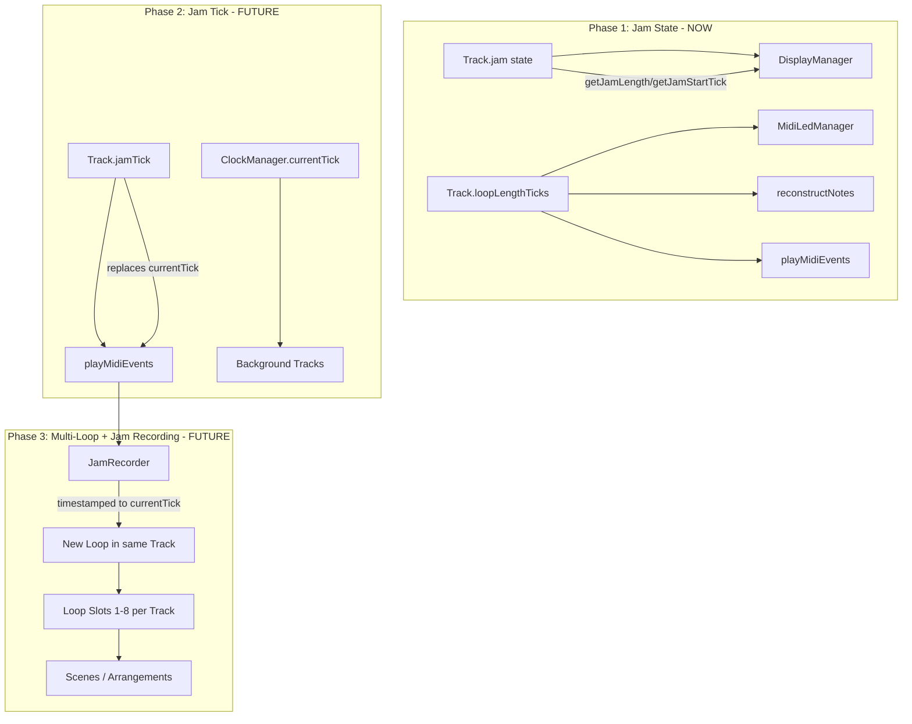

# Dual-Tick Architecture: Jam State + Future Jam Tick

## Problem Analysis

Two bugs exist in bar select mode, both caused by the same root: `enterBarSelect` mutates `track.setLoopLength(TICKS_PER_BAR)` and `track.setLoopStartTick(...)`, which cascades into:

1. **"Always shows first bar"**: `reconstructNotes(midiEvents, loopLength)` in `[src/Utils/NoteUtils.cpp](src/Utils/NoteUtils.cpp)` line 55 discards notes with `tick >= loopLength`. When `loopLength = TICKS_PER_BAR (768)`, only notes in storage ticks 0-767 survive — always the first bar's content.
2. **"Bar LEDs change to 1 bar"**: `MidiLedManager::updateLeds` reads `track.getLoopLength()`, which is now 768 instead of the original multi-bar length.

## Architecture: Three-Phase Design




**Key principle**: `loopLengthTicks` and `loopStartTick` are NEVER mutated during bar select. The jam state on Track determines what the display shows.

## Phase 1: Jam State (implement now)

### 1. Add jam state to Track

In `[include/Track.h](include/Track.h)`, add to private members (after line 202):

```cpp
uint32_t jamStartTick = UINT32_MAX;
uint32_t jamLength = 0;
```

Add to public section:

```cpp
bool isJamming() const { return jamLength > 0; }
uint32_t getJamLength() const {
    return jamLength > 0 ? jamLength : loopLengthTicks;
}
uint32_t getJamStartTick() const {
    return jamStartTick != UINT32_MAX ? jamStartTick : loopStartTick;
}
void setJam(uint32_t startTick, uint32_t length);
void clearJam();
```

In `[src/Track.cpp](src/Track.cpp)`, implement `setJam` and `clearJam`. Initialize both members in constructor.

### 2. Simplify BarStepButtonHandler bar select

In `[src/BarStepButtonHandler.cpp](src/BarStepButtonHandler.cpp)`:

- `**enterBarSelect**`: Replace `track.setLoopStartTick(...)` / `track.setLoopLength(...)` with `track.setJam(regionStartStorage, TICKS_PER_BAR)`. Remove `savedLoopStartTick`/`savedLoopLength` (no longer needed since actual loop params don't change). Can also replace `barSelectActive` with `track.isJamming()`.
- `**exitBarSelect**`: Replace restore logic with `track.clearJam()`.
- `**switchBarSelect**`: Replace `track.setLoopStartTick(...)` / `track.setLoopLength(...)` with `track.setJam(newRegionStart, TICKS_PER_BAR)`.

In `[include/BarStepButtonHandler.h](include/BarStepButtonHandler.h)`: remove `savedLoopStartTick`, `savedLoopLength`, and their getters (no longer needed).

### 3. Update DisplayManager to use jam params

In `[src/DisplayManager.cpp](src/DisplayManager.cpp)`, modify `drawPianoRoll` (line 279):

- `jamLength = track.getJamLength()` and `jamStartTick = track.getJamStartTick()` for display scaling
- `loopLength = track.getLoopLength()` for coordinate wrapping math
- Grid lines: use `jamLength`
- Playhead: compute relative to `jamStartTick`, skip if outside `jamLength`

Modify `drawAllNotes` (line 202): add `loopLength`, `jamLength`, `jamStartTick` parameters:

- Adjust note ticks relative to `jamStartTick` using `loopLength` for wrapping
- Skip notes where adjusted tick >= `jamLength`
- Map screen positions using `jamLength`

### 4. What stays UNCHANGED

- `**MidiLedManager**`: reads `track.getLoopLength()` and `track.getLoopStartTick()` — both unchanged during bar select, so LEDs correctly show the full loop. The deferred LED task is no longer needed.
- `**reconstructNotes**`: called via `getCachedNotes()` with `loopLengthTicks` — unchanged, all notes in the full loop are preserved.
- `**playMidiEvents**`: uses `loopLengthTicks` — unchanged, playback continues across the full loop.
- `**LoopEditManager**`: remove fader blocking — faders are allowed during jam mode as a performance tool. Remove the `isBarSelectActive()` early return checks entirely.

### 5. Seek logic in handleNoteOn

The immediate seek in `handleNoteOn` (line 208-226) currently uses `savedLoopStartTick`/`savedLoopLength` when bar select is active. Update to use `track.getLoopStartTick()`/`track.getLoopLength()` directly (since they're no longer modified).

## Phase 2: Jam Tick (design now, implement later)

Add to Track (alongside existing `jamStartTick`/`jamLength` from Phase 1):

```cpp
uint32_t jamTick = 0;
```

When `isJamming()` is true:

- `playMidiEvents` uses `jamTick` instead of `currentTick`
- `jamTick` auto-advances each clock tick (plays forward from seek point)
- Bar/16th buttons and faders set `jamTick` instead of calling `clockManager.setCurrentTick()`
- Display can optionally follow `jamTick`

In `TrackManager::updateAllTracks`:

- For tracks in jam mode: advance `jamTick` alongside `currentTick`
- Pass `jamTick` to `playMidiEvents` for jammed tracks

## Phase 3: Multi-Loop + Jam Recording (design now, implement later)

Each Track becomes a container for up to 8 independent loops, selectable via a dedicated set of 8 physical buttons (separate from the bar buttons).

### Terminology

- **Loop** = the stored data. 8 loop slots per track, each containing MIDI events, loop length, loop start, etc. All existing code stays as-is. No renaming.
- **Jam** = the performance mode/state. When jamming, you have an independent playback tick (`jamTick`) and can seek bars, switch between loops, and rearrange in real-time.

### Track Loop Slots Architecture

Extract current single-loop state into a `Loop` struct:

```cpp
struct Loop {
    std::vector<MidiEvent> midiEvents;
    uint32_t loopLengthTicks = 0;
    uint32_t loopStartTick = 0;
    NoteUtils::CachedNoteList noteCache;
    std::vector<size_t> playbackOrder;
    bool playbackOrderDirty = true;
};
```

Track holds 8 loop slots and jam state:

```cpp
// Data: 8 loops per track
Loop loops[8];
uint8_t activeLoopIndex = 0;
uint8_t loopCount = 1; // starts with 1 (the original recording)

// State: jam (performing) — jamStartTick/jamLength from Phase 1
// jamTick from Phase 2
uint32_t jamTick = 0;
```

### Loop Slot Properties

- **Independent length**: each loop can be a different number of bars
- **Loop 1 = original**: slot 0 is the original recording
- **Three ways to create a new loop**:
  - **Fresh recording**: with `jamTick == currentTick` (normal sync), simply play and record new MIDI input into an empty loop slot — a standard recording
  - **Rearrangement**: enter jam mode (independent `jamTick`) to rearrange bars of an existing loop by seeking to different positions, captured into a new slot
  - **Loop switching**: while recording into a new slot in jam mode, switch between existing loops in real-time using the loop buttons. E.g. play loop 1 for bars 1-3, press loop 2 button to switch source for bar 4 — the combined output is captured as a new loop
- **Loop selection**: a separate set of 8 buttons selects which loop is active for playback/display

### Loop Button Lifecycle

**UX**: Press an empty loop button to start recording. Press the same button again to stop — the new loop immediately becomes active and starts looping.

Each of the 8 loop buttons mirrors the full lifecycle currently implemented for the track-level rec/stop/overdub/delete button, but dedicated to its individual loop slot:

- **Empty slot — press**: start recording into that loop slot (captures output timestamped to `currentTick`)
- **Recording — press again**: stop recording, finalize loop (quantized to bar boundaries), switch playback to it
- **Filled slot — short press**: switch playback to that loop
- **Filled slot — double press / long press**: start overdubbing into that loop
- **Overdubbing — press**: stop overdubbing
- **Delete gesture (e.g. triple press)**: clear that loop slot, shift it back to empty

LED feedback per button reflects the loop slot state (empty / recording / playing / overdubbing / muted).

### Browsing Another Loop During Overdub

When a loop is overdubbing and you press another loop's button:

- **Display/LEDs switch** to show the pressed loop's content (using the jam state from Phase 1)
- **Recording target stays** on the overdubbing loop — captured output goes there
- **Bar/16th buttons** navigate the pressed loop's bars and steps, so you can seek and perform from its content
- The pressed loop's MIDI output (driven by `jamTick`) gets overdubbed into the recording loop (timestamped to `currentTick`)
- Pressing the overdubbing loop's button again switches the view back to its own content

### Scenes / Arrangements

- Each track's active loop index can be set per scene
- A scene is a snapshot of which loop is active on each of the 8 tracks
- Triggering a scene switches all tracks to their assigned loops
- This enables building full arrangements from loop variations created through jamming

## Files Changed (Phase 1 only)


| File                             | Change                                                                            |
| -------------------------------- | --------------------------------------------------------------------------------- |
| `include/Track.h`                | Add jam state members + getters/setters (setJam/clearJam/isJamming)               |
| `src/Track.cpp`                  | Implement setJam/clearJam, init in constructor                                    |
| `include/BarStepButtonHandler.h` | Remove savedLoopStartTick/savedLoopLength, remove their getters                   |
| `src/BarStepButtonHandler.cpp`   | Use track.setJam/clearJam instead of mutating loop params                         |
| `src/DisplayManager.cpp`         | drawPianoRoll and drawAllNotes use jam params                                     |
| `src/LoopEditManager.cpp`        | Remove isBarSelectActive() fader blocking checks and BarStepButtonHandler include |


