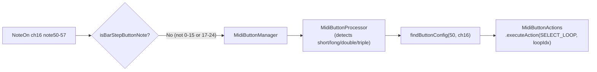

# Loop Button Detection

## How it works

Notes 50-57 on channel 16 already flow through the correct path in [MidiHandler.cpp](src/MidiHandler.cpp):



No routing changes needed. Just register the buttons and add a stub action.

## File Changes

### 1. [droid/midilooper_v1.ini](droid/midilooper_v1.ini) lines 641-664

Change the 2 existing loop buttons from toggle to momentary. Remove Droid-managed LEDs (Teensy will manage them later):

```ini
# Jams
[button]
    states = 1
    button = B2.9
    output = _LOOP_1

[button]
    states = 1
    button = B2.10
    output = _LOOP_2
```

The `midiout` block (notes 50-51) stays unchanged.

### 2. [include/MidiConfig.h](include/MidiConfig.h) — add after `BarStepButton` namespace (line 75)

Add constants for loop buttons:

```cpp
namespace LoopButton {
  constexpr uint8_t CHANNEL = 16;
  constexpr uint8_t BASE = 50;
  constexpr uint8_t COUNT = 8;          // notes 50-57
}
```

And add LED note range for future use (after `Led::BAR_BASE`):

```cpp
constexpr uint8_t LOOP_BASE = 50;      // 8 loop LEDs: notes 50-57
```

### 3. [include/Utils/MidiButtonConfig.h](include/Utils/MidiButtonConfig.h) line 44

Add new ActionType before `CUSTOM_ACTION`:

```cpp
SELECT_LOOP,
```

Add convenience method declaration in `Config` class (after `addEditModeButton`):

```cpp
static void addLoopButton(uint8_t note, uint8_t loopIndex, uint8_t channel = 16);
```

### 4. [src/Utils/MidiButtonConfig.cpp](src/Utils/MidiButtonConfig.cpp)

Add the convenience method:

```cpp
void Config::addLoopButton(uint8_t note, uint8_t loopIndex, uint8_t channel) {
    addButton(ButtonConfig(note, channel, ("Loop " + std::to_string(loopIndex + 1)).c_str())
              .onShortPress(ActionType::SELECT_LOOP)
              .withParameter(loopIndex));
}
```

Register the 8 loop buttons in `loadFullConfiguration()` (after the global transport button, before the extended buttons section):

```cpp
for (int i = 0; i < 8; i++) {
    addLoopButton(MidiConfig::LoopButton::BASE + i, i, MidiConfig::LoopButton::CHANNEL);
}
```

### 5. [include/MidiButtonActions.h](include/MidiButtonActions.h) line 68

Add declaration after `handleMoveCurrentTick`:

```cpp
void handleSelectLoop(uint8_t loopIndex);
```

### 6. [src/MidiButtonActions.cpp](src/MidiButtonActions.cpp)

Add case in `executeAction` switch (after `RESET_TO_LOOP_START`):

```cpp
case MidiButtonConfig::ActionType::SELECT_LOOP:
    handleSelectLoop(static_cast<uint8_t>(parameter));
    break;
```

Add stub handler:

```cpp
void MidiButtonActions::handleSelectLoop(uint8_t loopIndex) {
    logger.info("Loop button %d pressed (track %d)", 
                loopIndex + 1, trackManager.getSelectedTrackIndex());
}
```
